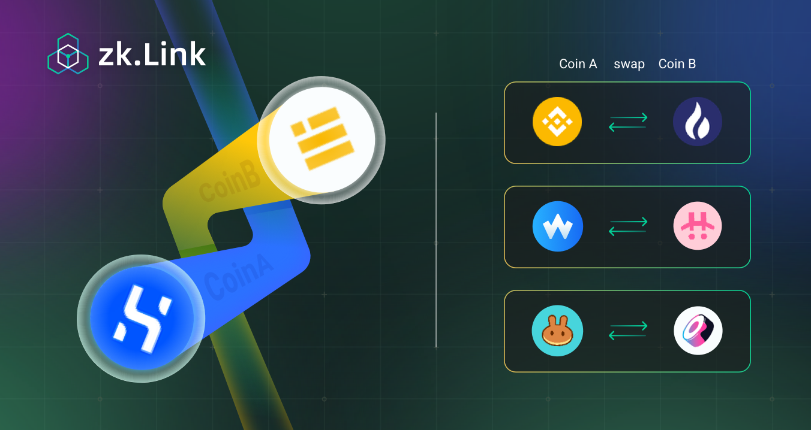

# Background

---

## What is zkLink？
zkLink is a trustless **chain-to-chain DEX** based on zero-knowledge technology.

As the bridging component among isolated chains and layer2 networks, zkLink makes it possible for native assets on separate ecos to interoperate and pair with each other.

> **🥇** Suppose that traders are able to swap from SRM on Solana for CAKE on BSC within 45 seconds, and developers will be provided with zkLink SDK for their users to enjoy fast cross chain swapping without leaving their platforms: this all happens in **a secure, fast, cost-friendly experience**, when zkLink adopts recursive SNARKs to guarantee the validity of cross-chain transactions.

## How does zkLink stands out?
The competitive edges of zkLink are achieved by: "Fast Cross Chain Swap" and "Zero Knowledge Technology".

  - Sleekest token cross-chain experience

    + Traders can now directly exchange one token to any kinds from any chains, with only "one click".
    + Different from other chain-interoperation platforms where users get stable-coins or mapping assets on the target chain, on zkLink they receive their target tokens, saving much time & effort.  
    + Friendly user experience in aspects of learning cost, mental cost, time cost, and monetary cost.

  - Security and validity

    + zkLink achieves the same security level as Ethereum Layer1.
    + Zero knowledge guarantees that nobody, including the platform, can play maliciously and users can retrieve tokens losslessly in any extreme cases, and that cross-chain transactions are always valid.
    + Even the total data loss of zkLink can not endanger capital safety when users can roll back account states based on Layer1 data.

  - Decentralization and non-custody

    + Free from restriction or authentication.
    + Users no longer have to "give out" the control of assets and private keys to exchanges instead they will have full custody over their funds: a true sense of "token ownership."

<!--

    <a class="field1" href="/docs/Technology/ZK-Rollup">
        
Fast Cross Chain Swap

    </a>
    <a class="field1 field2" href="/docs/Technology/Multi-Chain">
        
Zero Knowledge Technology

    </a>

    
low gas fee

    
high TPS

    
multi-chain asset aggregation

    
security

    
privacy

More detailed documentation about zkLink can be found from the sidebar.

-->

## Developer Guides
coming soon...

## Reference Materials
coming soon...
