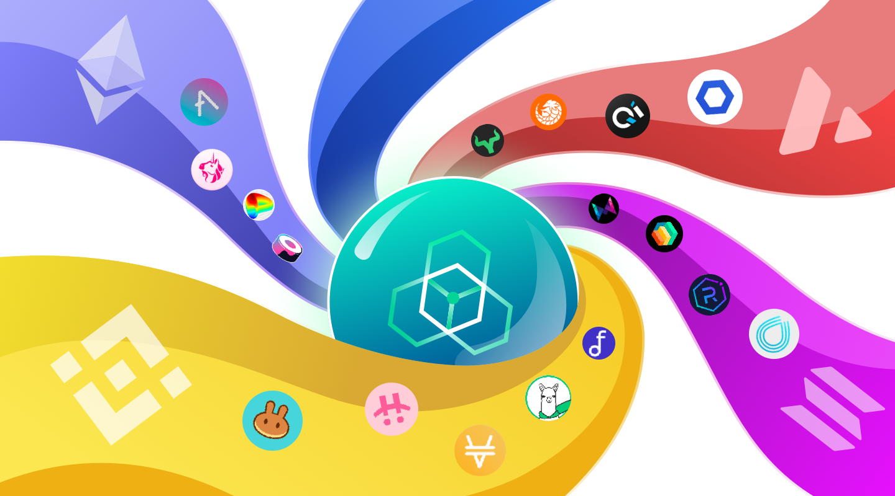

# Background

---

The world of DeFi is burgeoning, with players seeing a surging number of Dapps spread over multiple public chains, and holding a long list of tokens. As the vying for computing resource is becoming increasingly fierce, the value of Ethereum has spilt over into high-performing public chains represented by Polygon / Solana, and Layer 2 scaling solutions such as Optimism. It is settled that **a multi-chain, multi-layer infrastructure would be the future of blockchain**, with each nurturing their own blossoming eco with DeFi apps. Users no longer expect a single chain to fulfill all their needs of token interaction, instead they depend on scattered protocols in each market segment.

This is a double-edged sword: in the meantime that the development of these next-generation ecosystems contribute to the growing DeFi, they also form their own heterogeneous silos, locking users and assets into their respective island. **Liquidity segregation makes it impossible for traders to hold assets on or trade between separate chains and Layer2 projects by themselves**, since the consensus mechanism, the ledger, and the underlying technology are incompatible. Especially for novice users, those multitudinous DEXs can be extremely difficult for them to navigate, as high gas fees and poor UI and UX designs are prevalent.

This could, in turn, hinder the long-term development of DeFi where the only possible path of multi-chain token interoperability is centralized exchanges. Which can only be a temporary remedy rather than a long-term solution in a world that advocates decentralization, since the opportunity cost and risk cost for long-tail users to swap multi-chain assets via a CEX can be unbearably high.

> 🎁 The key to break the bottleneck lies in chain interoperability
>
> Imagine that the liquidity from separate chains and Layer2 protocols are connected with each other, wherein multi-chain, multi-layer transaction can be directly executed — it will hugely boost productivity for the DeFi ecosystem as a whole and for the whole blockchain world. zkLink was created for this mission

To provide an exponentially better user experience for traders, zkLink enables fast cross-chain swaps between tokens from different Layer1 ecosystems without requiring users to first deposit tokens on Layer2. While cross-chain transactions on other cross-chain protocols typically take 10-15 blocks, or about 10 minutes or more to complete, zkLink’s cross-chain transactions on high-performance chains such as Polygon, BSC and HECO take less than a minute. zkLink adopts zero-knowledge technology to ensure security and interoperability, creating multi-chain DeFi scenarios with a secure, efficient, and low-cost user experience.

In addition to efficient cross-chain functionality for its users, zLink empowers developers and projects to bring the same fast, secure transactions to their respective platforms through the zkLink SDK, enabling even more interconnectivity between and across multiple chains and boosting the overall interoperability of the entire blockchain ecosystem.
