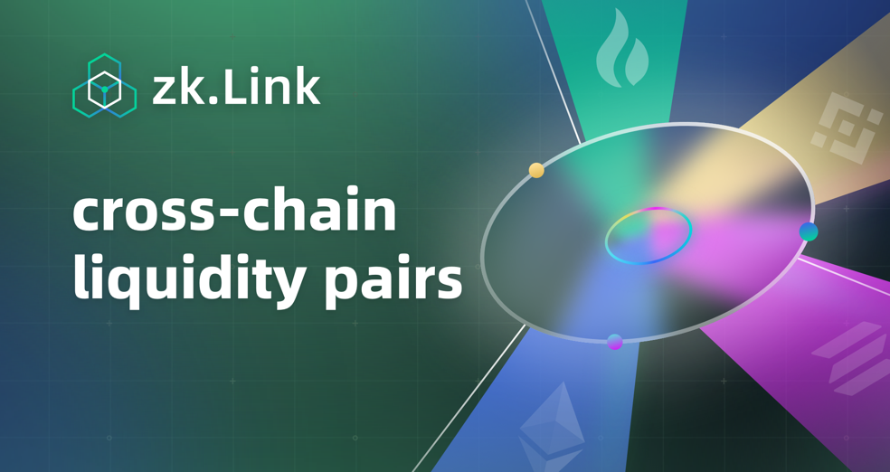

# Cross-chain Pairs

---
> 🌟 If we say that the invention of AMM model represented by Uniswap has taken DeFi from 0 to 1, then the direct interaction of cross-chain assets could be a cornerstone of the transition from 1 to 10. 

In the present stage, most users with cross-chain swap demand would go through centralized exchanges, which, as mentioned above, have nonnegligible flaws, including frustrating KYC, no privacy, long manual process and double transaction fees when trading with other ERC-20 tokens, etc. In a decentralized world, it can only be a temporary remedy rather than a long-term solution. Right now developers are seeking for decentralized methods and there are indeed some projects that can "partly" solve this problem: Polkadot and Cosmos are building their own ecos wherein parachains can  communicate with each other; cross-chain bridges like Chainswap uses mapping assets; some has managed to swap cross-chain stablecoins such as O3swap... **These first-movers are taking a detour to achieve the goal of chain interoperability, but what the industry really need is a more straightforward treatment and that is when direct liquidity pairs with cross-chain tokens (UNI-CAKE) come into this big picture**.

Similar to the meaning of AMM model to DeFi, these cross-chain trading pairs are believed to take it to its next level: the "globalization" of public chains in blockchain world, where there will be no boundary between two ecos, and local assets can be easily traded globally. Players and investors will be seeing more innovative defi scenarios that have never come to mind, here are two examples:

1. Loan with cross-chain assets: when a user need BUNNY but does not want to sell his/her UNI since he/she thinks the price of UNI will further increase, he/she can pledge UNI on Ethereum to borrow BUNNY on BSC in a safe environment.
2. Cross-chain farming: for those who hold two tokens on separate chains, they can provide liquidity directly with these two tokens and just start earning, without further operation.

Token interaction from direct liquidity pairs is only the first step, or we can say that it is a paving stone for chain interoperability and the first application of it. The ultimate goal is to connect isolated chains together in a real sense, achieving seamless communication in forms of information and other assets, not just tokens.

From the perspective of the entire DeFi industry, it is said that a single tree does not make a forest, so the mutual prosperity of more outstanding public chains will take DeFi a step forward, with chains being connected together, projects interacting with each other, and users enjoying the full potential of this ledger technology. Only when can DeFi form its own integrated system as strong as the real-world finance.
