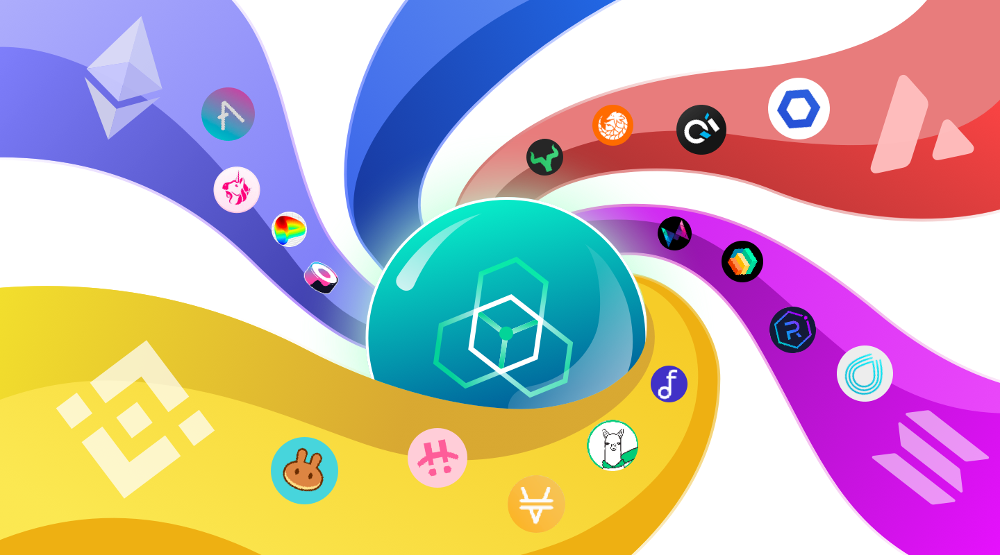

# Introduction

---

## What is zkLink？
zkLink is a **unified multi-chain trading infrastructure** secured with **zk-SNARKS**, empowering the next-generation of decentralized trading products such as order book DEX, NFT marketplaces, and more.

By connecting various L1 blockchains and L2 networks, zkLink's unified, multi-purpose ZK-Rollup middleware enables developers and traders to leverage aggregated assets and liquidity from different chains and offer a seamless multi-chain trading experience, contributing to a more accessible and efficient DeFi ecosystem for all.

Furthermore, atop its multi-chain ZK-Rollup infrastructure, zkLink offers an array of API-driven use cases to cater to a diverse range of decentralized applications.

>**🥇** zkLink innovatively applies **[zero-knowledge](/docs/Technology/Technology)** technology to multi-chain interoperability with a trustless and decentralized **[separation of powers](/docs/Technology/About-Security)** design that safeguards the security of assets and trades as well as multi-chain data transits.

## Features
### Zero-knowledge Proofs with Zero Security Compromise
Zero-knowledge validity proofs are mathematically certified to guarantee only valid transactions are executed and cannot be manipulated or falsified, and hence ensure security of funds.

- In virtue of ZK-Rollup's on-chain data availability, account states can always be rolled back in case of attacks, even when all the data on zkLink is lost.
- Zero knowledge guarantees that nobody, including the platform itself, can upload fake zk_proof to the main chain.

### A Rigorous Consensus Mechanism with Checks and Balances
A light oracle network independently ensures the consistency of multi-chain states. Such separation of powers in the verification and judgment process ensures no single party controls asset security or is capable of malicious behavior.

- The checks and balances design can protect zkLink protocol against economic attack from both external hackers and internal stakeholders by preventing any single branch from having too much power.

### Seamless Multi-Chain Trading Experience
With the suite of APIs provided by zkLink, developers can effortlessly create a DEX that closely resembles the user experience of a centralized exchange (CEX). Developers can focus solely on frontend user interaction and market operations, without worrying about performance or asset security concerns.

### Native Asset Aggregation From Multiple Chains
dApps built with zkLink leverage seamless multi-chain liquidity, with rapid deployment solutions for decentralized and non-custodial order book DEX (spot and derivatives), NFT exchanges, and more.

- A unified currency for all purposes on the zkLink.
- No need of multiple wallets for separate chains.
