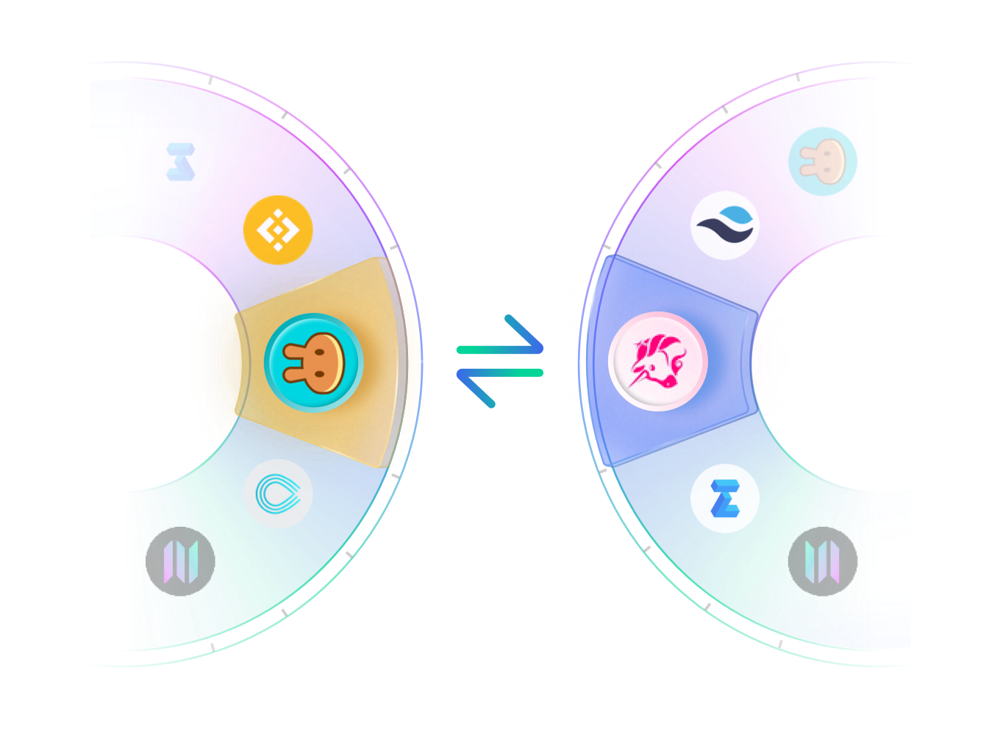

# Introduction

---

## What is zkLink？

zkLink is a trustless **chain-to-chain DEX** based on zero-knowledge technology.

As a middleware to connect isolated chains and layer2 networks, zkLink approaches the cross chain liquidity problem differently: we use ZK-Rollup as a solution for tokens and liquidity on separate chains to communicate with each other.

> **🥇** Suppose that traders are able to swap from SRM on Solana for CAKE on BSC within 45 seconds, and developers are able to leverage zkLink SDK as a built-in solution for their cross chain liquidity transfer: this all happens with **a secure, fast, cost-friendly experience**, when zkLink adopts recursive SNARKs to guarantee the validity of cross-chain transactions.

## zkLink Uniqueness

The competitive edges of zkLink are achieved by: "Fast Cross Chain Swap" and "Zero Knowledge Technology".

  - Easy token cross-chain experience

    + Traders can now directly exchange one token to any kinds from any chains, with only "**one click**".
    + Different from other chain-interoperation platforms where users get stable-coins or mapping assets on the target chain, on zkLink they receive their target tokens, **saving much time & effort**.  
    + **Friendly user experience** in aspects of learning cost, mental cost, time cost, and monetary cost.

  - Security and validity

    + zkLink achieves the same **security level** as Ethereum Layer1.
    + Zero knowledge guarantees that nobody, including the platform, can play maliciously and users can retrieve tokens losslessly in any extreme cases, and that **cross-chain transactions are always valid**.
    + Even the total data loss of zkLink can not endanger capital safety when users can always **roll back** their account states based on Layer1 data under all circumstances.

  - Decentralization and non-custody

    + Free from restriction or authentication.
    + Users no longer have to "give out" the control of assets and private keys to exchanges instead they will have full custody over their funds: a true sense of "token ownership."

## Developer Guides
coming soon...

## Reference Materials
coming soon...
