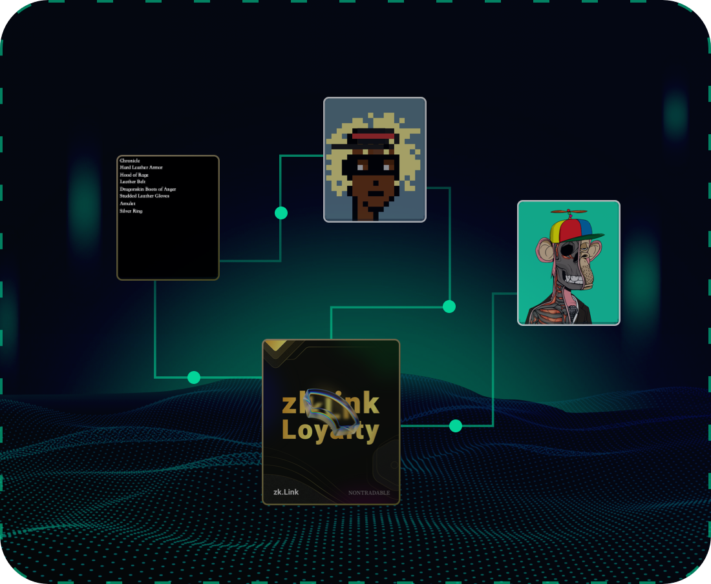

# Use Case 3: Multi-Chain NFT Mint and Trade

---
> **🥇** A global NFT marketplace on the zkLink L2 ecosystem that aggregates the NFTs native to different blockchains:

- Supports NFT minting, multi-chain trading, and mapping from any connected network to zkLink.
- Massive NFT assets from multiple L1 and L2 ecosystems for any audience.
- A unified pricing numeraire for NFTs from different blockchains.

