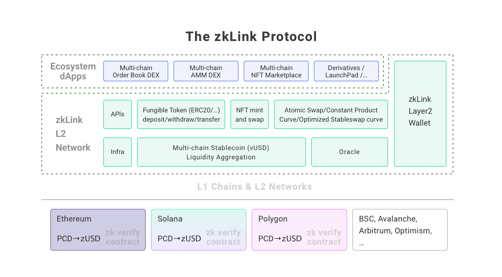

# Overview

---
zkLink is a unified multi-chain trading infrastructure secured with zk-SNARKS, empowering the next-generation of decentralized trading products such as order book DEX, NFT marketplaces, among others.

By connecting various L1 blockchains and L2 networks, zkLink's unified, multi-purpose ZK-Rollup middleware enables developers and traders to leverage aggregated assets and liquidity from different chains and offer a seamless multi-chain trading experience, contributing to a more accessible and efficient DeFi ecosystem for all.

> **🥇** For example, zkLink supports
- atomic swap for order book trades (spot trading and margin trading)
- constant product curve and stableswap curve for multi-chain AMMs
- NFT mint/trade for multi-chain NFT marketplace
