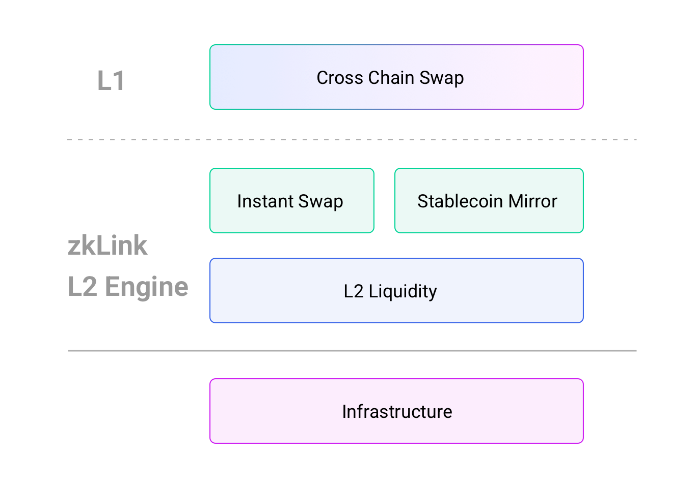

# Overview

---
As a chain-to-chain DEX, zkLink functions as a middleware to connect separate public chains and layer2 protocols, providing users with DEX scenarios with cross-chain assets in a time/monetary-cost friendly manner.

zkLink supports **the connection between EVM-compatible public chains and EVM-incompatible chains**, where users can link to heterogeneous blockchain accounts and permanently enjoy chain interoperability with assets on Layer2 network with a user-experience similar to CEX.

By connecting separate Layer1 networks with a single Layer2 network, tokens belonging to different ecosystems can be directly swapped with each other freely on this second layer, without an intermediate token. **Users will see the pairs that have never been seen before**, such as CAKE-SUSHI, BNB-HT, USDT(ERC20)-USDT(BEP20), BUSD-HUSD, WBTC-BTCB, etc.  

To provide an exponentially better user experience for traders, zkLink enables fast cross-chain swaps between tokens from different Layer1 ecosystems without requiring users to first deposit tokens on Layer2, taking only less than a minute on high-performance chains such as Polygon, BSC and HECO. In addition to efficient cross-chain functionality for its users, zLink empowers developers and projects to bring the same fast, secure transactions to their respective platforms through the zkLink SDK, enabling even more interconnectivity between and across multiple chains and boosting the overall interoperability of the entire blockchain ecosystem.

zkLink v1 will support Ethereum, Polygon, Binance Smart Chain, Huobi ECO Chain (HECO), and in the foreseeable future, will also be connected with other smart chains and layer2 protocols such as Solana, Optimism, Fantom, etc.
