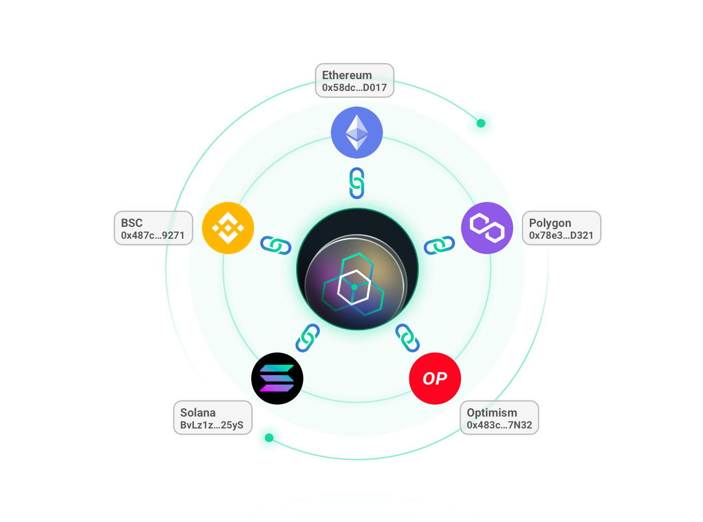

# Overview

---
As a multi-chain integration dex, zkLink functions as the bridging component between separate public chains and layer2 protocols, providing users with DEX scenarios in cross-chain assets in a time/monetary-cost friendly manner.

zkLink supports **the connection between EVM-compatible public chains and EVM-incompatible chains**, where users can link to heterogeneous blockchain accounts and permanently enjoy chain interoperability with assets on Layer2 network with a user-experience similar to CEX.

By connecting separate Layer1 networks with a single Layer2 network, tokens belonging to different ecosystems can be directly swapped with each other freely on this second layer, without an intermediate token. **Users will see the pairs that have never been seen before**, such as CAKE-SUSHI, BNB-HT, USDT(ERC20)-USDT(BEP20), BUSD-HUSD, WBTC-BTCB, etc.  

To maximize product performance and optimize user experience, zkLink adopts zero-knowledge technology. Apart from unimpeded traffic and real-time transaction on Layer2, users can expect a negligible gas fee largely shared since hundreds of transactions are batched and compressed into one pack. Moreover, zkLink will refer to Uniswap V3 on concentrated liquidity so that capital efficiency could be increased by about 4,000 times in the following version.

zkLink v1 will support Ethereum, Polygon, Binance Smart Chain, Huobi ECO Chain (HECO), and in the foreseeable future, will also be connected with other smart chains and layer2 protocols such as Solana, Optimism, Fantom, etc.
