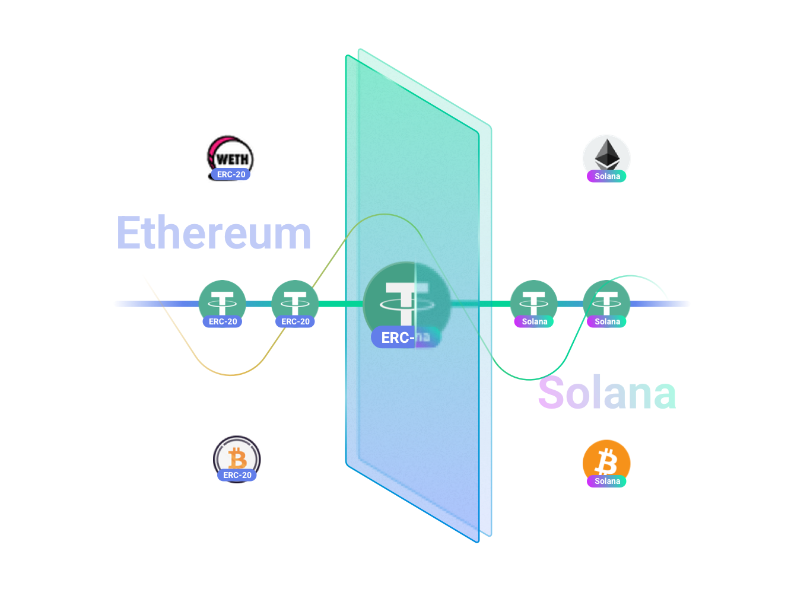
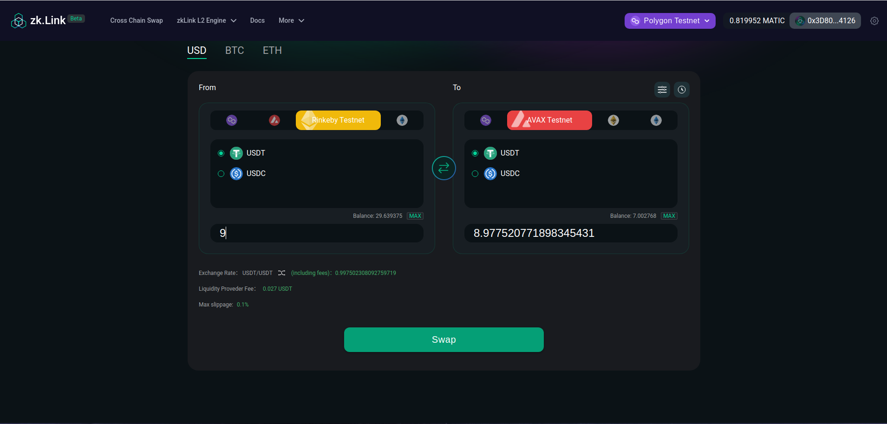

# L2 Stablecoin Mirror

---

zkLink supports **one-step stablecoin swaps** with stablecoins and anchored assets (e.g, BTC, ETH) across different chains and of different kinds on zkLink Layer2 Engine, as efficiently and economically as possible.

For example, on zkLink's Layer2 network, users can not only transfer their USDT on Ethereum (ERC-20) to BSC (BEP-20), but also swap their USDT on Ethereum to USDC on BSC.

Designed for DeFi traders and zkLink Layer2 Engine adopters, offering lower slippage, and low costs especially for large transactions.

> **🥇** Features
- A stablecoin-specialized AMM curve, referring to Curve.fi.
- Negligible slippage and low transaction fees.

<!-- mirror img -->

