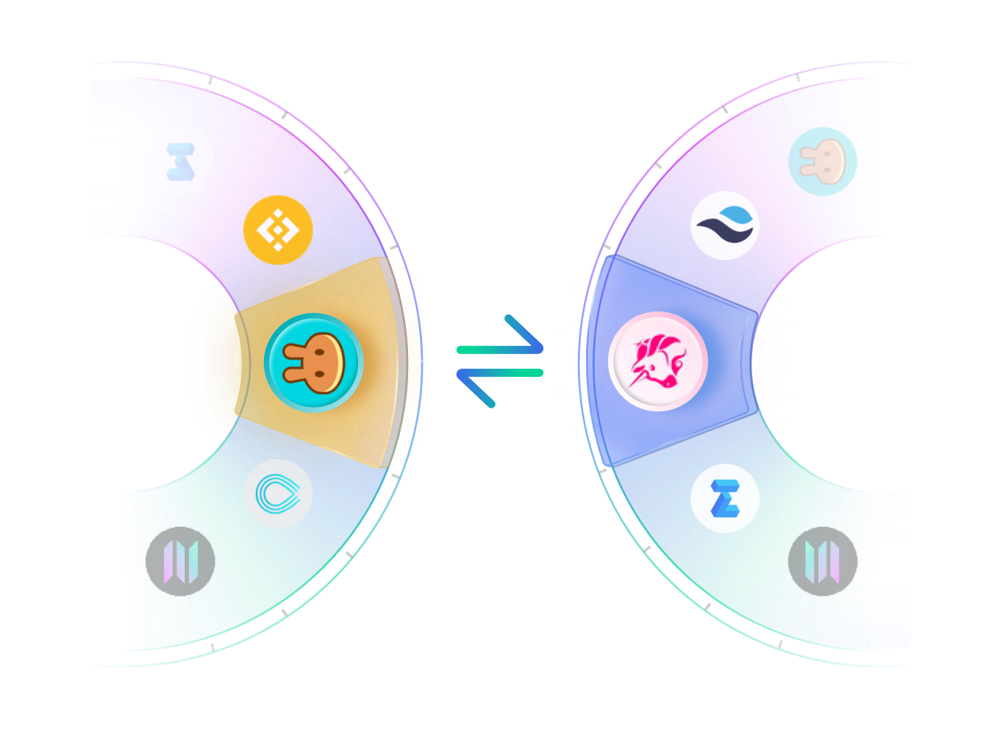
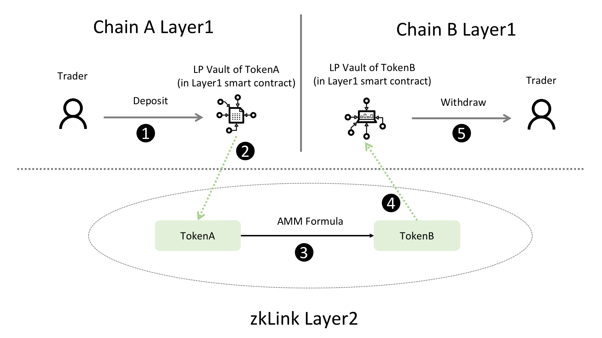

# Use Case 2: Multi-Chain AMM DEX

---
> **🥇** One-stop cross-chain transactions and trading

Permissionlessly create multi-chain LPs that consist of native tokens from separate chains, and of any type, such as ETH-SOL, UNI-CAKE, USD-XXX and more. Multiple trading curves are supported: constant product curve (UNI V2), optimized stableswap curve (Curve.fi), and concentrated liquidity model (UNI V3) - in development.

- **A Seamless and Easy-to-Use Trading Experience**
  - With negligible slippage on stablecoins;
  - No need to install multiple wallets from each chain;

- **Real-time settlement based on zk validity proofs**

## Partial Liquidity
When traders perceive the "direct" cross-chain liquidity pairs composed of tokens from two separate chains, there is no actual "cross-chain" events happened. As illustrated below, traders only interact with Layer1 smart contracts deployed on both source and target chains, to be more evocative, with a "vault" on each chain containing a single kind of token - where liquidity providers "put" their money.

Step 3 in the figure is elaborated in [Multi-chain ZK-Rollup](/docs/Technology/Technology#a-multi-chain-zk-rollup) and [Multi-chain AMM](/docs/Technology/Technology#a-use-case-of-multi-chain-zk-rollup-a-multi-chain-amm). In step 2, a `Layer1_Watcher` on zkLink Layer2 network is constantly monitoring Layer1 smart contract logs, and synchronizes parameters of each transaction to Layer2 engine for computation. Similarly in step 4, a `Layer1_Sender` passes the verified outcome to Layer1 contract on the according chain, which then transfers the wanted tokens to the trader. This is how zkLink Layer2 contract receives and send information from / to different Layer1 smart contracts.
