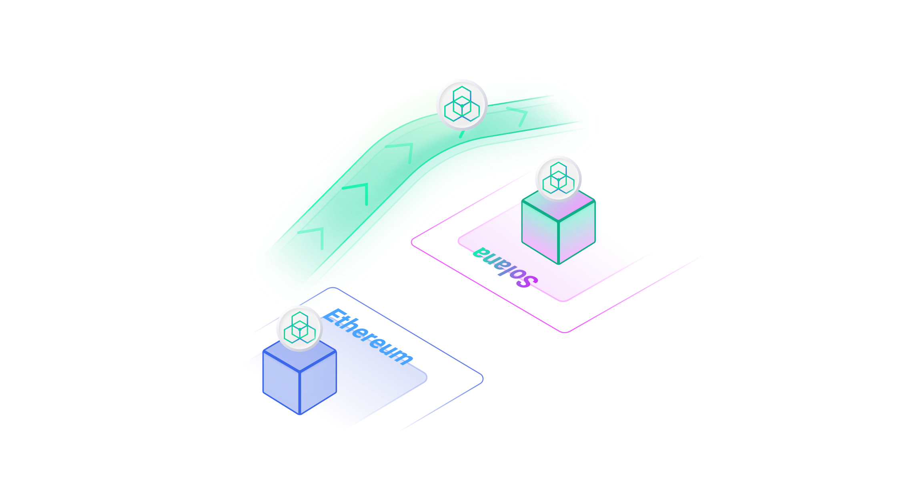
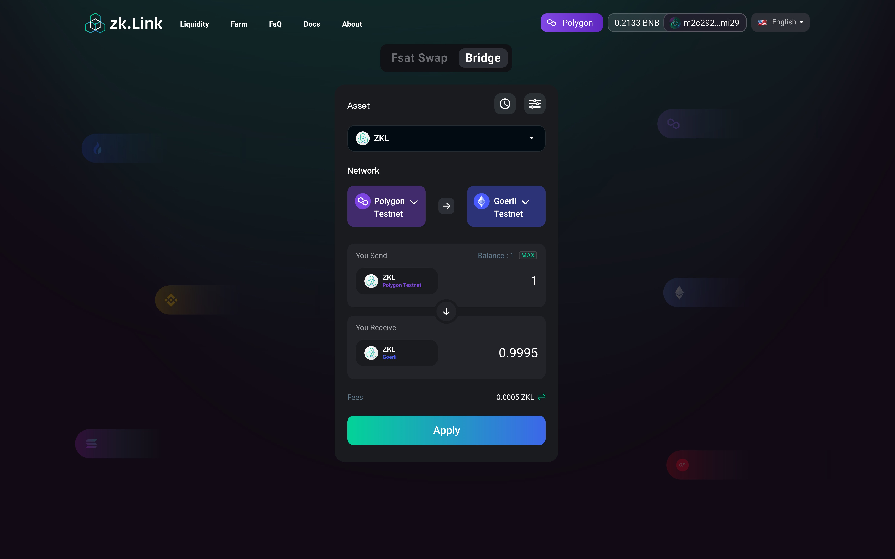

# Bridge

---

Fast Bridge is a multi-chain token mapping instrument on top of zkLink's high-performance and secure chain-to-chain infrastructure, boosting DeFi projects with their multi-chain deployment.

> **🥇** Features
- The security of mapping tokens is guarded by zero-knowledge technology from being maliciously minted.
- Different from the bridges controlled by a multi-sig community, new token-offering request would only be executed once it passes ZK verification.

