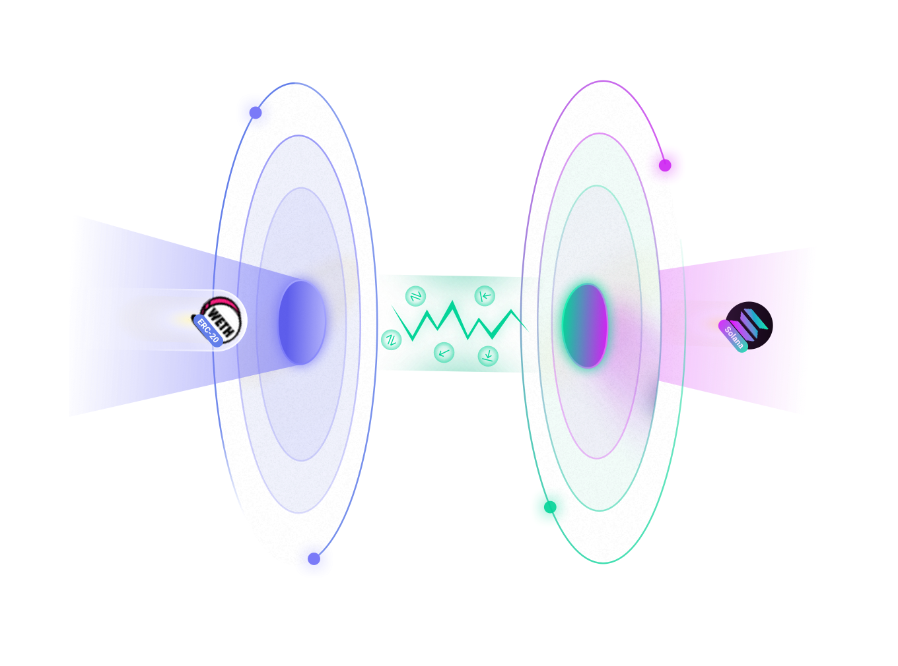
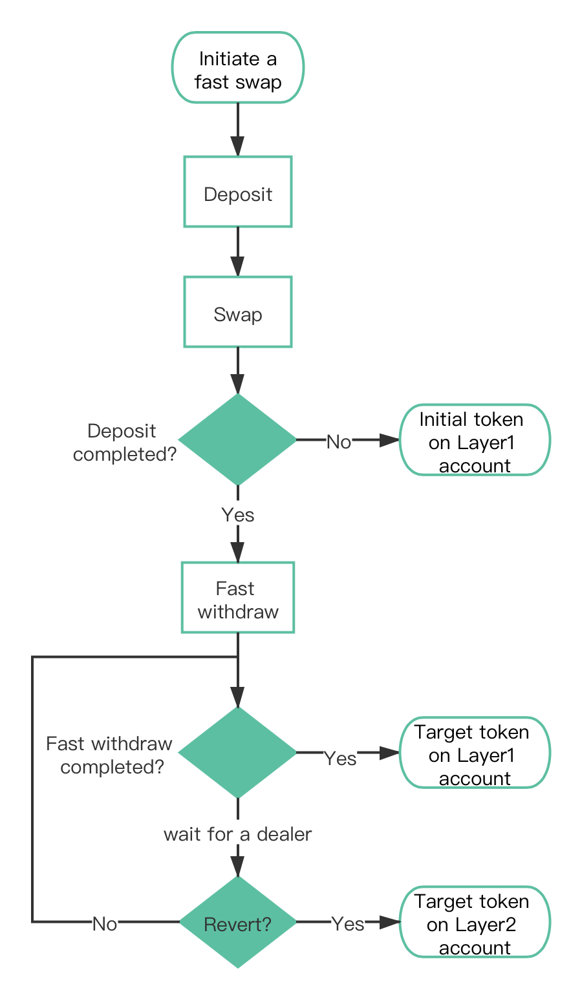

# Fast Cross Chain Swap

---

zkLink provides fast cross-chain transaction service for popular tokens from different chains, where **traders can enjoy chain interoperability on Layer1 without depositing tokens to zkLink Layer2 network in advance**.

For those whose demand is merely cross-chain swapping instead of participating on layer2 eco scenarios such as farming and loaning, they can simply achieve their goals via Fast Cross Chain Swap on Layer1. Target tokens will be on their layer1 wallet within only a few blocks' time.

> **🥇** Features
- Security guaranteed with a decentralized, tech-oriented solution and credible environment based on zero-knowledge technology.
- In virtue of Fast Withdraw technology, zkLink has managed to call Layer2 liquidity pool on Layer1 for a user-friendly experience.

## Mechanism

When users enjoying "one-click" cross-chain swapping, there are actually several procedures behind the scene:

1. Deposit: initial tokens will be automatically deposited to zkLink Layer2 network.
2. Swap: on zkLink Layer2 network, initial tokens will be directly swapped into target tokens on corresponding AMM-based liquidity pool.
3. Fast withdraw: once the swap is confirmed, target tokens will go to a dealer's Layer2 wallet, who will then transit right amount of target tokens to the user's Layer1 wallet from its Layer1 wallet. In this case, zkLink manages to save users even more time by avoiding the process of withdrawal from Layer2 to Layer1.
