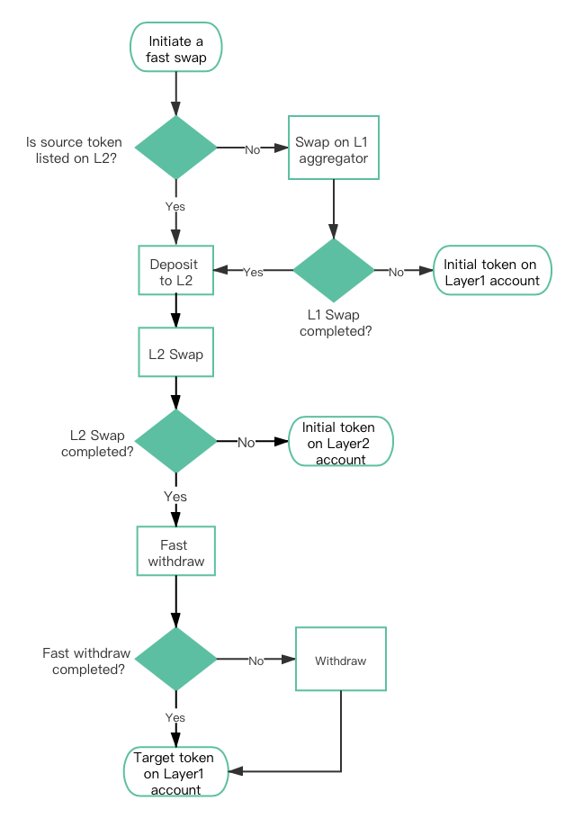
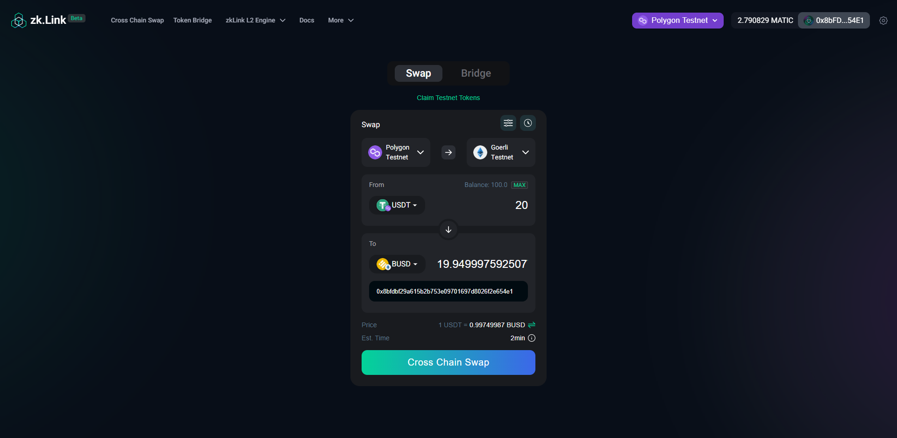

# Fast Cross Chain Swap

---

FastSwap a chain-to-chain trading tool based on zkLink's high-performance and secure multi-chain infrastructure, enabling "one-click" cross-chain transactions, where target token will be on account within only a few blocks’ time.

> **🥇** Features
- State-of-the-art cross chain transaction user experience.
- A chain-to-chain AMM model based on zkLink multi-chain Layer2 liquidity aggregation.
- High-level security of tokens guaranteed by zero-knowledge technology with a decentralized, tech-oriented solution and credible environment, effectively protecting cross-chain transactions and chain interoperation protocols from hackers.
- In cooperation with third-party Layer1 AMM protocols, more kinds of coins can be easily swapped to a frequently-used token from another chains, especially USD*.

zkLink provides fast cross-chain transaction service for popular tokens from different chains, where **traders can enjoy chain interoperability on Layer1 without depositing tokens to zkLink Layer2 network in advance**.

For those whose demand is merely cross-chain swapping instead of participating on layer2 eco scenarios such as farming and loaning, they can simply achieve their goals via Fast Cross Chain Swap on Layer1. Target tokens will be on their layer1 wallet within only a few blocks' time.

## Layer1 DEX Aggregator
For those less frequently-used tokens, zkLink Fast Cross Chain Swap breaks the barrier and offers a solution where users can trade them across separate chains. And this is achieved efficiently without adding a long list of liquidity pairs.  

zkLink aggregates multiple leading decentralized exchanges such as Uniswap. When an user initiates a cross-chain request with the source unlisted on any of the zkLink's L2 liquidity pools, the system would compare different Layer1 DEXs on the source chain in zkLink aggregator, **find the most cost-effective route and exchange rate**, and then swap the source token to an intermediary that is listed on zkLink Layer2 liquidity pools. We will then help the user to swap this intermediary to his/her designated token and then initiates the Fast_Withdraw protocol (elaborated below). - **This all happens within a few minutes, with no manual intervention required.**

In this manner, the scope of available source tokens is expanded considerably. Theoretically, any token that is listed on its local DEXs can be exchanged globally, so that traders do not need to bother exchanging their source tokens to something zkLink supports in advance when zkLink accomplishes this for them, saving them even much more trouble. In addition, with the support from third-party Layer1 DEXs, the number of necessary liquidity pairs on zkLink Layer2 network drops significantly, contributing to greater depth and lower slippage in the current liquidity pools.

## Mechanism

When users enjoying "one-click" cross-chain swapping, there are actually several procedures behind the scene:

1. If the source token is not listed on zkLink Layer2 liquidity pools, it will be firstly swapped into an "initial token" on zkLink Layer1 DEX Aggregator. Otherwise this step is skipped.
2. Deposit: initial tokens is automatically deposited to zkLink Layer2 network.
3. L2 Swap: on zkLink Layer2 network, initial tokens will be directly swapped into target tokens on corresponding AMM-based liquidity pool.
4. Fast withdraw: once the swap is confirmed, target tokens will go to a broker's Layer2 wallet, who will then transit right amount of target tokens to the user's Layer1 wallet from its Layer1 wallet. In this case, zkLink manages to save users even more time by avoiding the process of withdrawal from Layer2 to Layer1.

