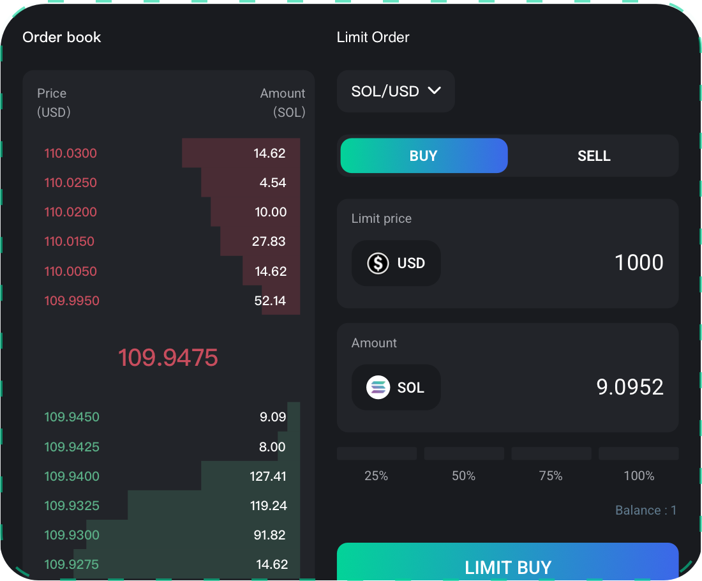

# Use Case 1: Multi-Chain Orderbook DEX

---
> **🥇** A seamless, permissionless, and anti-censorship multi-chain trading experience

zkLink supports atomic swap for order book traders (both spot trading and margin trading). With the unified massive liquidity on the zkLink L2 network, we achieve limit orders and stop loss functions in a decentralized way for DeFi traders.

### Simple CEX-like user experience
- Partial fulfillment and multiple pending orders are supported;
- Up to 32 maker orders;

### Secure and efficient
- High performance centralized buy/sell matching, but with decentralized finality;
- Non-custodial assets, secured by ZK-Rollup L2 wallet;

### Easy to deploy for MM
- Use existing market making strategy, only an extra sig service is needed.

