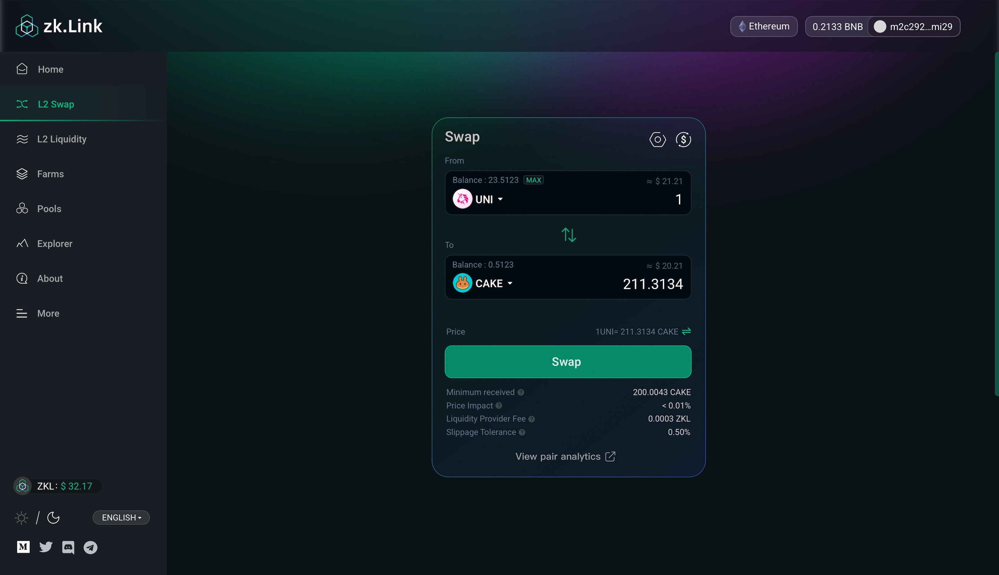
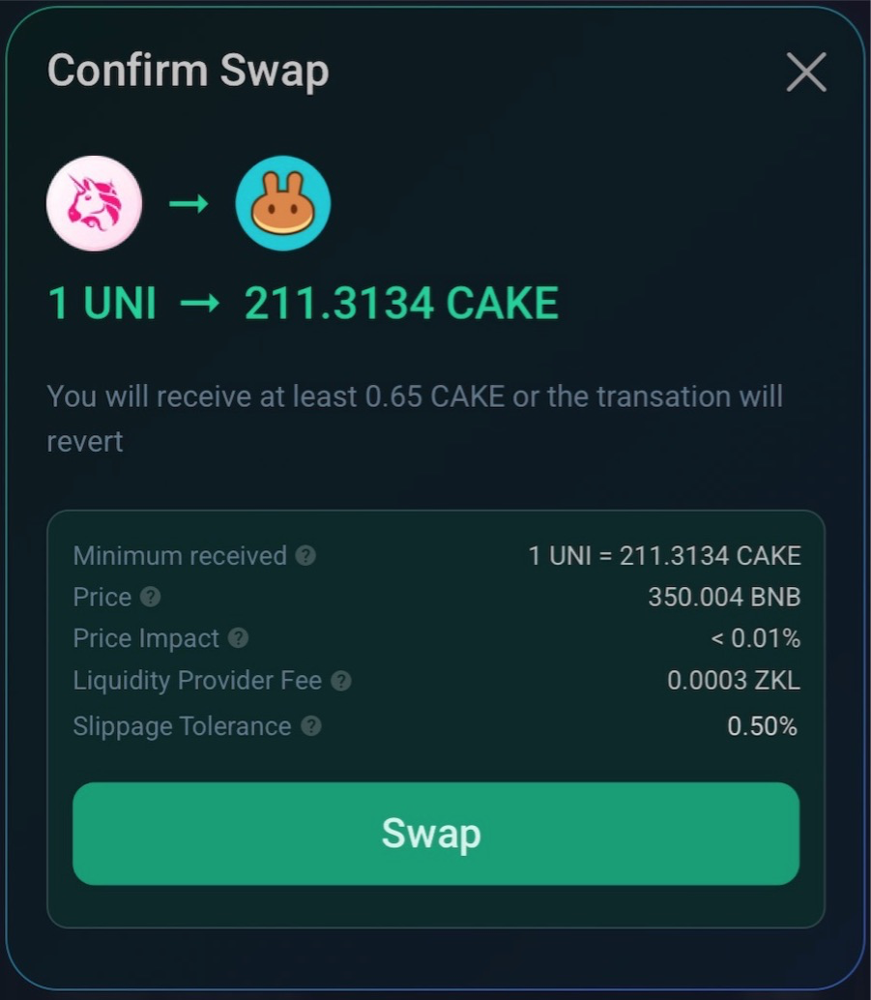

# Multi-chain

---

zkLink supports **one-click swapping** with assets which are **native for projects of different ecological types and public chains**.

For example, users can swap UNI on Ethereum for CAKE on BSC via zkLink with only one click, and can withdraw targeted tokens to respective chains to make full use of capital.

All intermediate steps are performed behind the scene: it means that users do not need to go through these steps by themselves, saving much trouble, time and money. Through zkLink, users can switch assets easily among disconnected chains.

<!-- proswap0 img -->

<!-- proswap1 img-->

