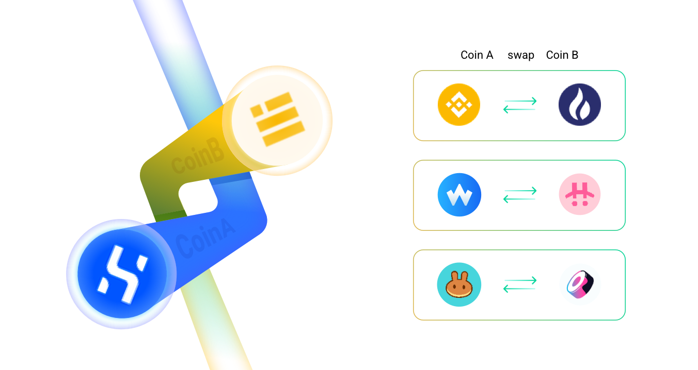
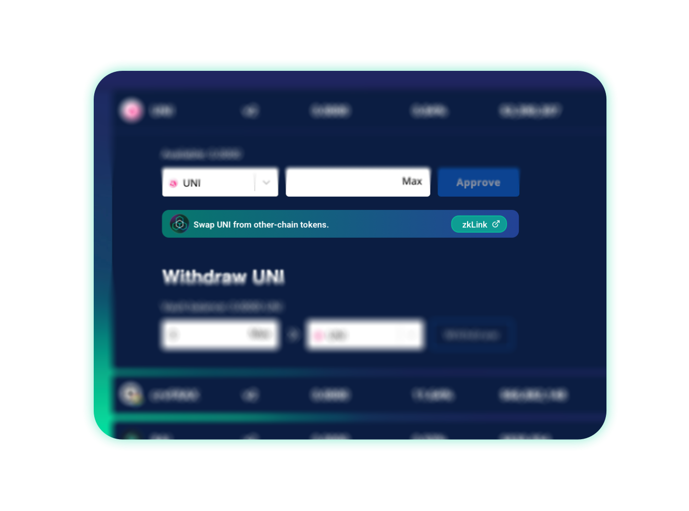
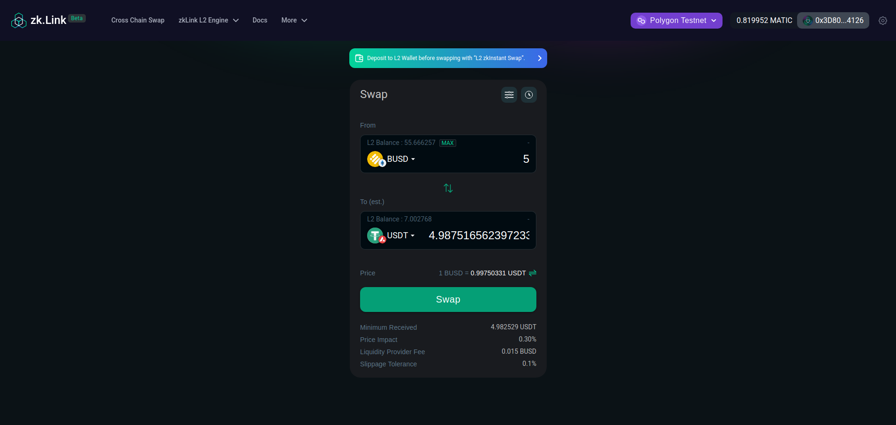

# Swap

---

zkLink supports **direct swapping** with assets which are **native for projects of different ecological types and public chains**.

> **🥇** Features
- Based on AMM model.
- Instant finality of transactions, compared with a long wait-time of other cross-chain solutions.
- No intermediary required, as direct liquidity pairs composed with native assets from separate chains are built.

On zkLink Layer2 network, there will be no boundary between two ecos, and local assets can be easily traded globally. For example, users are able to swap UNI on Ethereum for CAKE on BSC via zkLink with only one click, and can withdraw targeted tokens to respective chains to make full use of capital.

All intermediate steps are performed behind the scene: it means that users do not need to go through these steps by themselves, saving much trouble, time and money. Through zkLink, users can switch assets easily between disconnected chains.

<!-- proswap0 img -->

