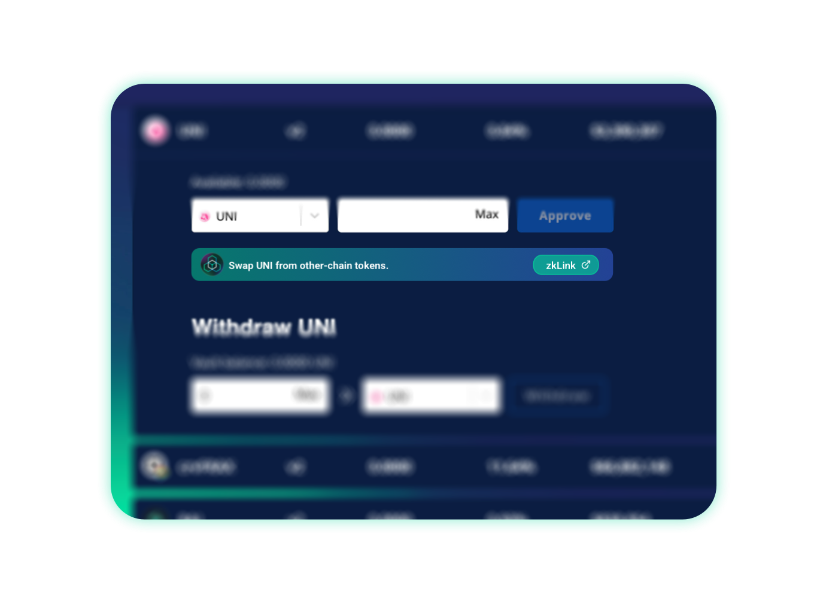

# Widget & SDK

---
With the support from FastCrossChainSwap, zkLink provides a brand new deposit channel for third-party DeFi projects by offering visualization component, which takes only a few steps to be plugged in (no coding required).

With zkLink widget settled, users can play with third-party DeFi (such as Vaults, Lending, etc.) with any kinds of assets from any public chains.

As a developer, imagine that your user needs to stake UNI to participate a campaign on your platform, but the only token that he/she holds is CAKE. If zkLink widget is plugged in your protocol, that user can simply swap his/her CAKE to UNI without even navigating out of the website.

<!-- <iframe src="https://docs.google.com/presentation/d/e/2PACX-1vQzcNbxfntaKxul5aCs-3aHix8UFZ4Via_9AM8r2_ERy8XFT0CGPQufu6J3NxoswdUdUoGtHF739Lhf/embed?start=true&loop=false&delayms=3000" frameborder="0" width="960" height="569" allowfullscreen="true" mozallowfullscreen="true" webkitallowfullscreen="true"></iframe> -->
