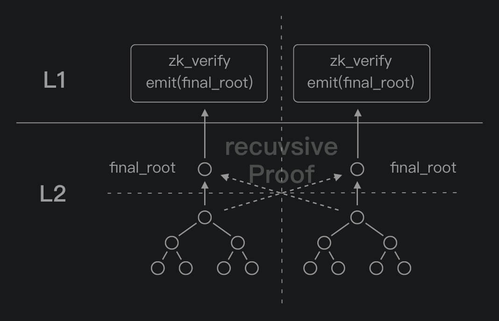
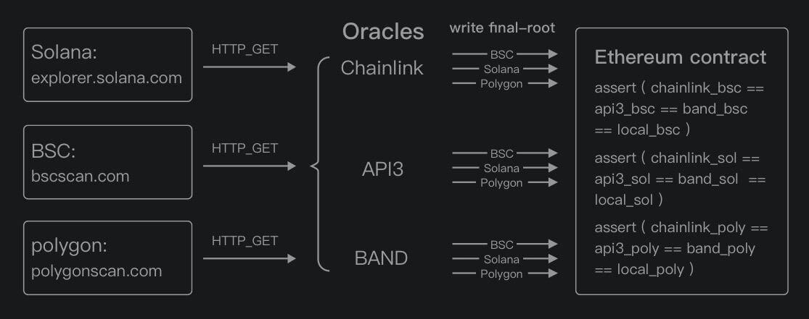

# About Security

---

zklink uses a unified off-chain L2 state to record the information transmitted between separate chains.

Inherited from classic ZK-Rollup, all L2 state changes will be uploaded to the corresponding Layer1 network. From the perspective of a single chain, zero-knowledge is capable to ensures that all state changes are the result of accurately running the circus. However, when it comes to cross-chain transactions, zero-knowledge fails to testify whether cross-chain data (data coming from the other chain) is authentic - even if it might satisfy the constraints of circuit, it is not necessarily TRUE. So how does zklink solve this problem of data authenticity?

Read more on [How does zkLink guarantee the authenticity of cross-chain data?](/docs/Technology/About-Security#how-does-zklink-guarantee-the-authencity-of-cross-chain-data)

## Security assumptions
The security of zkLink system is under the assumptions below:

- The proper operation of public chains and VM-compatible scaling protocols connected. The purpose of zkLink is to connect chains together, wherein the "bucket effect" exists in zkLink systemic risk, which means that the minimum commitment of zkLink security is determined by the one with the lowest security level among the many chains connected. Of course, the decision on connecting or removing a chain should be seriously considered and made collectively by the community.
- zkLink team will never conspire with Chainlink or other oracles.

## How does zkLink support direct interaction of multi-chains?

Zero-knowledge can turn the verification of a complicated logic into a simple proposition - it is one of the fundamental characteristics of ZK technology, and zkLink makes full use of it.

Based on the classic ZK-Rollup design, zkLink conducts an additional `recursive proof`, whose data comes from the two chains interacting with each other. After a valid recursive proof, the current states of different chains are interrelated mathematically, which is constrained by the circuit. We will open up the circuit related to zero-knowledge for third parties to verify it easily.

Once the recursive proof is executed, the two independent systems will be having a mutual final_root.

## How does zkLink guarantee the authencity of cross-chain data?
There is no need for zkLink to verify every details from the massive amounts of data. The recursive ZK-SNARKs endow the data and the final_root with an unidirectional causality like a hash function. Once the final_root is settled, there would be no person or organization capable of faking the source data of this final_root.

What an exciting feature - it signifies that we have turned a complicated and uncertain problem into a extremely simple task - comparing whether the two or more final_roots are uniform or not.

We utilize an oracle for data transmission, letting the smart contract to testify the consistency of final_roots. There are a number of oracles to choose from thanks to the development of DeFi-verse.

** According to the features of each Layer1 network, the choice of oracle can be different.

We have multiple Oracle networks working together, forming a community like a multi-sig. More than one oracles can further improve the security level, while the change of members in each oracle network can be voted on by zkLink DAO. Such a big decision should be made under prudent consideration so that there would be a cooling-off period for every community members to be notified.

## How nodes are operated?
Just like Loopring, zkSync, zkSwap, and other successful scaling solutions based on ZK-Rollup, the node of zkLink is also operated by the team.

You may think of zkLink as a centralized project, but you are only partly right - in very small part. How?

On the security side, zkLink system is `COMPLETELY` decentralized, eliminating the risk of malicious behavior from operators or validators - not because they don't want to, but because they are not able to - thanks to zero knowledge technology.

Under the premise of open-source circus, every off-chain execution must comply with the circuit's specifications. Just like the regulatory framework of a company, circuit is how zkLink world functions. Any illegal operations would be exposed during `zk verify`, which is processed by the smart contract with the verify key stored in. Both the algorithm of `zk verify` and `verify key` will be published online. As long as the circuit has been rigorously audited without any malicious logic, the ZK-based system can be considered as safe and sound.

For more information regarding the security of ZK technology, please refer to  *An Incomplete Guide to Rollups* by Vitalik Buterin (https://vitalik.ca/general/2021/01/05/rollup.html).

## zkLink is equipped with stronger anti-attack capability

As mentioned above, zkLink is operated by the zkLink team. Diving deeper into the recent cross-chain security incidents, we can conclude that all of them are resulted by coding bugs or system failure, instead of their consensus mechanism. From this point of view, zkLink, in virtue of ZK-Rollup, is equipped with stronger anti-attack capability comparing to other open-source systems, in the way that we adopts more traditional web security defense techniques.

In addition, extra consensus does not equal to absolute security. In the security incident happening on polynetwork on Aug 10, 2021, a bug on consensus was thought to blame. What will happen if the same thing occurs on zkLink? Nothing - at most the service would be shut down for some time. No harm would be done for tokens, since in zkLink system, it is pure mathematics that has the right to decide what will happen, instead of the validators, who can only convey a "yes" or "no".

#### Recent attack cases:

* [Umbrella Network — Update on Chainswap Hack](https://medium.com/umbrella-network/umbrella-network-update-on-chainswap-hack-628d1aaaa873)
* [Anyswap Multichain Router V3 Exploit Statement](https://anyswap.medium.com/anyswap-multichain-router-v3-exploit-statement-6833f1b7e6fb)
* [First attack on THORChain](https://www.reddit.com/r/THORChain/comments/oa0kss/first_attack_on_thorchain_fixed_already/)
* ['Critical Issues' With Thorchain After 2nd Hack in a Week](https://decrypt.co/76694/critical-issues-with-thorchain-after-2nd-hack-week)
* [PolyNetwork Suffers Record-Breaking $600.3 Million Hack](https://decrypt.co/78163/polynetwork-suffers-record-breaking-600-3m-hack)

## Highlights

- zero-knowledge technology guarantees the correctness of computation, while the oracle networks achieves the consistency of multi-chain states.

- chain interoperation is complicated and unforeseeable. With the help of zero-knowledge technology, zkLink simplifies the process to a degree that everyone can understand and supervise it.

- Less is more. The conciseness of POW has made today's Bitcoin
