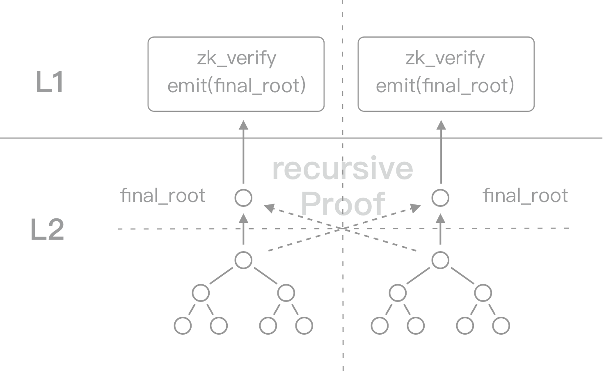
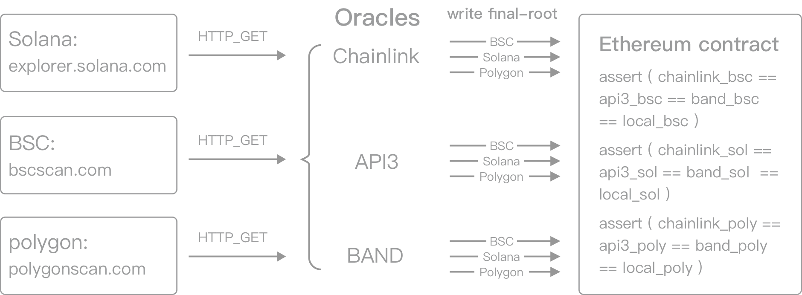

# Security

---

zklink constructs a off-chain L2 network to monitor and record the information transmitted between separate chains and Layer2 networks.

Inherited from classic ZK-Rollup, all L2 state changes will be uploaded to the corresponding Layer1 network. For transactions within a single chain, zero-knowledge is capable of ensuring that all state changes are the result of accurately running the circuit. However, when it comes to cross-chain transactions, zero-knowledge fails to testify whether cross-chain states (Hash values of another chain) is valid - even if it might satisfy the constraints of circuit, it is not necessarily TRUE. So how does zklink solve this problem of data authenticity?

We will address this problem from the two perspectives mentioned in [the previous chapter](/docs/Technology/Overview#two-key-components-in-cross-chain-interoperability).

## Security assumptions
The security of zkLink system is under the assumptions below:

- The security of public chains and VM-compatible scaling protocols connected. The purpose of zkLink is to connect chains together, wherein the "bucket effect" makes the minimum commitment of zkLink security is determined by the one with the lowest security level among the many chains connected. Of course, the decision on connecting or disconnecting a chain should be seriously considered and made collectively by the community.
- zklink, Chainlink and other oracles are obligated to the DeFi community by acting in good faith in all decisions taken, and will reject and report any malicious action.

## The correctness of cross-chain computation

Zero-knowledge can turn the verification of a complicated logic into a simple proposition - it is one of the fundamental characteristics of ZK technology, and zkLink makes full use of it.

Based on the classic ZK-Rollup design, zkLink conducts an additional `recursive proof`, whose data comes from the two chains interacting with each other. Once the recursive_proof function is executed, the two independent systems have a mutual `final_root` on the zkLink Layer2 network.

Then, just like a classic ZK-Rollup solution, zkLink uploads all the necessary information of the transaction, along with the `final_root`, to the Layer1 contract on both chains for the purpose of on-chain data availability.

The recursive ZK-SNARK will be further approved by `zk_verify` function, before the Layer1 smart contract emits log `final_root`.

When the `final_root` is settled, it is not possible to fake the source data of this final_root, since the data and the `final_root` exhibit a nonlinear causality (in a self-reinforcing loop).

## The validity of cross-chain states
There is no need for zkLink to verify every details of the massive amount of data. The recursive ZK-SNARKs endow the data and the final_root with an unidirectional causality like a hash function. Once the final_root is settled, there would be no identity or organization capable of faking the source data of this `final_root`.

What an exciting feature - it signifies that we have turned a complicated and uncertain problem into an extremely simple task - comparing whether the two or more `final_roots` are consistent or not.

In most chain-interoperation projects, the consistency of the multi-chain status is checked by a multi-sig group, meaning the state validity depends on the logic of the program - or the competence of the people who actually wrote the code.

zkLink in contrast, is secure by design, and provides a mechanism to check if the final_roots from two interacting chains match. Instead of running our own program, we utilize an oracle network for data transmission, which passes the final_root of one chain to the other, and the local smart contract can simply compare the final_root with its own. Thanks to the development of DeFi-verse, there are a number of oracles to cooperate with.

** According to the features of each Layer1 network, the choice of oracle can be different.

We have multiple Oracle networks working together, forming a community like a multi-sig. More than one oracles can further improve the security level, while the change of members in each oracle network can be voted on by zkLink DAO. Such a big decision should be made under prudent consideration so that there would be a cooling-off period for every community members to be notified.

## Stable triangle of governance

The data security of zkLink is logically similar to the 'checks and balances' structure of a functioning government: executive, judicial and legislative, equivalently as 3 branches in zkLink as the sequencer, oracle network, and DAO. The sequencer transmits the result of running the circuit to Layer1 smart contracts, while the oracle network has the power to approve or halt it, and the change of members in each oracle network or the sequencer can be voted on by the zkLink DAO.

Such separation of powers is well designed to guard against economic attack from both external hackers and internal stakeholders, by ensuring no single branch has too much power. In this fashion, zkLink is equipped with higher security level and stronger anti-attack capability. We guarantee that traders can retrieve tokens losslessly under any extreme circumstances.

## Preventing attacks on cross-chain trades

By studying the transaction processes of recent cross-chain security hacks, we find there are 2 scenarios where security vulnerabilities often occur: in the computation process, or in the consensus process. With a different logical design, zkLink mitigates risks in both scenarios.

### Vulnerability in the computation process
Diving deeper into the recent cross-chain security incidents, we can conclude that most of them are resulted by Vulnerability in the computation process, i.e., the correctness of computation, rather than consensus mechanism. Here are some of the cases:

* [Umbrella Network — Update on Chainswap Hack](https://medium.com/umbrella-network/umbrella-network-update-on-chainswap-hack-628d1aaaa873)
* [Anyswap Multichain Router V3 Exploit Statement](https://anyswap.medium.com/anyswap-multichain-router-v3-exploit-statement-6833f1b7e6fb)
* [First attack on THORChain](https://www.reddit.com/r/THORChain/comments/oa0kss/first_attack_on_thorchain_fixed_already/)
* ['Critical Issues' With Thorchain After 2nd Hack in a Week](https://decrypt.co/76694/critical-issues-with-thorchain-after-2nd-hack-week)

zkLink, guarded by zero-knowledge technology, is robust to this kind of attack comparing to other open-source systems. Before Layer2 transactions are approved and uploaded to respective Layer1 smart contract, an extra recursive proof with data derived from both chains will be generated based on established ZK-Rollup protocols.

The result of this execution is a mutual `final_root` of the two interacting chains, which guarantees  the new state is the result of the circuit being correctly computed. Of course, zkLink circuit will be opened up for public supervision sooner than mainnet launch.

If hackers try to manipulate data uploaded to Layer1,  it would be rejected by the sequencer. The zkLink dev team adopt a more sophisticated traditional web security defense technique than those open-source Layer1 protocols where the permission of validation is open through competition.

### Vulnerability in the consensus process
Reviewing the most recent [PolyNetwork Hack](https://decrypt.co/78163/polynetwork-suffers-record-breaking-600-3m-hack), what if hackers have managed to break through the authentication of validator? If hackers manage to break the private key of a consensus member, they might potentially gain the privilege to manipulate funds on a smart contract - including the ability to transfer assets to themselves

However, if the same thing happens on zkLink, at most, the service would be stopped for a short time.

The authority of the zkLink consensus community (a network composed of multiple third-party oracles similar to a multi-sig group in other projects) is limited in it's authority to a minimum, as explained in [overview](/docs/Technology/Overview).

Even if hackers manage to spoof or steal the identity of the consensus community, they can never fake a transaction, instead the only damage they can ever cause is rejecting the transaction requests from Layer2 to Layer1, doing no harm at all to assets or account status.
