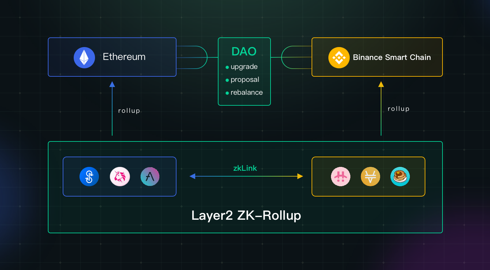

# Multi-Chain

---

**zkLink** connects separate Layer1 networks with a single Layer2 network, so that tokens belonging to different ecosystems can be directly swapped with each other freely on this second layer, without an intermediate token. Users will see the pairs that have never been seen before, such as: CAKE-SUSHI, BNB-HT, BUNNY-COW, etc.

The Layer2 network will generate zero-knowledge proofs of the off-chain state on a regular basis and upload them to respective Layer1 contracts for verification. In this way, data security of assets and transactions is guaranteed by pure mathematics than game model and economic models.

** More specified technical models for multi-chain asset interoperability will be disclosed at a future date.

#### Swap with multi-chain assets

zkLink supports one-click swapping with assets on different chains. For example, users can swap UNI on Ethereum for CAKE on BSC via zkLink with only one click, and can withdraw targeted tokens to respective chains to make full use of capital. All intermediate steps are performed behind the scene: it means that users do not need to go through these steps by themselves, saving much trouble, time and money. Through zkLink, users can switch assets easily among disconnected chains.

#### Provide liquidity with multi-chain assets

Likewise, users can provide liquidity with to pairs from different chains to earn transaction fees, getting the utmost out of their idle funds.

For example, to earn interest with unused UNI on Ethereum and unused CAKE on BSC without a multi-chain aggregator, users have to choose between single staking and swapping via a centralized exchange. But the former is with a small return and the latter requires complex operation. In zkLink, however, users can provide CAKE-UNI liquidity and make full use of these two tokens with high rewards.

#### More scenarios

zkLink is planning on more innovative DeFi scenarios such as cross-chain farming, loaning, and the financialization of NFT, trying to build a free market where assets can interact with each other and create higher values for holders.

<!-- more scenarios插图 -->

