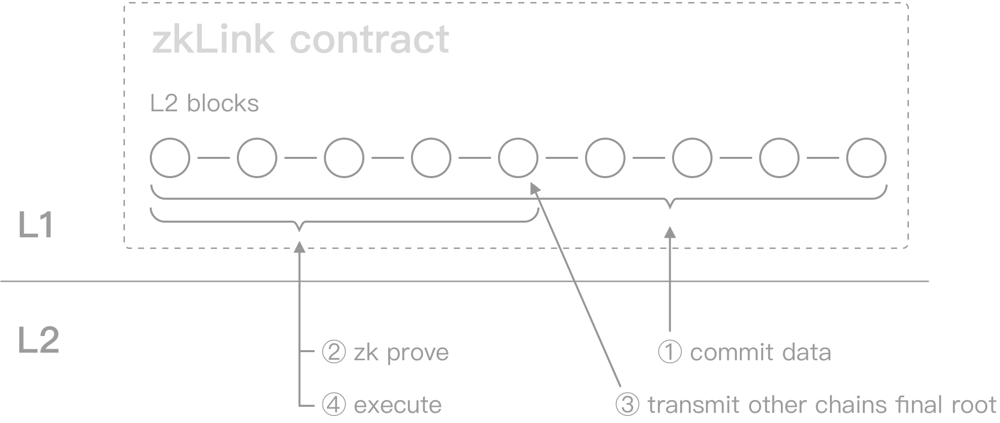

# A Multi-Chain ZK-Rollup
---
## ZK-Rollup Stands Out Among Layer2 Solutions
The current Layer2 solutions can be categorized into the following types: Sidechain, State Channels, Plasma, Rollups (including Optimistic Rollup, ZK-Rollup), and Validium (Matter Labs’ zkPorter). Different solutions vary in terms of data availability and security, with trade-offs in speed, finality time, scalability, computational cost, and security level.

**Sidechain**: Despite its low development and utilization cost, sidechains are not secured by Layer1, and are dependent on the reputation of validators. This flaw prevents large-value trades and limits its usage to frequent transactions.

**Plasma and State Channels**: Theoretically, these solutions can achieve instant withdrawal and the highest TPS among Layer2 technologies. However, it is time and money consuming to set up a specialized channel for each pair of traders. Thus they are more suitable for P2P transactions rather than common trading requests. Moreover, a Plasma/State Channels project depends on the constant attention of users or a watchtower to monitor each transaction for security purposes (liveness requirement).

**Validium**: Validium can ensure the correctness of change-in-states with no withdrawal delay but lacks on-chain data availability. To solve this problem, many Validium solutions rely on a Data Availability Committee (DAC) whose members store a copy of account states off-chain and sign each batch attesting to the correctness of transactions. However, it is still trust-based and weaker than on-chain data availability in that a committee is always easier to attack than a fully-equipped blockchain.

**Optimistic Rollups**: The most significant advantage of a rollup is its on-chain data availability, i.e., to store relevant transaction data on Layer1, which can be verified at any time. Op-Rollup solutions use fraud proofs as their security mechanism, assuming all transactions are rightful by default unless being challenged. This design results in three deficiencies:
- sacrifice in security;
- long wait times before token withdrawal;
- The Dispute Time Frame usually requires seven days and hampers user experience.

**Zero-knowledge Rollups**: In contrast to an Op-Rollup, a ZK-Rollup solution uses a validity proof (a SNARK - succinct non-interactive argument of knowledge) to guarantee that the data uploaded to Layer1 is not manipulated or falsified, ensuring the security of funds by the cryptographic method instead of trust and probability theory. It also resolves the DTF problem that an Op-Rollup faces since it only takes minutes to verify the proofs once sent to Layer1. As a result, ZK-Rollups are faster and more secure, at the expense of more intense computation and deployment difficulty.

> ‘Zero Knowledge Proof’ is a technique which employs cryptographic algorithms so that various parties can verify the veracity of an item of information without sharing the data that compose it.  
——Teresa Alameda

For detailed explanation of ZK-Rollup technology, please refer to [EthHub-io](https://docs.ethhub.io/ethereum-roadmap/layer-2-scaling/zk-rollups/)

## A Multi-Chain ZK-Rollup Model

There are generally three stages in a classic ZK-Rollup solution (referring to the implementation of Matter Labs): commit, prove, and execute. zkLink takes a step further and utilizes ZK-Rollup technology in chain interoperability by introducing a ‘consensus’ stage (step 3 above).

1. Commit: Multiple transactions happening on Layer2, including single-chain and cross-chain transactions, are batched into one bundle and would be uploaded to the smart contract on Layer1 together with a ZK-SNARK. The on-chain data fulfills data availability so that account states can be retrieved if anything goes wrong on the Layer2 network.

2. Prove: ZK proofs are submitted to Layer1 and verified by the smart contract. Once approved, it will emit an event and write a log for the respective blockchain, containing that current final_root (a hash value).

3. Consensus: The oracle network processes this stage, which will accomplish the interchange of the final_root with each chain, and compare if the final_root from the two chains are consistent with each other.

4. Execute: zk_verify guarantees that the new final_root is correctly computed with the old final_root and new transactions info, while the oracle network ensures the final_root is correctly passed to the other chain. Requests for funds flow will be executed once these two steps are confirmed.

## Sequencer
Sequencer are operated by the zkLink team. It does not mean that zkLink is a centralized project. As a matter of fact, zkLink system is **COMPLETELY decentralized** from the perspective of security that eliminates the risk of malicious behavior from operators or validators mathematically- not because they don't want to, but because they simply cannot - zero knowledge technology guarantees this point.

Under the premise of open-source circuit, every off-chain execution must comply with the circuit's specifications. The circuit acts as the regulatory framework of zkLink: any illegal operations would not pass the circuit during `zk verify`, which is processed by the smart contract with the built-in `verify key`. Both the algorithm of `zk verify` and `verify key` will be published online. As long as the circuit has undergone rigorous auditing and is free of logical bugs, the ZK-based system can be considered safe and secure

For more information regarding the security of ZK technology, please refer to  [*An Incomplete Guide to Rollups*](https://vitalik.ca/general/2021/01/05/rollup.html) by Vitalik Buterin.
