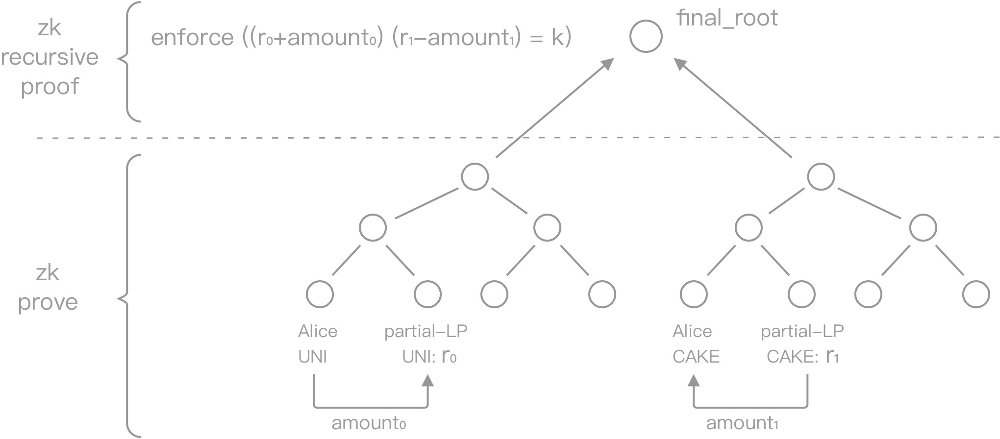

# How zkLink works

## About ZK-Rollup
- [A thorough elaboration of Rollup from Vitalik Buterin](https://vitalik.ca/general/2021/01/05/rollup.html)
- [Matter Labs' ZK-Rollup talk at Zcon1 (video)](https://www.youtube.com/watch?v=QyM9qdFKsEA)
- [Validity proofs (ZK-Rolluo) vs. fraud proofs](https://medium.com/starkware/validity-proofs-vs-fraud-proofs-4ef8b4d3d87a)
- [zkSNARKs in a nutshell](https://blog.ethereum.org/2016/12/05/zksnarks-in-a-nutshell/)

## Technical flow
For the implementation logic and technical flow, please refer to [zkLink Technological Process](/docs/Technology/Overview#zklink-technological-process)

## A Multi-Chain ZK-Rollup

In a classic ZK-Rollup solution, there are generally 3 stages (referring to the implementation of Matter Labs): commit, prove, and execute. zkLink takes a step further an utilizes ZK-Rollup technology in chain interoperability by adding a 'consensus' stage (step 3 in the illustration above) based on the classic solution.

1. Commit: Multiple transactions happening on Layer2, including single-chain transaction and cross-chain transactions, are batched into one transit and would be uploaded to the smart contract on Layer1 together with a ZK-SNARK, which fulfills data availability so that transaction can be rolled back and account states can be recovered when anything goes wrong on Layer2 network.
2. Prove: ZK proofs are submitted to Layer1 and verified by the smart contract. Once approved, it will emit an event and write a log for the respective blockchain, which contains that current `final_root`.
3. Consensus: This stage is processed by the oracle network, who will accomplish the interchange of the `final_root` from each chain, and will submit it to the smart contract.
4. Execute: Compared with a classic ZK-Rollup solution, zkLink adds a prerequisite that the old and current `final_root` must be consistent. Once this prerequisite ZK proofs are proved, requests for funds flowing from L2 to L1 will be executed.

Thanks to MatterLabs for their contributions, otherwise the implementation of multi-chain ZK-Rollup will be more difficult than expected.

## A Multi-Chain AMM

In the current zkLink V1, the multi-chain AMM is realized by a new concept of "partial-LP" as shown in the figure. The two halves of one liquidity pair are stored in the two parallel states.

The process of swap is also divided into two parallel processes, respectively being 'funds transferred to LP pair' and 'funds transferred out from LP pair' from user perspective.

During the first ZK prove, the circuit will accept any value of `amount0`, `amount1`, `r0`, and `r1`, calculating a `proof` value on each chain. After which, a recursive ZK prove function is processed with parameters including the same parameters as the previous function plus the two `proofs` (the results of running the first ZK prove function). During the recursive verification, the circuit imposes restrictions on that `amount0`, `amount1`, `r0`, and `r1` satisfy the AMM constraint (constant product as shown below):

`enforce((r0 + amount0)*(r1 - amount1) == r0 * r1)`

This is how the two separate systems are interconnected - they share a mutual final root. Of course, the above equation is only a simplified version with transactions fees excluded.

## Partial Liquidity
When traders perceive the "direct" cross-chain liquidity pairs composed of tokens from two separate chains, there is no actual "cross-chain" events happened. As illustrated below, traders only interact with Layer1 smart contracts deployed on both source and target chains, to be more evocative, with a "vault" on each chain containing a single kind of token - where liquidity providers "put" their money. (read more on [one-coin LP](/docs/functionality/L2liquidity)).

Step 3 in the figure is elaborated in [Multi-chain ZK-Rollup](/docs/Technology/Technology#a-multi-chain-zk-rollup) and [Multi-chain AMM](/docs/Technology/Technology#a-multi-chain-amm). In step 2, a `Layer1_Watcher` on zkLink Layer2 network is constantly monitoring Layer1 smart contract logs, and synchronizes parameters of each transaction to Layer2 engine for computation. Similarly in step 4, a `Layer1_Sender` passes the verified outcome to Layer1 contract on the according chain, which then transfers the wanted tokens to the trader. This is how zkLink Layer2 contract receives and send information from / to different Layer1 smart contracts.

## High-Availability Architecture of zkLink Layer2

zkLink has prepared at least two active servers for each chain for L2-state storage and has implemented a highly available data synchronization system based on relational databases.

The front-end is hosted in AWS's container service with high-availability, while the api services are deployed based on LBS (load balance service) provided by a cloud service provider. In addition, at least 3 servers will be plugged in to ensure the high availability of service.

ZkLink has also prepared an independent internal control system which independently audits whether the data submitted to Layer 1 is correct, to avoid temporary service shutdown caused by computational errors.

## Nodes Operation
Just like Loopring, zkSync, zkSwap, and other successful ZK-Rollup scaling solutions, nodes of zkLink are also run by the team. It does not mean that zkLink is a centralized project. As a matter of fact, zkLink system is **COMPLETELY** decentralized from the perspective of security, eliminating the risk of malicious behavior from operators or validators - not because they don't want to, but because they are not able to - zero knowledge technology guarantees this point.

Under the premise of open-source circuit, every off-chain execution must comply with the circuit's specifications. Just like the regulatory framework of a company, circuit is how zkLink protocol functions. Any illegal operations would be exposed during `zk verify`, which is processed by the smart contract with the `verify key` built in. Both the algorithm of `zk verify` and `verify key` will be published online. As long as the circuit has been rigorously audited without logical bugs, the ZK-based system can be considered as safe and sound.

For more information regarding the security of ZK technology, please refer to  *An Incomplete Guide to Rollups* by Vitalik Buterin (https://vitalik.ca/general/2021/01/05/rollup.html).
