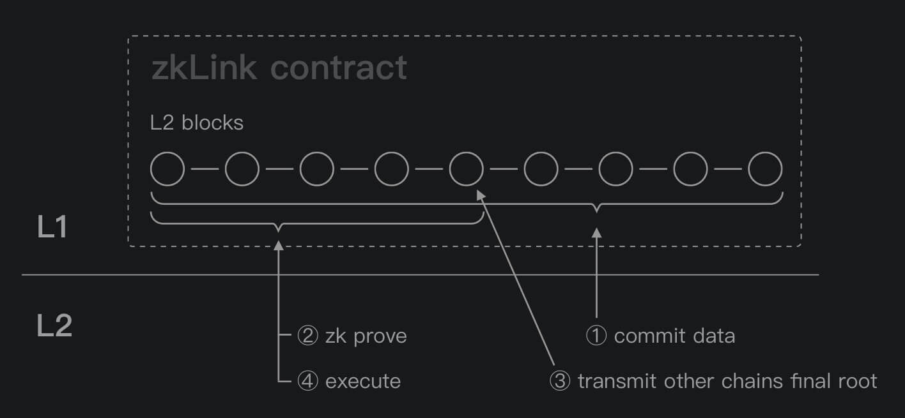
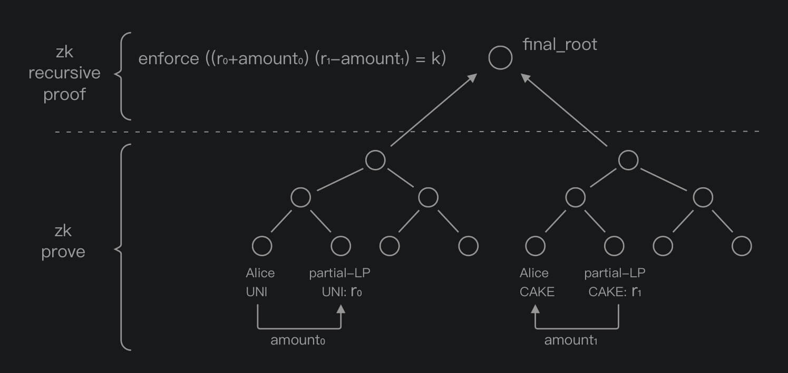

# Technology

## About zkRollup
- [A thorough elaboration of Rollup from Vitalik Buterin](https://vitalik.ca/general/2021/01/05/rollup.html)
- [Matter Labs' ZK-Rollup talk at Zcon1 (video)](https://www.youtube.com/watch?v=QyM9qdFKsEA)
- [Validity proofs (ZK-Rolluo) vs. fraud proofs](https://medium.com/starkware/validity-proofs-vs-fraud-proofs-4ef8b4d3d87a)
- [zkSNARKs in a nutshell](https://blog.ethereum.org/2016/12/05/zksnarks-in-a-nutshell/)

## The difference between a multi-chain ZK-Rollup and a classic ZK-Rollup

The classic ZK-Rollup solution generally consists of 3 stages (referring to the implementation of Matter Labs): commit, prove, and execute. In order to achieve chain interoperation in a more secure manner, zkLink inserts a 'Consensus' stage to this cycle based on the classic solution.
1. Commit: Transactions happening on Layer2, including single-chain transaction and related cross-chain transactions, are batched into one transit and would be uploaded to the smart contract on Layer1, which effectively fulfills data availability so that transaction can be retrospected and account states can be recovered when something goes wrong on Layer2 network.
2. Prove: ZK proofs are submitted to Layer1 and verified by the smart contract. Once approved, it will `emit log`, which contains that current `final_root`.
3. Consensus: This stage is processed by the oracle network, who will accomplish the interchange of the `final_root` from each chain, and will submit it to the smart contract.
4. Execute: Compared with a classic ZK-Rollup solution, zkLink adds a prerequisite that the old and current `final_roots` must be consistent. Once this prerequisite ZK proofs are proved, all requests for funds flowing from L2 to L1 will be executed.

Thanks to MatterLabs for their contributions, otherwise the implementation of multi-chain ZK-Rollup will be more difficult than expected.

## How does zkLink's multi-chain AMM work?

In the current zkLink V1, multi-chain AMM is achieved by partial-LP as shown in the figure. The two halves of one pair are stored in the two parallel states.

The process of swap is also divided into two parallel processes, respectively being 'funds transferred to LP pair' and 'funds transferred out from LP pair' from user perspective.

During the first ZK prove, the circuit will accept any value of `amount0`, `amount1`, `r0`, and `r1`. But during recursive ZK prove, the circuit will require that `amount0`, `amount1`, `r0`, and `r1`
still satisfy the AMM constraint (constant product as shown below):

`enforce((r0 + amount0)*(r1 - amount1) == r0 * r1)`

Of course, this is a simple equation with transactions fees excluded.

## High-availability architecture of zkLink Layer2

zkLink has prepared at least two active servers for each chain for L2-state storage datastore and has implemented a highly available data synchronization system based on relational databases.

The front end is hosted in AWS's container service with high-availability, while the api services are deployed based on the LBS (load balance service) provided by a cloud service provider. In addition, at least 3 servers will be plugged in to ensure the high availability of service.

ZkLink has also prepared an independent internal control system which independently audits whether the data submitted to Layer 1 is correct, to avoid temporary service shutdown caused by data errors.
