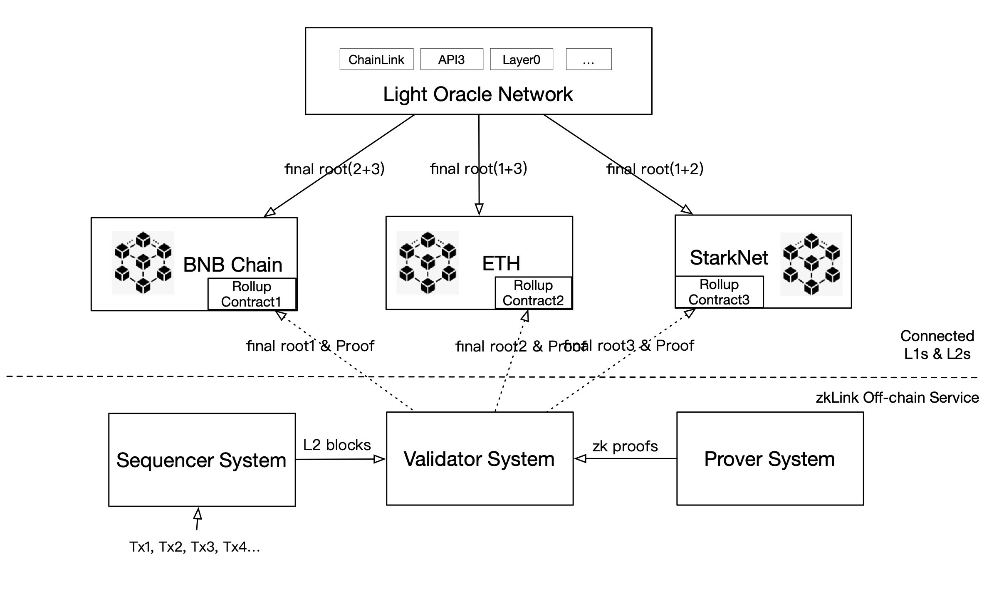

# A Multi-Chain ZK-Rollup
---
The zkLink protocol is instantiated as a multi-chain Zero-Knowledge (ZK) Rollup scheme. The ZK circuit is formulated and tailored to suit particular use cases, aiming to fulfill the requisites of economical and high-throughput trading.

## A Brief Summary of the Classic Architecture of a ZK-Rollup
The classic design of zkRollup includes:
1. **Commit stage:** Users submit transactions to the Rollup validator. The Rollup validator collects all transactions within a certain period of time, generates the Merkle tree root and Zero-Knowledge proof, and then commits it to the main chain.
2. **Proof stage:** Anyone can verify the ZK proof committed by the Rollup validator to the main chain. If the proof is correct, then all submitted transactions are valid. This ensures that the Rollup validator's behavior is transparent and verifiable.
3. **Execution stage:** The purpose of the execution stage is to process withdrawal requests on the chain. Only withdrawals that have passed the Layer 2 information of the zero-knowledge proof can be approved.

## A Multi-Chain ZK-Rollup Model
zkLink is an improved design of zkRollup. The classic zkRollup has three stages: Commit stage, Proof stage, and Execution stage. zkLink adds a Consensus stage after the Proof stage. The purpose of the Consensus stage is to synchronize the states of different chains.

1. Commit: Multiple transactions happening on Layer2, including single-chain and multi-chain transactions, are batched into one bundle and would be uploaded to the smart contract on Layer1 together with a ZK-SNARK. The on-chain data fulfills data availability so that account states can be retrieved when anything goes wrong on the Layer2 network.

2. Prove: ZK proofs are submitted to Layer1 and verified by the smart contract. Once approved, it will emit an event and write a log for the respective blockchain, containing that current final_root (a hash value).

3. Consensus: The oracle network processes this stage, which will accomplish the interchange of the final_root with each chain, and compare if the two final_root from two chains are consistent with each other.

4. Execute: zk_verify guarantees that the new final_root is correctly computed with the old final_root and new transactions info, while the oracle network ensures the final_root is correctly passed to the other chain. Requests for funds flowing from L2 to L1 will be executed once these two steps are confirmed.

## The Exception Handling of zkLink Multi-Chain Rollup
The exception handling mechanism includes Exit Mode and FullExit. They ensure that users' funds are secure and allow exiting at any time in the event of validator exceptions or malice.

### Exit mode
The exit mode means that when the validator cannot continue to work normally due to irresistible factors, it allows users to generate capital withdrawal proofs independently. The generation and submission of proofs should be permitted behaviors.
- When the rollup validator cannot continue normal operations due to irresistible factors such as hacking attacks, users have the right to exit directly and withdraw funds.
- Users can generate exit proofs on their own without the validator's permission. The exit proof proves the user's balance and transaction records in the rollup.
- Users can submit exit proofs directly to the main chain without the validator's permission. After the main chain verifies the exit proofs, it will return the corresponding funds to the user.
- The generation and submission of exit proofs do not require the validator's authorization or cooperation. This ensures that users can withdraw funds safely even when the validator is unavailable.
- The main chain should verify the submitted exit proofs. Only proofs that can pass the verification will trigger the withdrawal of the corresponding funds. This prevents malicious exit proofs from damaging fund security.

### FullExit
- Users should have the right to initiate withdrawals from the main chain, which should not be refused. If the validator refuses, rollup will be forced into exit mode.

## The System Break-down of zkLink Protocol
The zkLink system consists of 5 components: Multi-Chain Rollup Contract, ZK Prover System, Sequencer System, Validator System, and Light Oracle Network.

## Sequencers
Sequencer are operated by the zkLink team. It does not mean that zkLink is a centralized project. As a matter of fact, zkLink system is **COMPLETELY decentralized** from the perspective of security that eliminates the risk of malicious behavior from operators or validators mathematically- not because they don't want to, but because they simply cannot - zero knowledge technology guarantees this point.

Under the premise of open-source circuit, every off-chain execution must comply with the circuit's specifications. The circuit acts as the regulatory framework of zkLink: any illegal operations would not pass the circuit during `zk verify`, which is processed by the smart contract with the built-in `verify key`. Both the algorithm of `zk verify` and `verify key` will be published online. As long as the circuit has undergone rigorous auditing and is free of logical bugs, the ZK-based system can be considered safe and secure

For more information regarding the security of ZK technology, please refer to  [*An Incomplete Guide to Rollups*](https://vitalik.ca/general/2021/01/05/rollup.html) by Vitalik Buterin.
