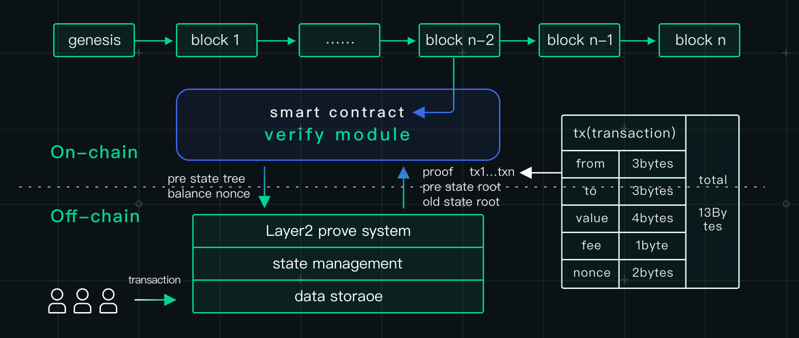

# ZK-Rollup

---
<!-- 需要技术爸爸帮忙修改 -->

The key of Layer2 is to handle transactions off the main chain (Layer1) to ease the burden of the latter since the only command that Layer1 needs to execute is the verification of transaction. On top of it, zkLink adopts ZK-Rollup technology to guarantee the correctness of off-chain compunation.

The essence of ZK-Rollup is to compress and represent user status like balance in a Merkle tree. When a collection of transactions are compressed into a batch (which also includes the previous state-root and the new state root) and sent to the main chain, the smart contract will check if the previous state root in the batch matches the current state root stored in the contract, and will update the Merkle root with a positive answer. In this way, data on Layer2 is uploaded to and stored on the main chain.

Moreover, ZK-Rollup applies zero knowledge proofs to ensure the correctness of off-chain state transitions. When the transaction is being packed, every batch includes a cryptographic proof called a ZK-SNARK (zero knowledge succinct non-interactive argument of knowledge, using the PLONK protocol), which proves that the post-state root is the correct result of executing the batch. SNARK proves that this series of transactions is correctly approved and signed by the users and that the update of the account balance is correct from the previous Merkle root to the new Merkle root, so it is impossible for the relayer to submit an invalid or manipulated batch. As a result, ZK-Rollup can inherits the high level of security of Ethereum main chain.

Since its smart contract on Layer1 only needs to verify the validity of this ZK-SNARK, ZK-Rollup can significantly reduce the computation of the main chain that the same amount of transactions occupy. In this manner, not only the transaction speed is improved, but also gas fees are reduced considerably.
