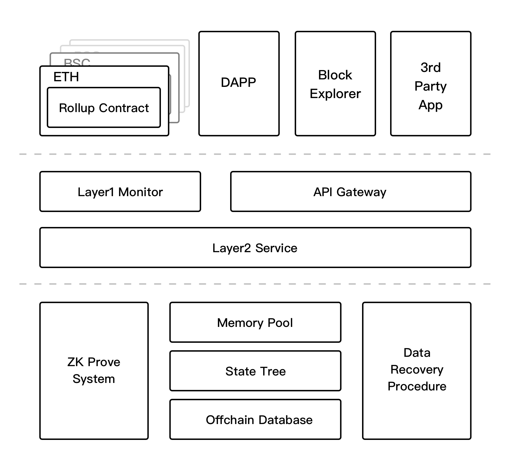
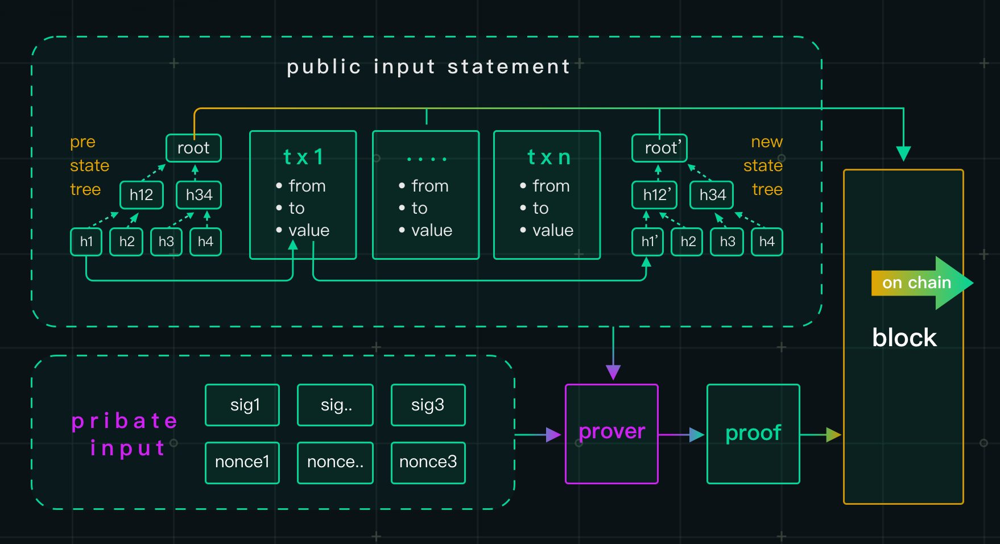

# zkLink Protocol

---

zkLink system consists of 4 parts: **Multi-Chain Rollup Contract**, **ZK Prove System**, **Layer2 Data System**, **Layer2 Service System**.

<!-- protocol插图 -->

**Multi-Chain Rollup Contract**: a series of rollup contracts are deployed on different L1s, fulfilling the role of regulating capital flow, verifying and storing the updated status of L2 data. The verification of zero-knowledge proofs is also completed in the rollup contracts.

**ZK Prove System**: zkLink uses the Plonk algorithm to generate proofs. The system is tasked with sorting transaction data on different L1s, and regularly generating zero-knowledge proofs, giving feedback to the Layer2 Service System.

**Layer2 Data System**: it consists of Off-Chain Database, Block Explorer, and Data Recovery Procedure. The Off-Chain Database stores all historical transaction data on L2; the Block Explorer reads and presents it; and the Data Recovery Procedure can quickly recover the entire off-chain database from the fullnode of Layer1 in case of off-chain data loss.

**Layer2 Service System**: it consists of Web Service, State Manage, Memory Pool and Layer1 Monitor. The Layer2 transactions are stored in the Memory Pool and the Data System via the Web Service. After a period of time, the transactions in the Memory Pool will be batched into a new Layer2 Block and the State Tree will be updated. ZK Prove System will generate the corresponding zero-knowledge proofs and release them to the corresponding Layer1 Monitor to be published in the on-chain rollup contracts.

