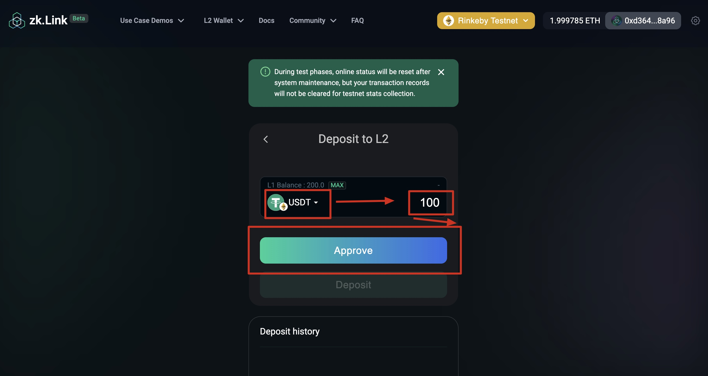
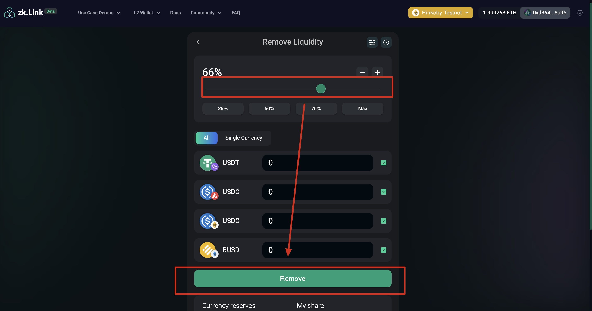

# How to use zkLink's AMM DEX Demo

---
## 1. Deposit to  zkLink L2 Wallet

<!---  --->

a. Navigate to "Top Bar - L2 Wallet - Deposit".

b. Select a token and enter the amount that you wish to deposit. Then click "Approve".

c. Click "Approve" and sign in your wallet.

d. Click "Deposit" and sign again to finalize the deposit.

e. You can view your deposit history at the bottom of the page.

## 2. L2 Instant Swap
a. Navigate to "Use Case Demos" on the top bar, and click "AMM DEX".

b. Choose "L2 Instant Swap" tab.

c. Choose your source token and enter the amount.

d. Choose your target token and confirm the fees.

e. click "Swap".

f. Confirm and sign in your wallet.

## 3. L2 Stablecoin Mirror
a. Navigate to "Use Case Demos" on the top bar, and click "AMM DEX".

b. Choose "L2 Stablecoin Mirror" tab.

c. Choose your source chain & tokens and your target chain & token.

d. Enter the amount and click "Swap".

e. Confirm and sign in your wallet.

## 4. L2 Liquidity
### 4.1 Add Liquidity
<!------>

a. Navigate to "Use Case Demos" on the top bar, and click "AMM DEX".

b. Choose "L2 Liquidity" tab, select a pool that you wish to supply liquidity to, and click "Add".

c. Choose your preferred strategy.

d. Enter the amount of one or more kinds of tokens, and click "Supply".

e. Confirm and sign in your wallet.

### 4.2 Remove Liquidity
<!----->

a. Navigate to "Use Case Demos" on the top bar, and click "AMM DEX".

b. Choose "L2 Liquidity" tab, select a pool that you wish to remove liquidity to, and click "Remove".

c. Slide and choose a percentage that you want to remove, and click "Remove".

d. Confirm and sign in your wallet.

## 5. L2 Wallet

### 5.1 Transfer between L2
<!---  --->

a. Navigate to "Layer2 Wallet" on the top bar, and click "Transfer".

b. Enter the target address (a zkLink Layer2 address).

c. Select a designated token and enter the amount.

d. Confirm the fee and click "Transfer".

e. Sign in your wallet.

f. Submit the transaction.

g. Check the status in the transaction history.

### 5.2 Withdraw to Layer1
<!---  --->

a. Navigate to "Layer2 Wallet" on the top bar, and click "Withdraw".

b. Enter the target wallet address, the preset address is your L1 Metamask address.

c. Select your target chain

d. Select your target token and enter the amount you with to withdraw to L1.

e. Confirm the fees and click "Withdraw".

f. Sign in your wallet.

