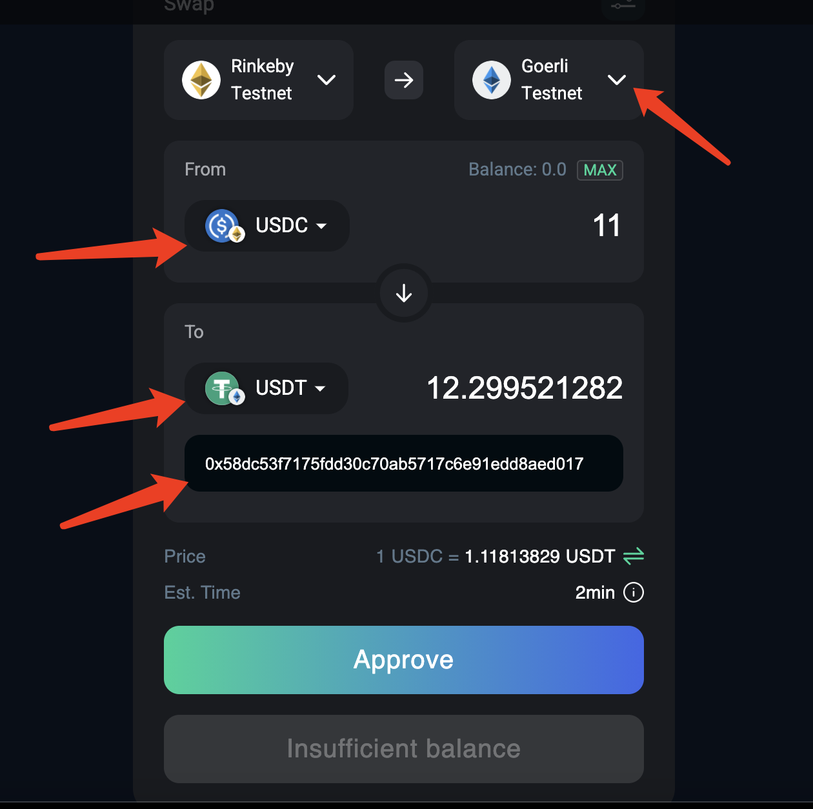
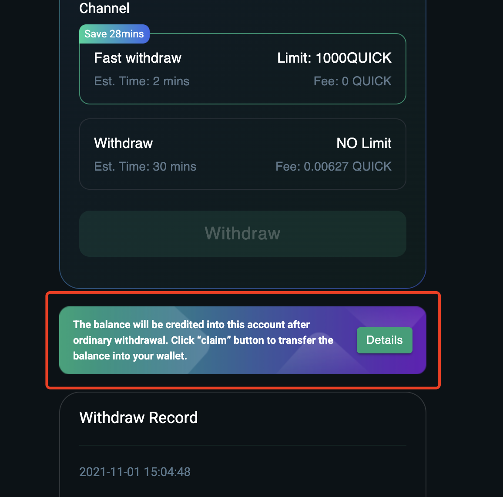

# How to use zkLink's AMM DEX Demo

---
## Case 1. L1 Cross Chain Swap

  1. Switch the MetaMask network to your source chain.

  2. Choose your target chain, source token, and target token.

  3. Enter the amount that you wish to swap.

  4. Enter the wallet address where you wish to swap tokens. The default value is the same as your source address.

  5. Confirm the transaction on your Metamask wallet.

  6. You can view your transaction status in your "transaction history" as shown below:

## Case 2. Layer2 DEX

### 1. Deposit to  zkLink L2 Wallet

<!---  --->

a. Navigate to "Top Bar - L2 Wallet - Deposit".

b. Select a token and enter the amount that you wish to deposit. Then click "Approve".

c. Click "Approve" and sign in your wallet.

d. Click "Deposit" and sign again to finalize the deposit.

e. You can view your deposit history at the bottom of the page.

### 2. Transfer between L2
<!---  --->

a. Navigate to "Layer2 Wallet" on the top bar, and click "Transfer".

b. Enter the address (another zkLink Layer2 address), then select a designated token, enter the amount, and then click
 "Transfer".
c. Sign in your wallet.

d. Submit the transaction.

e. Check the status in the transaction history.

### 3. Withdraw to Layer1
<!---  --->

a. Navigate to "Layer2 Wallet" on the top bar, and click "Withdraw".

b. Enter the target wallet address --- select your target chain --- select a token --- enter the amount.

c. Choose between "Fast Withdraw" and "Withdraw". "Fast Withdraw" takes around 2 minutes with a transaction limit, while "Withdraw" takes around 30 mins without a limit. If you choose to "withdraw", you will need to claim your tokens as shown below before you can receive the tokens on your Layer1 wallet.

d. Confirm and sign in your wallet.

### 4. Add liquidity
<!------>

a. Navigate to "Use Case Demos" on the top bar, and click "AMM DEX".

b. Choose "L2 Liquidity" tab, select a pool that you wish to supply liquidity to, and click "Add".

c. Enter the amount of one or more kinds of tokens, and click "Supply".

d. Confirm and sign in your wallet.

### 6. Remove liquidity
<!----->

a. Navigate to "Use Case Demos" on the top bar, and click "AMM DEX".

b. Choose "L2 Liquidity" tab, select a pool that you wish to supply liquidity to, and click "Remove".

c. Slide and choose a percentage that you want to remove, and click "Remove".

d. Confirm and sign in your wallet.

### 7. L2 Stablecoin Mirror
a. Navigate to "Use Case Demos" on the top bar, and click "AMM DEX".

b. Choose "L2 Stablecoin Mirror" tab.

c. Choose your source chain & tokens and your target chain & token.

d. Enter the amount and click "Swap".

e. Confirm and sign in your wallet.

