# 如何参与zkLink测试（中文）

---
## 一、准备工作

### 1. Metamask钱包添加测试网RPC

#### - Heco Tset

a. 浏览器安装metamask插件钱包，点击三个点，选择expand view打开网页版

b. 点击网络设置，选择自定义RPC

c. 按照顺序输入对应的数值，即可添加完成测试网

  - heco测试网
    - networkName: Test heco
    - RPC Url: https://http-testnet.huobichain.com
    - chainId: 256
    - symbol: HT
    - explorerUrl: https://testnet.hecoinfo.com

  - Polygon
    - networkName: Mumbai Testnet
    - RPC Url: https://rpc-mumbai.maticvigil.com
    - chainId: 80001
    - symbol: Matic
    - explorerUrl: https://explorer-mumbai.maticvigil.com

  - Rinkeby & Goerli  
    Rinkeby & Goerli 测试网默认存在，无需添加

### 2. 领取测试网络的Gas费

#### - Rinkeby
  a. Metamask网络切换到Rinkeby，打开水龙头领取测试币网址: https://faucet.rinkeby.io/

  b. 点击URL打开链接并跳转至推特

  c. 将模版中0x....地址改为自己的钱包公钥地址，并发布推特

  d. 找到转发的推特，点击转发-复制该条推特地址

  e. 回到Rinkeby水龙头网站，复制推特地址领取ETH测试币

#### - Goerli

  a. Metamask网络切换到Goerli，打开Goerli水龙头: https://goerli-faucet.slock.it/

  b. 复制地址，进行人机验证，然后点击【REQUEST 0.05 GOETH】

  c. 领取完成等1分钟左右可以在钱包查看ETH测试币是否到账

#### - Polygon
  a. Metamask网络切换Mumbai Testnet，打开matic水龙头: https://faucet.matic.network/

  b. 复制地址，点击【Submit】，然后点击【Confirm】

  c. 领取完成等1分钟左右可以在钱包查看Matic测试币是否到账

#### - Heco

  a. Metamask网络切换到test Heco，打开heco水龙头: https://scan-testnet.hecochain.com/faucet

  b. 链接github账号，没有的用户需要提前注册github账户

  c. 领取完成等1分钟左右可以在钱包查看HT测试币是否到账

## 二、在Metamask添加测试币

### 1. 领取测试币
  a. 保证自己测试网有一定量的Gas费

  b. 切换到对应的测试网，设置Metamask和zkLink的网络一致。以Rinkeby测试网领取UNI为例

  c. 导航栏选择【Faucet】，选择UNI，点击Get

  d. 在Metamask钱包签名，在钱包查看测试币到账

#### 目前支持领取的测试币：
  - Rinkeby （XVS、AUTO、UNI、SUSHI）
  - Goerli （SRM、RAY）
  - Polygon Test （QUICK、KRILL）
  - Heco Test（COW、MDX）

### 2. 在钱包里添加测试币

#### 测试代币合约地址：

- Rinkeby （XVS、AUTO、UNI、SUSHI）

  - XVS  ：0xAAC36C620E2f52AeC3EeEd2b89A2eA19BAbB132A
  - AUTO ：0x5122fa43c7D6dA72Ecf423F4955A0cC38753dab2
  - UNI  ：0x8Dc5CA19e64ade17aEEB4F8c52BF8ff220eD17dE
  - SUSHI：0xFced6f29c8BE8C1A679fBc7Ebb0AC1D3298e775e

- Goerli （SRM、RAY）

  - SRM ：0x80101F4da93A2912DC41b8eDBB30b98d428b8C43
  - RAY ：0xd42b3eebb2e86ef83f78eFB7d5432912D5F9259c

- Polygon Test （QUICK、KRILL）

  - QUICK ：0xAAC36C620E2f52AeC3EeEd2b89A2eA19BAbB132A
  - KRILL ：0x5122fa43c7D6dA72Ecf423F4955A0cC38753dab2

- Heco Test（COW、MDX）

  - COW ：0x1A508809A119Eee6F4b7ADeef3f2a9b4479608Ac
  - MDX ：0xe583769738b6dd4E7CAF8451050d1948BE717679

#### 如何添加

这里以Rinkeby添加XVS为例。添加代币需先切换到对应网络，其他同理:

a. 选择Rinkeby测试网

b. 点击【Add token】

c. 复制代币合约地址（XVS  ：0xAAC36C620E2f52AeC3EeEd2b89A2eA19BAbB132A）到 Token Contract Address，点击【Next】即可添加完成

## 三、如何进行充提和转账

### 1. 充值
  - a. 点击首页【充值】,进入充值页面；
  - b. 在充值页面，选择想要充值代币并输入充值金额，点击【充值】；
  - c. MetaMask会将显示一个弹出窗口以确认交易。您可以在此处调整 GAS 费用（GAS费视当时L1主网平均手续费而定），点击确认；
  - d. 充值提交完成：需要等待L1主链区块确认后，充值进zkLink的代币才会到账，具体时间基于L1主链网络情况而定。到账后将会在L2钱包资产明细中显示；
  - e. 可在充值记录查看充值明细，点击可以跳转至zkLink浏览器充值查看详情。

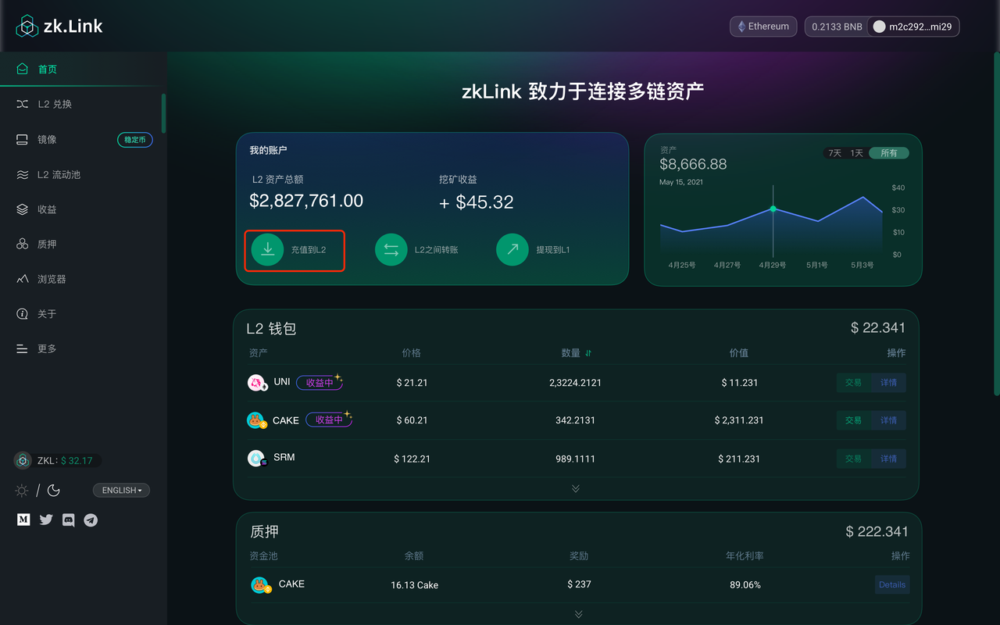
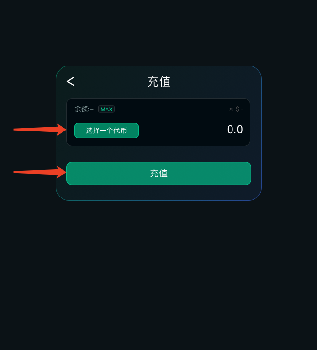

### 2. 转账
  - a. 点击首页【转账】,进入转账页面；
  - b. 输入转账地址（其他 zkLinkSwap layer2 钱包地址），选择代币并输入转账金额，点击【转账】；
  - c. MetaMask会自动弹窗，点击签名完成转账；
  - d. 可在转账记录查看转账明细，点击可以跳转至zkLink浏览器查看详情。

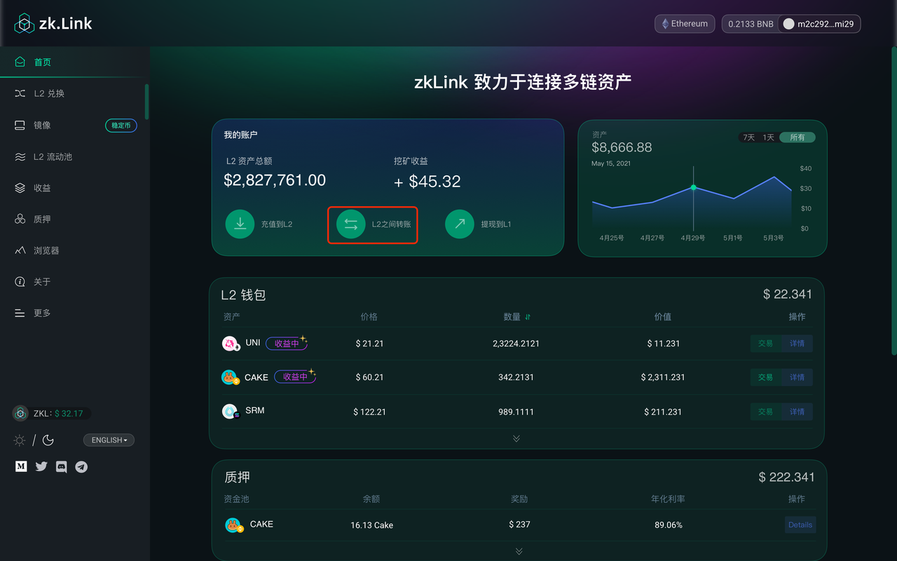
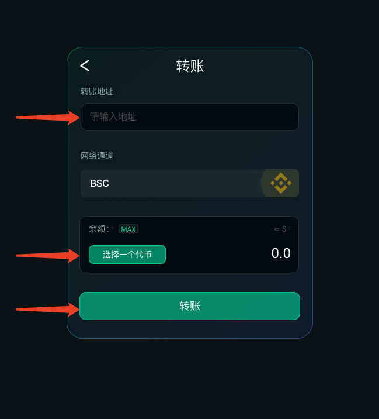

### 3. 提现
  - a. 点击首页【提现】,进入提现页面；
  - b. 输入提现地址 - 选择要提现的币种 - 输入提现金额 - 选择提现网络 - 点击【提现】；
  - c. MetaMask会自动弹窗，点击签名完成提现；
  - d. 提现提交完成（预计1-3分钟提现交易会发送至L1网络，具体到账时间取决于L1网络状况，可以跳转至浏览器查看进度）；
  - e. 可在提现记录查看提现明细，点击可以跳转至zkLink浏览器查看详情。

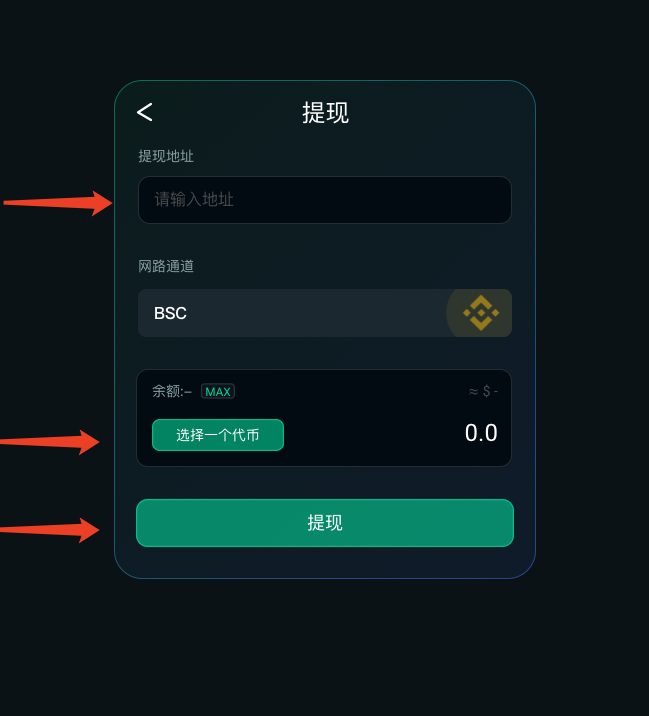

## 四、如何交换和提供流动性

### 1. 交换代币
  - a. 点击L2交换；
  - b. 选择输入的代币种类和数量-选择输出的代币种类；
  - c. 在上角设置滑点-点击兑换；
  - d. MetaMask 弹窗显示即将执行的对话交易 - 点击签名；
  - e. 兑换完成提交：（目前约等待5秒至2分钟完成兑换确认，取决于L2交易状况，交易越多则确认越快）。

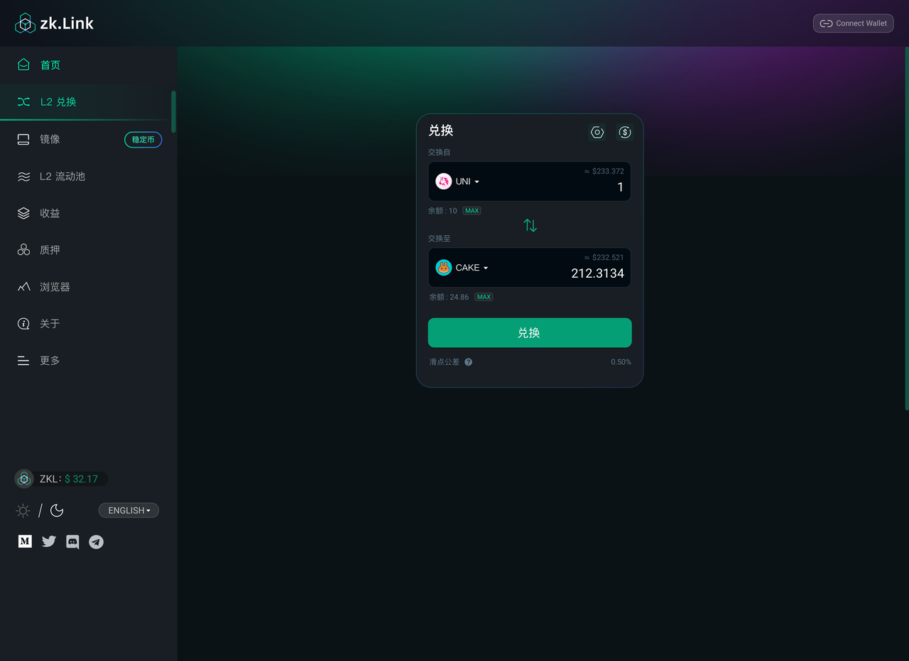
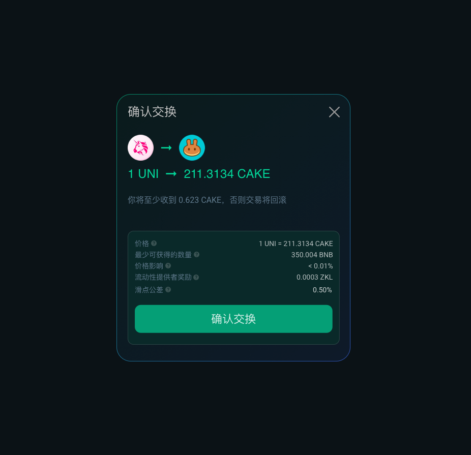

### 2. 如何添加流动性
  - a. 左边导航栏选择L2流动性，点击【添加流动性】；
  - b. 选择添加流动性的两种代币，输入其中一种代币数量，系统会自动生成需要添加的另一种的代币数量 - 点击【供应】；
  - c. MetaMask 弹窗显示即将执行的交易 - 点击签名；
  - d. 添加流动性完成；（目前约等待5秒至2分钟完成添加确认，取决于L2交易状态，交易越多则确认越快）；
  - e. 在流动性页面可以看到已添加过流动性的资金池显示 ，下拉展开已添加流动性列表，点击【增加】可以添加流动性的份额。

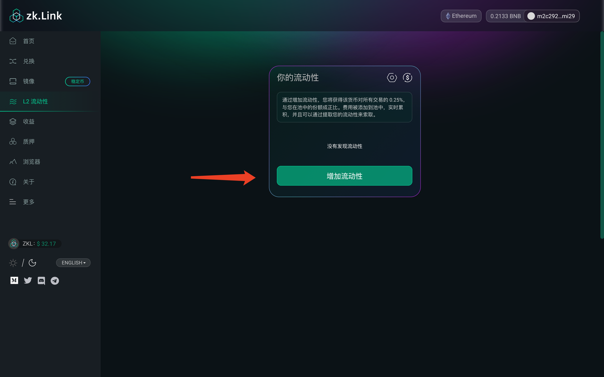
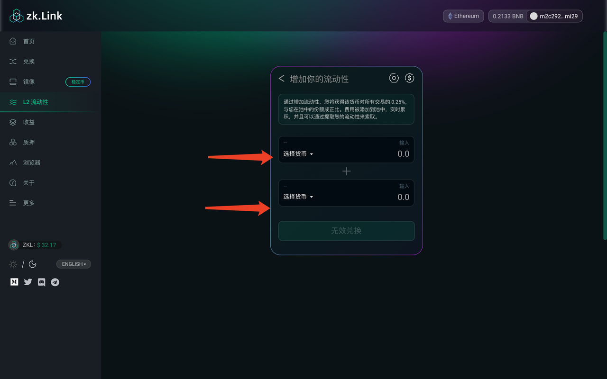
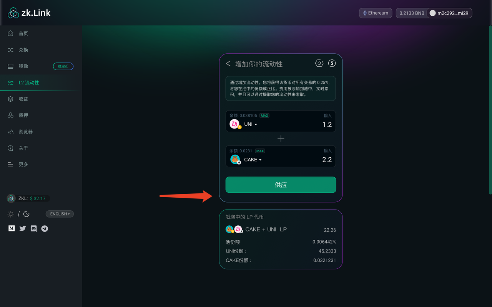
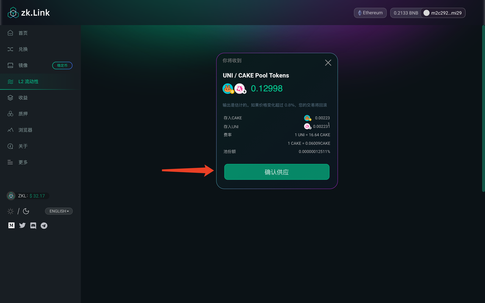

### 3. 如何移除流动性
  - a. 左边导航栏选择L2流动性，点击已添加过流动性资金池，点击【移除】按钮；
  - b. 拉动按钮确认移除金额的百分比 - 点击【移除】；（目前约等待5秒至2分钟完成移除确认，取决于L2交易状况，交易越多则确认越快）；
  - c. MetaMask 自动弹窗显示即将执行的交易 - 点击“签名”；
  - d. 移除流动性完成；（目前约等待5秒至2分钟完成流动性移除的确认（取决于L2交易状况，交易越多则确认越快）；
  - e. 在流动性页面可以看到已添加过流动性的资金池显示 ，下拉展开已添加流动性列表，点击【增加】可以添加流动性的份额。

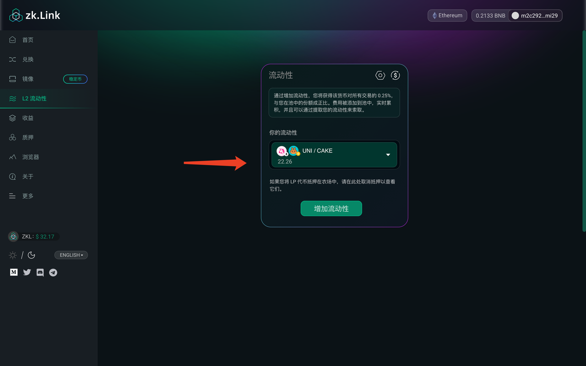
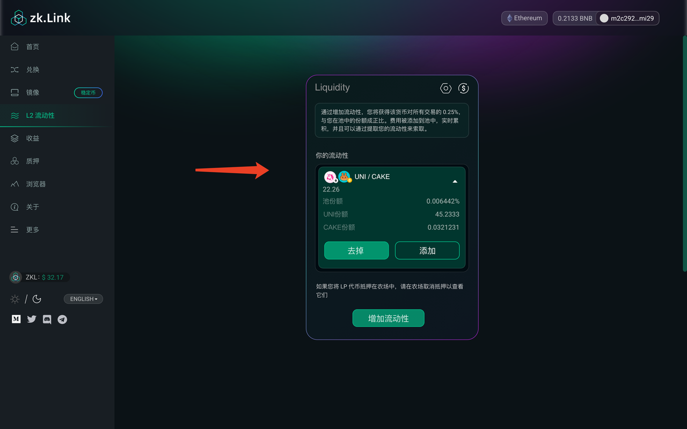
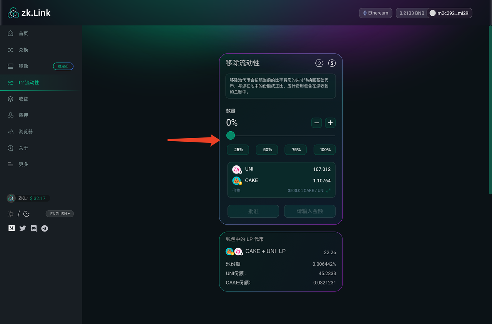
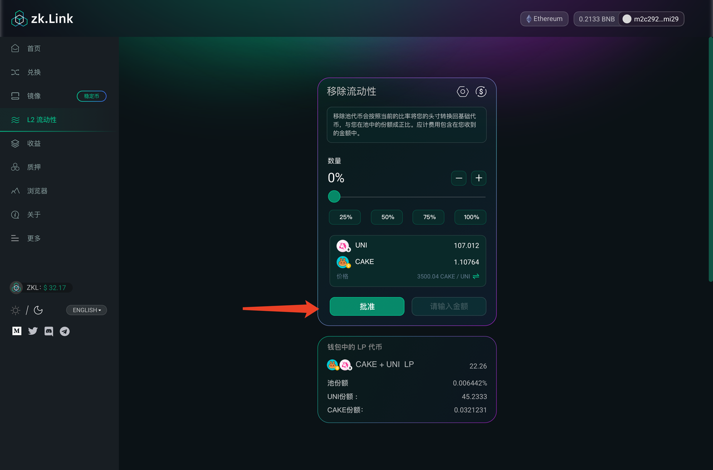
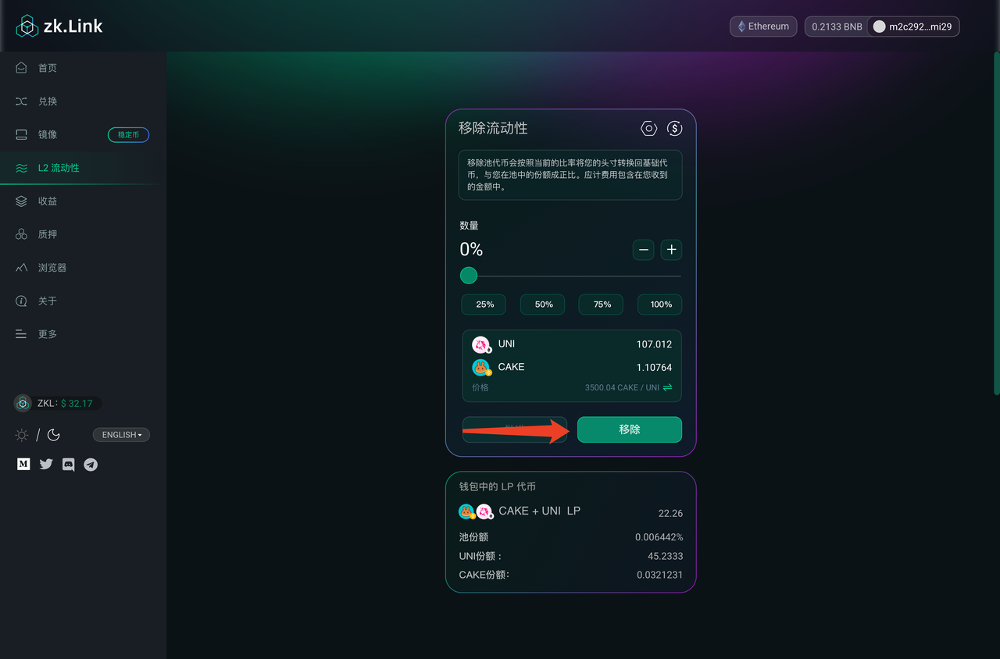
