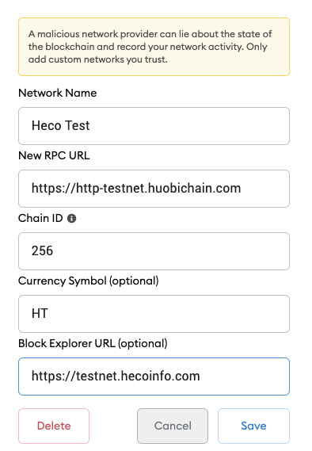
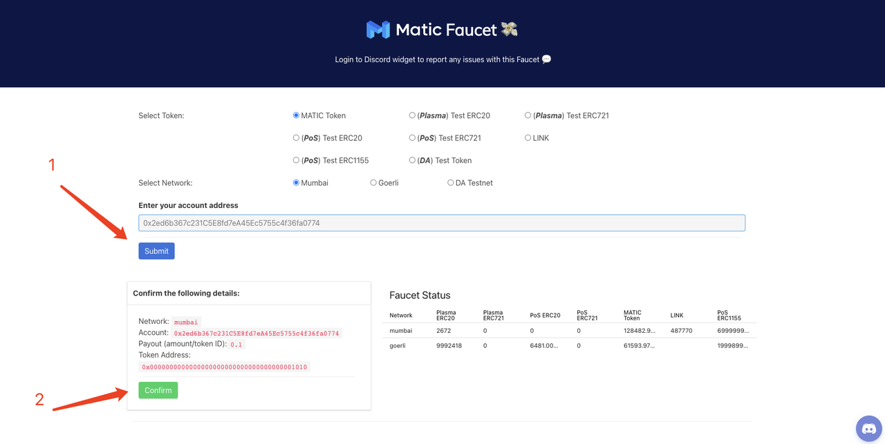
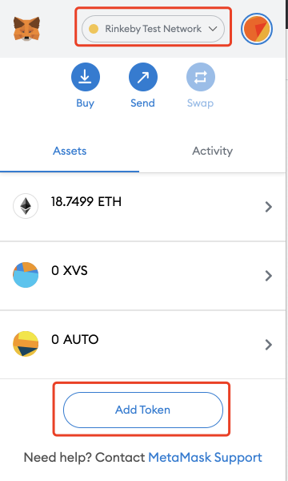
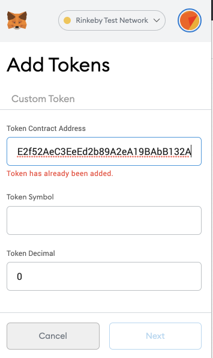
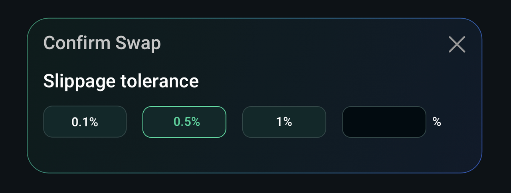
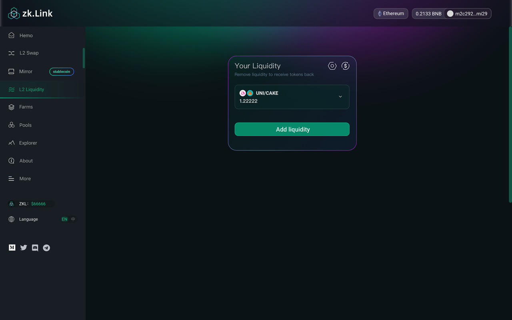

# How to participate in zkLink testnet? (English)

---
## Step 1. Set up your wallet & get ready

### 1. Configure Metamask for testnets
Please configure your Metamask for our four testnets: Rinkeby, Goerli, HECO Testnet, and Polygon Testnet.

#### - Heco Testnet

a. Set up Metamask on your browser, click "expand view" to open web version.

b. Click network settings and choose "Custom RPC".

c. Mannually add HECO Testnet as below

  - HECO Testnet
    - networkName: Test heco
    - RPC Url: https://http-testnet.huobichain.com
    - chainId: 256
    - symbol: HT
    - explorerUrl: https://testnet.hecoinfo.com

  - Polygon Testnet
    - networkName: Mumbai Testnet
    - RPC Url: https://rpc-mumbai.maticvigil.com
    - chainId: 80001
    - symbol: Matic
    - explorerUrl: https://explorer-mumbai.maticvigil.com

  - Rinkeby & Goerli Testnet
    Ethereum Testnet "Rinkeby" and "Ropsten" are set by default in your Networks.

### 2. Claim gas fee

You should claim some test gas fee for the four testnets: Rinkeby, Goerli, HECO Testnet, and Polygon Testnet.

#### - Claim ETH test tokens on Rinkeby testnet
  a. Switch network on Metamask to Rinkeby, and open the website: https://faucet.rinkeby.io/

  b. Redirect to Twitter.

  c. Change the 0x... address to your Ethereum address and tweet it.

  d. Find the tweet and copy the link to tweet.

  e. Go to Rinkeby. Paste the link and claim ETH test token.

#### - Claim ETH test tokens on Goerli testnet

  a. Switch network to Goerli on Metamask, and open the website: https://goerli-faucet.slock.it/

  b. Wait around 1 min and you can check your ETH balance in your wallet.

#### - Polygon
  a. Switch network on Metamask to Polygon testnet, and open the website: https://faucet.matic.network/

  b. Copy and paste your wallet address, click 'Sumbit', and then click 'Confirm'.

  c. Wait around 1 min and you can check Matic balance in your wallet.

#### - Claim HECO test tokens

  a. Switch network to HECO Testnet on Metamask, and open the website: https://scan-testnet.hecochain.com/faucet

  b. You will be redirected to GitHub to verify the identity. A github account is required to claim HT test tokens.

  c. Wait around 1 min and you can check the HT balance in your wallet.

### 3. Add 8 test tokens to Metamask

#### - Rinkeby testnet (XVS, AUTO, UNI, SUSHI)

  - XVS  ：0xAAC36C620E2f52AeC3EeEd2b89A2eA19BAbB132A
  - AUTO ：0x5122fa43c7D6dA72Ecf423F4955A0cC38753dab2
  - UNI  ：0x8Dc5CA19e64ade17aEEB4F8c52BF8ff220eD17dE
  - SUSHI：0xFced6f29c8BE8C1A679fBc7Ebb0AC1D3298e775e

#### - Goerli testnet (SRM, RAY)

  - SRM ：0x80101F4da93A2912DC41b8eDBB30b98d428b8C43
  - RAY：0xd42b3eebb2e86ef83f78eFB7d5432912D5F9259c

#### - HECO testnet (COW, MDX)
  - COW ：0x1A508809A119Eee6F4b7ADeef3f2a9b4479608Ac
  - MDX ：0xe583769738b6dd4E7CAF8451050d1948BE717679

#### - Polygon testnet (QUICK, KRILL）
  - QUICK ：0xAAC36C620E2f52AeC3EeEd2b89A2eA19BAbB132A
  - KRILL ：0x5122fa43c7D6dA72Ecf423F4955A0cC38753dab2

#### Take XVS as an example, and you can add another token in the same way

  a. Switch Metamask network to Rinkeby.

  b. Under "Assets" tab, click "Add Token".

  c. Copy & paste token contract address above, and click "Next".

## Step 2. Deposit, withdrawal and transfer

### 1. Deposit to Layer2
  - Step 1. Click "Deposit" on the home page.
  - Step 2. In the following page, select a target token and enter the amount of token that you wish to deposit. Then click "Deposit".
  - Step 3. Confirm the transaction in your wallet.
  - Step 4. Once the transaction on Layer1 (the "mainchain") is confirmed, the deposit will be added to your L2 wallet balance.
  - Step 5. You can check the status of your deposit in zkLinkscan.

### 2. Transfer
  - Step 1. Click "Transfer" from the home page.
  - Step 2. Enter the address (another zkLinkSwap Layer2 wallet address), then select a designated token, enter the amount, and then click "Transfer".
  - Step 3. Sign in your wallet.
  - Step 4. Transaction submitted.
  - Step 5. Check the status in the transaction history.

### 3. Withdraw to Layer1
  - Step 1. Click "Withdraw" from the home page.
  - Step 2. Enter the target address --- select a token --- enter the amount --- select a network, and click "Withdraw".
  - Step 3. Confirm and sign in your wallet.
  - Step 4. After the withdrawal is submitted, you can check the transaction status in the withdrawal history.

## Step 3. Swap and provide liquidity

### 1. Swap
  - Step 1. Click "L2 Swap" from home page.
  - Step 2. Choose the token in “From” and “To” and enter the amount you want to swap.
  - Step 3. Set a slippage and click "Swap".
  - Step 4. Confirm and sign in your wallet.
  - Step 5. Swap request is submitted. It takes 5 seconds to 2 minutes for the swap to be confirmed.

### 2. Add liquidity
  - Step 1. Click "L2 Liquidity" from the sidebar.
  - Step 2. Select two tokens you want to add liquidity. Enter the amount of one token, and the amount of the another token required will be filled automatically. Then click "Supply".
  - Step 3. Confirm and sign in the your wallet.
  - Step 4. It takes 5 seconds to 2 minutes for the swap to be confirmed. You can view your liquidity providing history from "L2 liquidity" page.

### 3. Remove liquidity
  - Step 1. Click the liquidity pool that you want to remove, and click "remove".
  - Step 2. Slide and choose a percentage that you want to remove, and click "approve".
  - Step 3. Confirm and sign in your wallet.
  - Step 4. The more withdrawals are made at the same time, the faster your withdrawal is confirmed.

