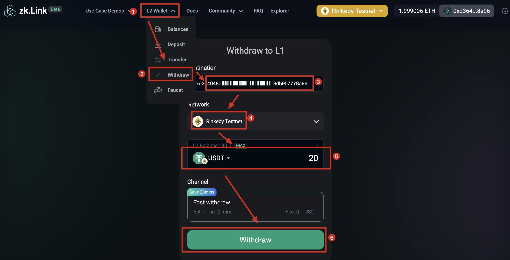

# How to use zkLink L2 Wallet

---
## 1. Deposit to L2

<!---  --->

a. Navigate to "Top Bar - L2 Wallet - Deposit", and connect your wallet.

b. Select a token and enter the amount that you wish to deposit. Then click "Approve".

c. Click "Approve" and sign in your wallet.

d. Click "Deposit" and sign again to finalize the deposit.

e. You can view your deposit history at the bottom of the page.

## 2. Transfer between L2
<!---  --->

a. Navigate to "Layer2 Wallet" on the top bar, and click "Transfer".

b. Enter the target address (a zkLink Layer2 address).

c. Select a designated token and enter the amount.

d. Confirm the fee and click "Transfer".

e. Sign in your wallet.

f. Check the status in the transaction history.

## 3. Withdraw to Layer1
<!---  --->

a. Navigate to "Layer2 Wallet" on the top bar, and click "Withdraw".

b. Enter the target wallet address, the preset address is your L1 Metamask address.

c. Select your target chain

d. Select your target token and enter the amount you with to withdraw to L1.

e. Confirm the fees and click "Withdraw".

f. Sign in your wallet.

