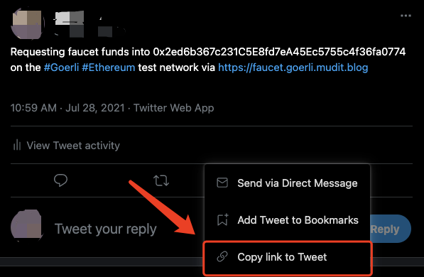
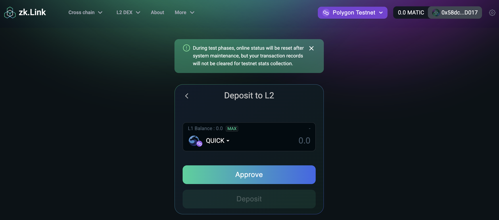
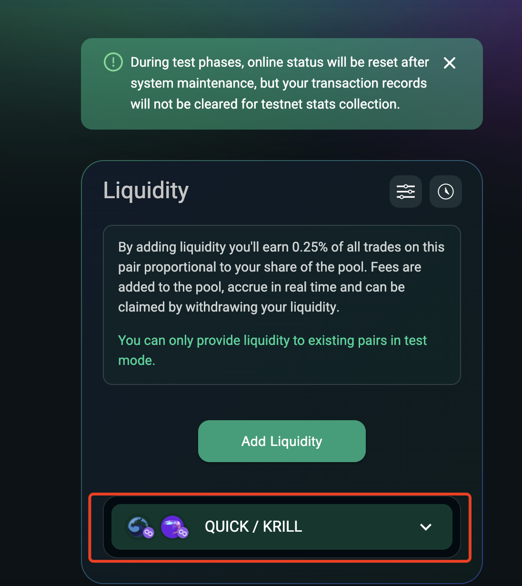

# How to participate in zkLink testnet (English)

---
## Step 1. Set up your wallet & get ready

### 1. Configure Metamask for testnets
Please configure your Metamask for our four testnets: Rinkeby, Goerli, AVAX Testnet, and Polygon Testnet.

  **a. Set up Metamask on your browser. Click "expand view" to open the web version.**

  **b. Click network settings and choose "Custom RPC".**

  **c. Manually add AVAX and Polygon Testnet as shown below:**

  - AVAX Testnet
    - networkName: Avalanche Fuji Testnet
    - RPC Url: https://api.avax-test.network/ext/bc/C/rpc
    - chainId: 43113
    - symbol: AVAX
    - explorerUrl: https://testnet.snowtrace.io/

  - Polygon Testnet
    - networkName: Mumbai Testnet
    - RPC Url: https://rpc-mumbai.maticvigil.com
    - chainId: 80001
    - symbol: Matic
    - explorerUrl: https://explorer-mumbai.maticvigil.com

  - Rinkeby & Goerli Testnet
    - Goerli Testnet and Rinkeby Testnet (Ethereum Testnets) are set to default in the your networks.

### 2. Claim gas fee

**Claim test gas fees for the four testnets: Rinkeby, Goerli, AVAX Testnet, and Polygon Testnet.**

<!------>

#### - Claim ETH test tokens on Rinkeby testnet
  a. Switch network on Metamask to Rinkeby and open the website: https://faucet.rinkeby.io/

  b. Redirect to Twitter.

  c. Change the 0x... address to the public key of your wallet and tweet it.

<!------>

  d. Find the tweet and click "Copy link to Tweet".

  e. Go to Rinkeby. Paste the link and claim the ETH test token.

#### - Claim ETH test tokens on Goerli testnet
##### Method 1
  a. Switch network on Metamask to Goerli and open the website: https://faucet.goerli.mudit.blog/

  b. Redirect to Twitter.

  c. Change the 0x... address to the public key of your wallet and tweet it.

<!------>

  d. Find the tweet and click "Copy link to Tweet".

  e. Go to Goerli. Paste the link and claim an ETH test token.

##### Method 2

  a. Switch network to Goerli on Metamask, and open the website: https://goerli-faucet.slock.it/

  b. Wait about 1 minute and then check the ETH balance in your wallet.

#### - Claim MATIC test tokens on Polygon testnet
  a. Switch network on Metamask to Polygon testnet, and open the website: https://faucet.matic.network/

  b. Copy and paste your wallet address, click 'Submit', and then click 'Confirm'.

  c. Wait about 1 minute and then check the MATIC balance in your wallet.

#### - Claim AVAX test tokens on AVAX testnet

  a. Switch the network to AVAX Testnet on Metamask and open the website: https://faucet.avax-test.network/

  b. Copy and paste your wallet address (C-chain), and click "request".

  c. Wait about 1 minute and then check the AVAX balance in your wallet.

## Step 2. Claim and add test tokens

### 1. Claim test tokens
<!---  --->

  a. Make sure that you have claimed testnet gas fees.

  b. Click "Get Testnet Token" on the "Cross Chain" page.

  b. Switch your network to the corresponding testnet, and choose the token that you want to claim.

  c. Click "Get".

**Currently we support the following kinds of test tokens:**
  - Rinkeby: XVS, AUTO, UNI, SUSHI, USDT, USDC
  - Goerli: SRM, RAY, USDT, BUSD
  - Polygon Testnet: QUICK, KRILL, USDT
  - AVAX Testnet: AVAX, CRA, USDT

### 2. Add test tokens to MetaMask
<!---  --->

#### Add test tokens to MetaMask following the example with XVS below.

  a. Copy the token contract address.

  b. Switch MetaMask network to Rinkeby.

  c. Under the "Assets" tab, click "Add Token".

  d. Paste the token contract address, and click "Next".

## Step 3. Cross Chain Swap
  1. Switch the MetaMask network to your source chain.

  2. Choose your target chain, source token, and target token.

  3. Enter the amount that you wish to swap.

  4. Enter the wallet address where you wish to swap tokens. The default value is the same as your source address.

  5. Confirm the transaction on your Metamask wallet.

  6. You can view your transaction status in your "transaction history" as shown below:

## Step 4. Bridge

  1. Switch Metamask network to your source chain.

  2. Choose the token that you wish to "bridge" and your target chain.

  3. Enter the amount that you wish to "bridge".

  4. Enter the wallet address where you wish to swap tokens. The default value is the same as your source address.

  5. Confirm the transaction on your Metamask wallet.

  6. You can view your transaction status in your "transaction history".

## Step 5. Layer2 DEX

### 1. Deposit to Layer2

<!---  --->

  - Step 1. Click "Layer2 DEX" on the navigation bar, and click "L2 Wallet" - "Deposit".
  - Step 2. On the following page, select a target token and enter the amount of tokens that you wish to deposit. Then click "Deposit".
  - Step 3. Confirm the transaction in a pop-up window from Metamask, and adjust the gas fee as you wish.
  - Step 4. Once the transaction on Layer1 (the "mainchain") is confirmed, the deposit will be added to your L2 wallet balance.

### 2. Transfer
<!---  --->

  - Step 1. Click "Layer2 DEX" on the navigation bar, and click "L2 Wallet" - "Transfer".
  - Step 2. Enter the address (another zkLinkSwap Layer2 wallet address), then select a designated token, enter the amount, and then click "Transfer".
  - Step 3. Sign in your wallet.
  - Step 4. Submit the transaction.
  - Step 5. Check the status in the transaction history.

### 3. Withdraw to Layer1
<!---  --->

  - Step 1. Click "Layer2 DEX" on the navigation bar, and click "L2 Wallet" - "Transfer".
  - Step 2. Enter the target wallet address --- select your target chain --- select a token --- enter the amount.
  - Step 3. Choose between "Fast Withdraw" and "Withdraw". "Fast Withdraw" takes around 2 minutes with a transaction limit, while "Withdraw" takes around 30 mins without a limit. *If you choose to "withdraw", you will need to claim your tokens as shown below before you can receive the tokens on your Layer1 wallet.*
  - Step 3. Confirm and sign in your wallet.

### 4. Swap
<!---  --->

  - Step 1. Click "Layer2 DEX" on the navigation bar, and select "L2 Swap".
  - Step 2. Choose the token in “From” and “To” and enter the amount you want to swap.
  - Step 3. Set a slippage and click "Swap".
  - Step 4. Confirm and sign in your wallet.
  - Step 5. Submit swap request.

### 5. Add liquidity
<!------>

  - Step 1. Click "Layer2 DEX" on the navigation bar and select "L2 Liquidity".
  - Step 2. Select two tokens in which you want to add liquidity. Enter the amount of one token, and the other token’s amount will be auto-filled. Then click "Supply".
  - Step 3. Confirm and sign in your wallet.
  - Step 4. Wait 5 seconds to 2 minutes for the swap to be confirmed.
  - Step 5. View your liquidity history on the drop-down list.

### 6. Remove liquidity
<!----->

  - Step 1. Click "Layer2 DEX" on the navigation bar, and select "L2 Liquidity". Choose a pool that you wish to remove liquidity from, and click "remove".
  - Step 2. Slide and choose a percentage that you want to remove, and click "approve".
  - Step 3. Confirm and sign in your wallet.
  - Step 4. You can view your liquidity history on the drop-down list.

### 7. L2 Mirror

- Step 1. Click "Layer2 DEX" on the navigation bar, and select "L2 Mirror".
- Step 2. Choose your source chain & tokens and your target chain & token.
- Step 3. Enter the amount.
- Step 4. Click "Swap".
- Step 5. Confirm and sign in your wallet.

