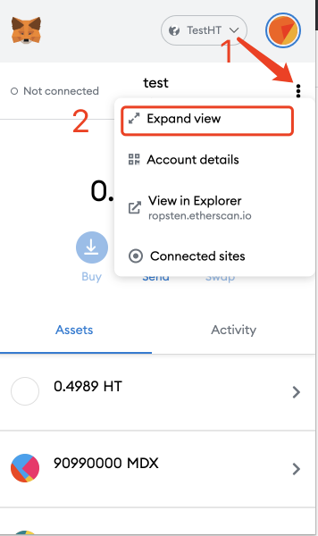
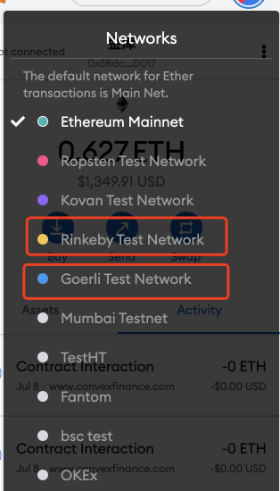
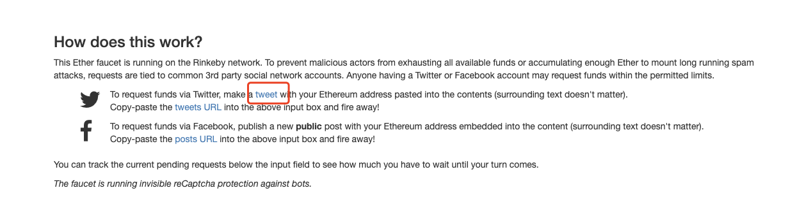
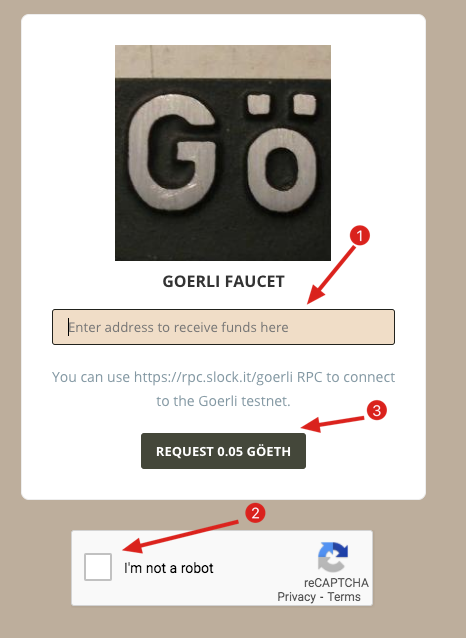
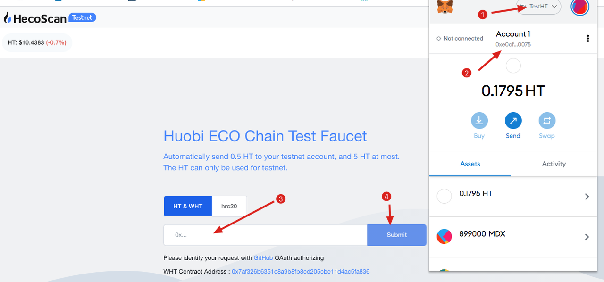
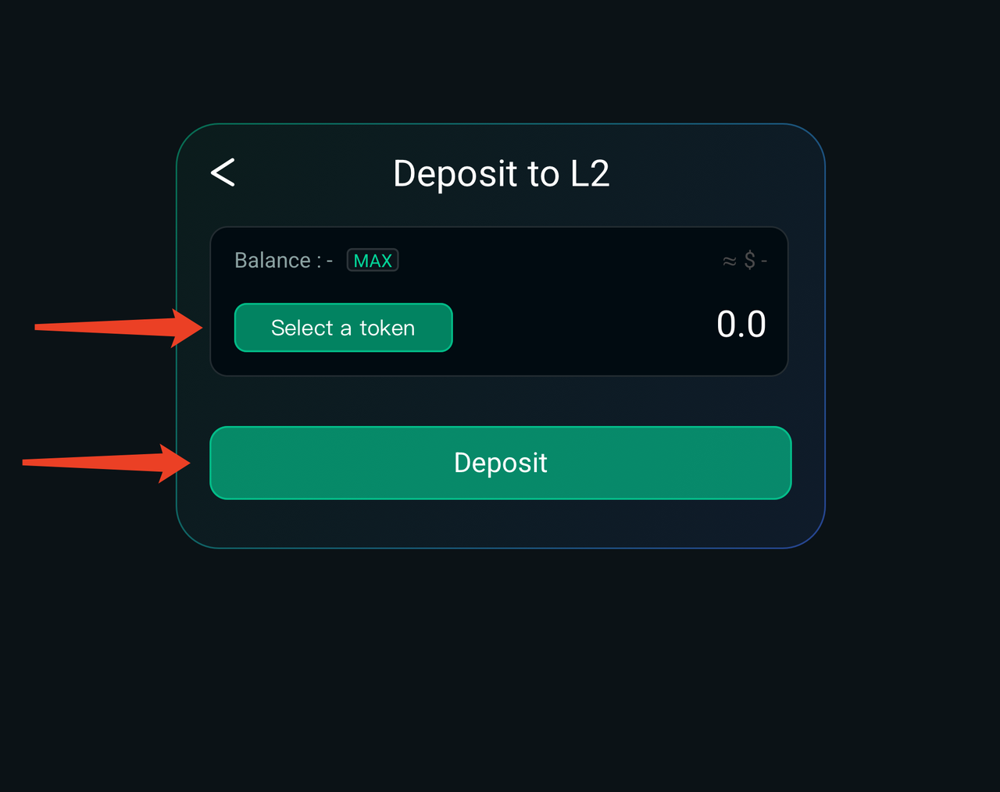
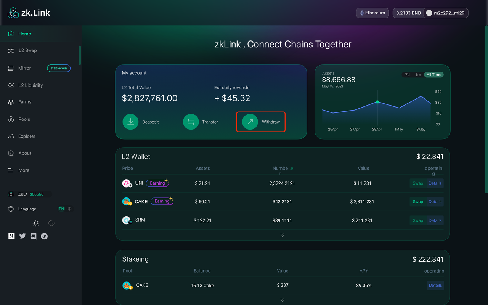
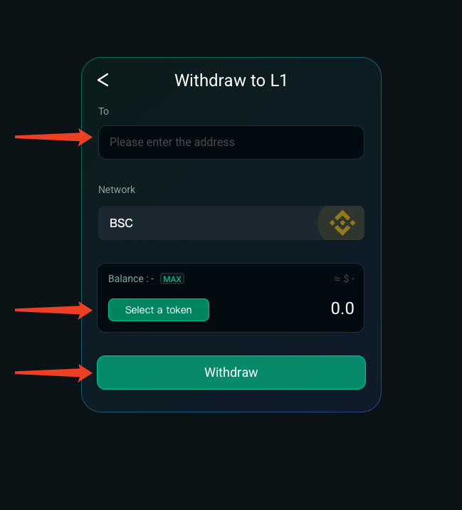
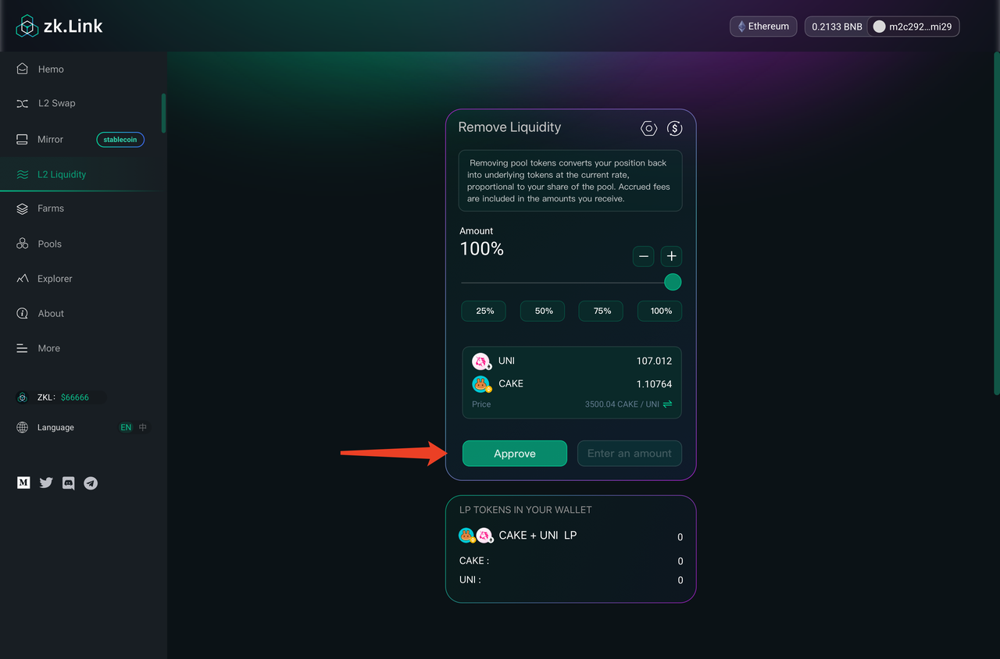

# Cómo participar en la prueba de zkLink？(Español)

---
## Patada 1. La preparación

### 1. Instalar la cartera y probar el internet

#### - Heco Testnet

a. Instalar la cartera del complemento de metamask en el navegador, hacer clic en los tres puntos y seleccionar "expand view" para abrir la versión web.

b. Hacer clic en la configuración de red y la opción de "custom RPC".

c. Agregar manualmente HECO Testnet como se muestra a continuación.

  - HECO Testnet
    - networkName: Test heco
    - RPC Url: https://http-testnet.huobichain.com
    - chainId: 256
    - symbol: HT
    - explorerUrl: https://testnet.hecoinfo.com

  - Polygon Testnet
    - networkName: Mumbai Testnet
    - RPC Url: https://rpc-mumbai.maticvigil.com
    - chainId: 80001
    - symbol: Matic
    - explorerUrl: https://explorer-mumbai.maticvigil.com

  - Rinkeby & Goerli Testnet
    Testnet "Rinkeby" y "Goerli" se establecen de forma predeterminada.

### 2. Recibir los gastos de Gas

#### - Rinkeby
  a. Cambiar la red de Metamask a la de Rinkeby，y abrir el sitio web: https://faucet.rinkeby.io/

  b. Hacer clic en la URL para abrir Twitter.

  c. Cambiar la dirección 0x.... a su dirección Ethereum y hacer un tweet.

  d. Buscar el tweet y "copy link to Tweet".

  e. Volver a Rinkeby, copiar la dirección de tweet para recibir los test tokens de ETH.

#### - Goerli

  a. Cambiar la red de Metamask a la de Goerli, y abrir el sitio web: https://goerli-faucet.slock.it/

  b. Copiar la dirección, hacer la verificación hombre-máquina y luego hacer clic en "REQUEST 0.05 GOETH'.

  c. Esperar 1 minuto y verificar los test tokens de ETH en la cartera.

#### - Polygon
  a. Cambiar la red de Metamask a la de Mumbai Testnet，y abrir el sitio web: https://faucet.matic.network/

  b. Copiar la dirección, hacer clic en “Submit” y luego en “Confirm”.

  c. Esperar 1 minuto y verificar los test tokens de Matic en la cartera.

#### - HECO

  a. Cambiar la red de Metamask a la de test HECO，y abrir el sitio web: https://scan-testnet.hecochain.com/faucet

  b. Redirigir a GitHub. Se requiere una cuenta de GitHub para cada uno, de lo contrario, hay que registrar una cuenta con anticipación.

  c. Esperar 1 minuto y verificar los test tokens de HT en la cartera.

## Patada 2. Agregar los test tokens en Metamask

### 1. Recibir los text tokens

  a. Asegurarse de haber reclamado los gastos de gas de testnet.

  b. Cambiar la red al testnet correspondiente. Configurar la red de Metamask y la de zkLink para que sea coherente. Tomar el testnet de Rinkeby para recibir UNI como ejemplo.

  c. Seleccionar “Faucet” y UNI. Hacer clic en "Get".

  d. Firmar en la cartera de Metamask para verificar la llegada de los test tokens.

**Los test tokens actualmente admitidos：**
  - Rinkeby （XVS, AUTO, UNI, SUSHI）
  - Goerli （SRM, RAY）
  - Polygon Test （QUICK, KRILL）
  - Heco Test（COW, MDX）

### 2. Agregar los test tokens en Metamask

#### - Rinkeby testnet (XVS, AUTO, UNI, SUSHI)

  - XVS  ：0xAAC36C620E2f52AeC3EeEd2b89A2eA19BAbB132A
  - AUTO ：0x5122fa43c7D6dA72Ecf423F4955A0cC38753dab2
  - UNI  ：0x8Dc5CA19e64ade17aEEB4F8c52BF8ff220eD17dE
  - SUSHI ：0xFced6f29c8BE8C1A679fBc7Ebb0AC1D3298e775e

#### - Goerli testnet (SRM, RAY)

  - SRM ：0x80101F4da93A2912DC41b8eDBB30b98d428b8C43
  - RAY：0xd42b3eebb2e86ef83f78eFB7d5432912D5F9259c

#### - HECO testnet (COW, MDX)
  - COW ：0x1A508809A119Eee6F4b7ADeef3f2a9b4479608Ac
  - MDX ：0xe583769738b6dd4E7CAF8451050d1948BE717679

#### - Polygon testnet (QUICK, KRILL）
  - QUICK ：0xAAC36C620E2f52AeC3EeEd2b89A2eA19BAbB132A
  - KRILL ：0x5122fa43c7D6dA72Ecf423F4955A0cC38753dab2

#### Cómo agregar:Tomar XVS como ejemplo. Para agregar un token, primero hay que cambiar a la red correspondiente, y los demás son los mismos.

  a. Seleccionar el testnet de Rinkeby.

  b. Hacer clic en "Add Token".

  c. Copiar la dirección（XVS：0xAAC36C620E2f52AeC3EeEd2b89A2eA19BAbB132A）a Token Contract Address, y hacer clic en "Next".

## Patada 3. Depositar, retirar y transferir

### 1. Depositar

  a. Hacer clic en “deposit”.

  b. En la siguiente página, seleccionar un token e ingresar la cantidad de token, y hacer clic en “deposit”.

  c. Confirmar la transacción en MetaMask. Poder ajustar los gastos de GAS aquí (los gastos de GAS depende de la tarifa de manejo promedio de L1 en ese momento), y luego hacer clic en confirmar.

  d. Se completa el envío del depósito: una vez que se confirma la transacción en L1, el depósito se agregará a la cartera de L2. El tiempo específico se base en la situación de la red de L1. Una vez recibida la cuenta, se mostrará en los detalles del activo de la cartera L2.

  e. Poder ver los detalles en el registro de depósito y hacer clic para saltar al depósito del navegador zkLink para el los detalles.

### 2. Transferir

  a. Hacer clic en "transferir".

  b. Entrar en la dirección (otra detección de la cartera de zkLinkSwap layer2), seleccionar el token e ingresar la cantidad, y luego hacer clic en "transferir".

  c. Firmar en MetaMask.

  d. Poder ver los detalles de la transferencia en el registro de la transferencia y hacer clic para ir al navegador zkLink para ver los detalles.

### 3. Retirar

  a. Hacer clic en "retirar".

  b. Ingresar la dirección de retiro - seleccionar un token - ingresar la cantidad - seleccionar la red de retiro - hacer clic en "retirar".

  c. Firmar en MetaMask.

  d. El envío del retiro se completa (se estima que la transacción de retiro es de 1-3 minutos y luego se enviará a L1. La hora de llegada especifica depende del estado de L1. Poder ver los detalles en el navegador).

  e. Poder ver los detalles del retiro en el registro del retiro y hacer clic para ir al navegador zkLink para ver los detalles.

## Patada 4. Cómo intercambiar y proporcionar liquidez

### 1. Intercambiar

  a. Hacer clic en " L2 intercambiar".

  b. Seleccionar el token de "From" y la cantidad - seleccionar el token de "To".

  c. Establecer un deslizamiento - hacer clic en "intercambiar".

  d. Firmar en MetaMask.

  e. Se envía la solicitud de intercambio: se necesitan de 5 segundos a 2 minutos para que confirme el intercambio, y eso depende del estado de L2.

### 2. Cómo agregar liquidez

  a. Hacer clic en "L2 liquidez".

  b. Seleccionar dos tokens que se quieren agregar liquidez, ingresar la cantidad de uno de los dos, el sistema generará automáticamente la cantidad del otro - hacer clic en "supply".

  c. Firmar en MetaMask.

  d. Se completa (se necesitan de 5 segundos a 2 minutos, y eso depende del estado de L2).

  e. Poder ver que la liquidez se ha agregado en la página de liquidez. Desplazarse hacia abajo para expandir la lista de liquidez, y hacer clic en "agregar" para agregar la cantidad de liquidez.

### 3. Cómo eliminar liquidez

  a. Hacer clic en el fondo de liquidez que desea eliminar y hacer clic en "eliminar".

  b. Confirmar el porcentaje de la cantidad de eliminación - hacer clic en"eliminar". (se necesitan de 5 segundos a 2 minutos para que confirme el eliminación, y eso depende del estado de L2)

  c. Afirmar en MetaMask.

  d. Se completa. (se necesitan de 5 segundos a 2 minutos para que confirme el eliminación, y eso depende del estado de L2).

  e. En la página de liquidez, poder ver la visualización de los fondos de liquidez que han agregado. Desplazarse hacia abajo para expandir la lista de liquidez gregada y hacer clic en "agregar" para agregar la cantidad de liquidez.

