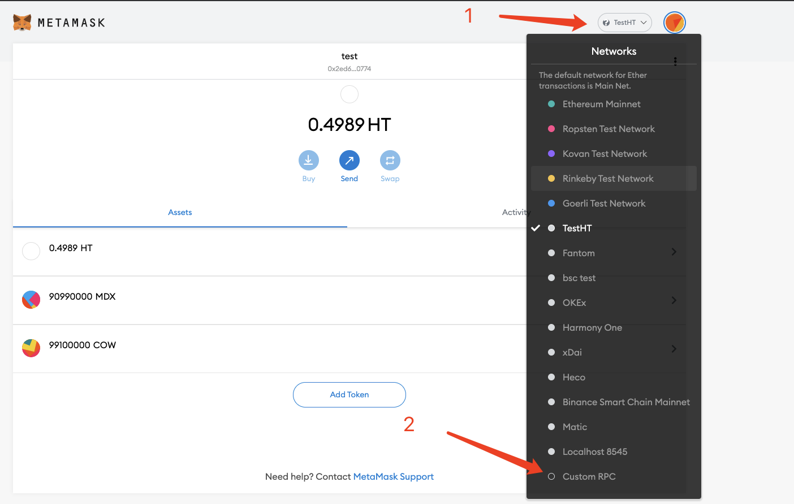
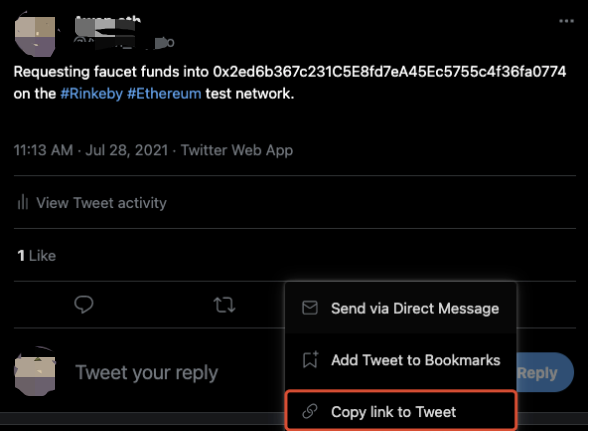

# zkLinkテストに参加する方法 (日本語)

---
## Step 1. 準備すること

### 1. MetamaskにテストネットのRPCを追加すること

#### - Heco Testnet

a. ブラウザにMetamaskをインストールし、3つのドットをクリックし、Expand viewを選択してWebバージョンを開きます。

b. ネットワーク設定をクリックして、カスタムRPCを選択します

c. 対応する値を順番に入力すると、テストネットが追加できます

  - HECO テストネット   
    - networkName: Test heco
    - RPC Url: https://http-testnet.huobichain.com
    - chainId: 256
    - symbol: HT
    - explorerUrl: https://testnet.hecoinfo.com

  - Polygon テストネット   
    - networkName: Mumbai Testnet
    - RPC Url: https://rpc-mumbai.maticvigil.com
    - chainId: 80001
    - symbol: Matic
    - explorerUrl: https://explorer-mumbai.maticvigil.com

  - Rinkeby & Goerli Testnet
    Rinkeby & Goerli 既に存在しますから、追加する必要はありません

### 2. テストネットのガス料を受け取ること

#### - Rinkeby
  a. MetamaskネットワークがRinkebyに切り替わり、蛇口のURLを開いて、テストコインが受け取れます: https://faucet.rinkeby.io/

  b. URLをクリックしてリンクを開き、Twitterにジャンプします

  c. テンプレートの0x ....アドレスを自分のウォレット公開鍵アドレスに変更し、Twitterに投稿します

  d. ツイートを見つけ、「ツイートのリンクをコピー」をクリックします

  e. Rinkeby蛇口のWebサイトに戻り、Twitterアドレスをコピーして、ETHテストコインを受け取れます。

#### - Goerli

##### 収集方法1
  a. MetamaskネットワークがGoerliに切り替わり、蛇口のURLを開いて、テストコインが受け取れます: https://faucet.goerli.mudit.blog/

  b. URLをクリックしてリンクを開き、Twitterにジャンプします

  c. テンプレートの0x ....アドレスを自分のウォレット公開鍵アドレスに変更し、Twitterに投稿します

  d. ツイートを見つけ、「ツイートのリンクをコピー」をクリックします

  e. Goerli蛇口のWebサイトに戻り、Twitterアドレスをコピーして、ETHテストコインを受け取れます。

##### 収集方法2
  a. MetamaskネットワークがGoerliに切り替わり，蛇口のURLを開いて: https://goerli-faucet.slock.it/

  b. アドレスをコピーし、マンマシン検証を実行して、【REQUEST 0.05 GOETH】をクリックします

  c. 約1分待ってから、ETHテストコインが到着したかどうかを確認できます。

#### - Polygon
  a. MetamaskネットワークがMumbai Testnetに切り替わり，蛇口のURLを開いて: https://faucet.matic.network/

  b. アドレスをコピーして，【Submit】をクリックして，【Confirm】をクリックします

  c. 約1分待ってから、Maticテストコインが到着したかどうかを確認できます。

#### - HECO

  a. Metamaskネットワークがtest Hecoに切り替わり，蛇口のURLを開いて: https://scan-testnet.hecochain.com/faucet

  b. githubアカウントをリンクします。その前にgithubアカウントに登録する必要があります

  c. 約1分待ってから、HTテストコインが到着したかどうかを確認できます

## Step 2. zkLinkテストコインを受け取ること

### 1. テストコインを受け取ること

  a. テストネットワークに一定額のガス料が持ってることを確認します。

  b. MetamaskネットワークとzkLinkネットワークが一貫するように設定します。

  c. 例えば、RinkebyテストネットワークでUNIを受け取りたいなら、[Faucet]をクリックし、UNIを選択して、[GET]をクリックします。

  d. Metamaskでサインして、テストコインの到着を確認します。

**現在サポートされているテストコイン：**
  - Rinkeby （XVS, AUTO, UNI, SUSHI, USDT, USDC）
  - Goerli （SRM, RAY, USDT, BUSD)
  - Polygon Test （QUICK, KRILL, USDT）
  - Heco Test（COW, MDX, USDT, HUSD）

### 2. Metamaskでテストコインアドレスを追加すること

#### - Rinkeby testnet（XVS, AUTO, UNI, SUSHI, USDT, USDC）

  - XVS  ：0xAAC36C620E2f52AeC3EeEd2b89A2eA19BAbB132A
  - AUTO ：0x5122fa43c7D6dA72Ecf423F4955A0cC38753dab2
  - UNI  ：0x8Dc5CA19e64ade17aEEB4F8c52BF8ff220eD17dE
  - SUSHI ：0xFced6f29c8BE8C1A679fBc7Ebb0AC1D3298e775e
  - USDT：0xa689352b7c1CaD82864bEb1D90679356d3962f4d
  - USDC：0xe583769738b6dd4E7CAF8451050d1948BE717679

#### - Goerli testnet（SRM, RAY, USDT, BUSD)

  - SRM ：0x80101F4da93A2912DC41b8eDBB30b98d428b8C43
  - RAY：0xd42b3eebb2e86ef83f78eFB7d5432912D5F9259c
  - USDT：0xe583769738b6dd4E7CAF8451050d1948BE717679
  - BUSD：0xb809b9B2dc5e93CB863176Ea2D565425B03c0540

#### - HECO testnet（COW, MDX, USDT, HUSD）
  - COW ：0x1A508809A119Eee6F4b7ADeef3f2a9b4479608Ac
  - MDX ：0xe583769738b6dd4E7CAF8451050d1948BE717679
  - USDT：0x100fFDF20A0a105C83174F28b74dBA13625b54Dd
  - HUSD：0x934988A757a543C2ECCf39F6eFf398C62A0D9Fd6

#### - Polygon testnet（QUICK, KRILL, USDT）
  - QUICK ：0xAAC36C620E2f52AeC3EeEd2b89A2eA19BAbB132A
  - KRILL ：0x5122fa43c7D6dA72Ecf423F4955A0cC38753dab2
  - USDT：0xe583769738b6dd4E7CAF8451050d1948BE717679

#### 例えば、RinkebyでXVSを追加したいなら、 まずは対応するネットワークに切り替える必要があります。

  a. Rinkebyテストネットを選択します

  b.【Add token】をクリックします

  c. コインアドレス（XVS ：0xAAC36C620E2f52AeC3EeEd2b89A2eA19BAbB132A）をToken Contract Addressにコピーして，【Next】をクリックしたら、追加できます。

## Step 3. 入金、出金、振り込みの方法

### 1. 入金

  a.【Deposit】をクリックして、入金ページに入ります。

  b. トークンを選択し、金額を入力て、【Deposit】をクリックします。

  c. MetaMaskで確認します。

  d. L1メインチェーンブロックが確認されたら、L2ウォレットの資産に表示されます。

  e. レコードで入金の明細を表示できます。

### 2. 振り込み

  a.【Transfer】をクリックして、振り込みページに入ります。

  b. 他人のアドレスを入力して（zkLinkSwap layer2アドレス），トークンを選択して、数量を入力して，【Transfer】をクリックします。

  c. MetaMaskで確認します。

  d. レコードで振り込みの明細を表示できます。

### 3. 出金

  a.【Withdraw】をクリックして、出金ページに入ります。

  b. 出金先のアドレスを入力して、トークンを選択して、数量を入力して、 ネットワークを選択して、【Withdraw】をクリックします。

  c. MetaMaskで確認します。

  d. L1メインチェーンブロックが確認されたら、完成できます。

  e. レコードで出金の明細を表示できます。

## Step 4. 取替と流動性追加のこと

### 1. 取替

  a. 【L2 Swap】をクリックします。

  b. 元のトークンを選択して、数量を入力して、取替するトークンを選択します。

  c. 右上隅でスリッページ許容値を選択して、SWAPをクリックします。

  d. MetaMaskで確認します。

  e. 取替完成します。

### 2. 流動性追加

  a.【Add Liquidity】をクリックします。

  b. 両方のトークンを選択して、その中の一つの数量を入力したら、残りの一つの数量は自動的に入力できます。そして、【Supply】をクリックします。

  c. MetaMaskで確認します。

  d. 流動性追加できます。

  e. 既に追加した流動性も、このページは表示できます。

### 3. 流動性を除くこと

  a. 既に追加した流動性の中に、一つを選択して、【Remove】をクリックします。

  b. 除きたいパーセントを確認て、【Remove】をクリックします。

  c. MetaMaskで確認します。

  d. 流動性を除くことが完成できます。

  e. 既に追加した流動性の中に、流動性を除くことができるだけではありません、同じの流動性を追加することもできます。

