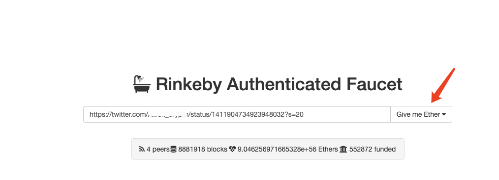
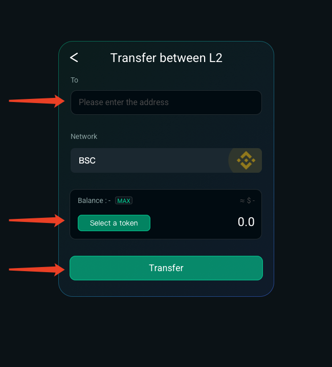
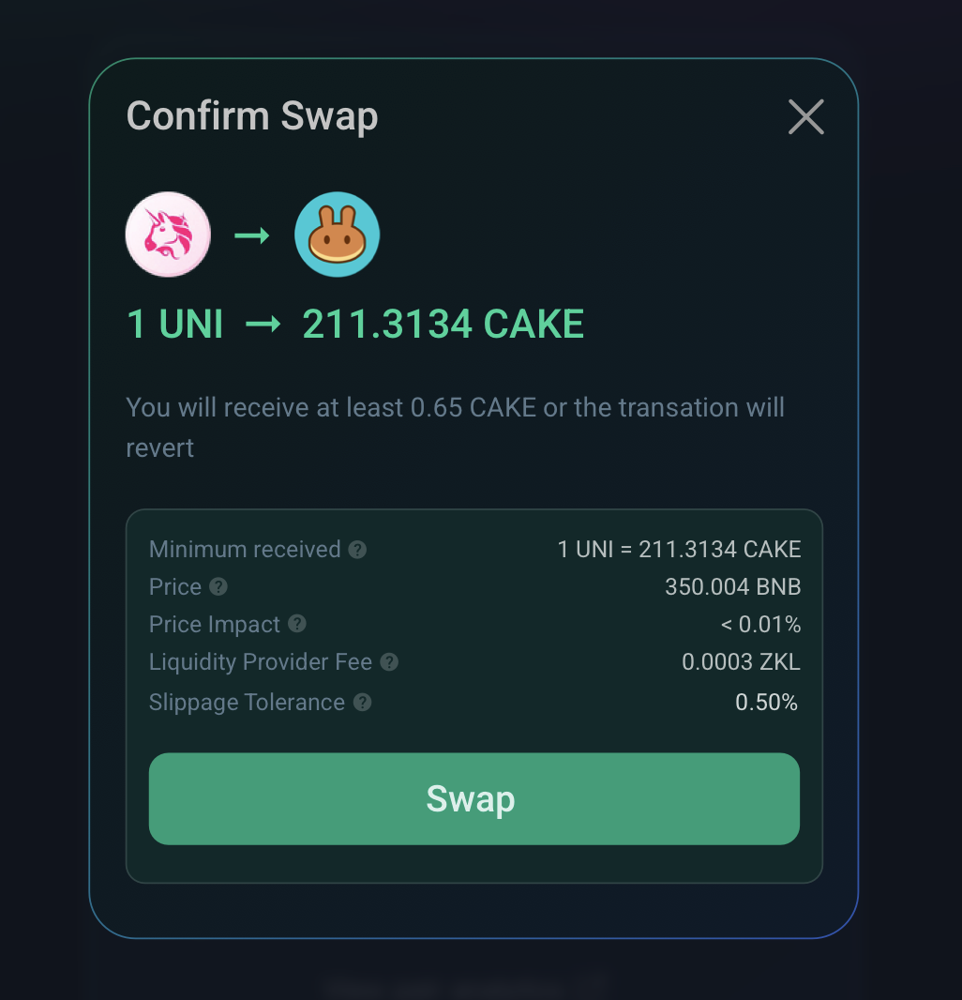
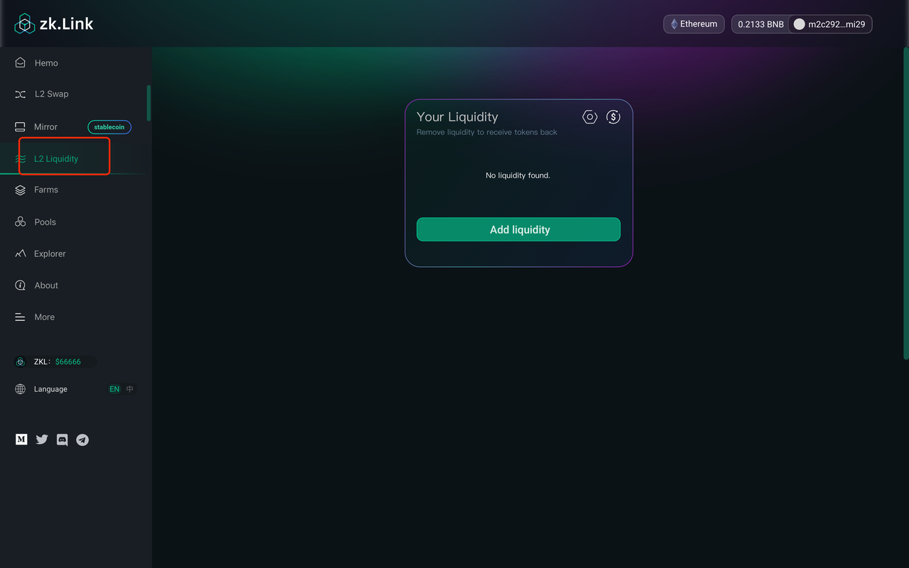
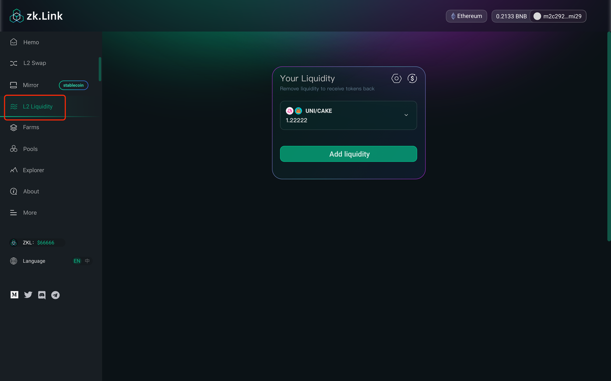

# zklink 테스트 어떻게 참여합니까? (한국어)

---
## Step 1. 지갑 설정 및 준비

### 1. Metamask 설정

#### - Heco Testnet

a. 우측 위에 선택브라우저에서 Metamask 설정하고 [Expand view] 클릭하여 웹 버전 열림

b. [Network settings] 클릭 후 [Custom RPC] 선택

c. 아래와 같이 [HECO Testnet] 추가

  - HECO Testnet
    - networkName: Test heco
    - RPC Url: https://http-testnet.huobichain.com
    - chainId: 256
    - symbol: HT
    - explorerUrl: https://testnet.hecoinfo.com

  - Polygon Testnet
    - networkName: Mumbai Testnet
    - RPC Url: https://rpc-mumbai.maticvigil.com
    - chainId: 80001
    - symbol: Matic
    - explorerUrl: https://explorer-mumbai.maticvigil.com

  - Rinkeby & Goerli Testnet
    Ethereum Testnet "Rinkeby" and "Ropsten" are set by default in your Networks.

### 2. Gas Fee 클레임

#### - Rinkeby
  a. Metamask의 네트워크를 Linkeby로 전환하고 https://faucet.rinkby io/웹사이트 열림

  b. Twitter로 리디렉

  c. 0x... 주소로 변경한 다음 트윗함

  d. 트윗을 찾아 트윗에 링크 복사

  e. Rinkeby로 가서 링크를 붙여넣고 ETH 테스트 토큰 클레임

#### - Goerli

  a. Metamask의 Goerli로 전환하고 https://goerli-faucet.slock.it/웹사이트 열림

  b. 주소 복사 후 인간-기계 확인한 다음  [REQUEST 0.05 GOETH] 클릭

  c. 1분 정도 기다리면 지갑에서 ETH 잔액을 확인 가능

#### - Polygon
  a. Metamask의 네트워크를 Polygon 테스트넷으로 전환하고 https://faucet.matic.network/ 웹 사이트 열림

  b. 지갑 주소를 복사하여 붙여넣고 [Sumbit]을 클릭한 다음 [Confirm] 클릭

  c. 1분 정도 기다리면 지갑에서  Matic잔액 확인 가능

#### - HECO

  a. Metamask의 HECO로 전환하고  https://scan-testnet.hecochain.com/faucet 웹사이트 열림

  b. ID확인하기 위해 GitHub로 리디렉션됩니다. HT 테스트 토큰을 할당하려면 github 계정이 필요함

  c. 1분 정도 기다리시면 지갑의 HT 잔액을 확인 가능

## Step 2. 테스트 토큰 클레임 및 추가 요청

### 1. 테스트 토큰 클레임

  a. 테스트 gas fee 받았는지 확인

  b. 해당 테스트 네트워크로 전환한지 확인

  c. 사이드바에서 [Faucet] 를 선택하고 토큰을 선택한 후[Get] 클릭

  d. 지갑에 로그인

**다음과 같이 테스트 토큰 10개를 제공합니다**
  - Rinkeby （XVS, AUTO, UNI, SUSHI）
  - Goerli （SRM, RAY）
  - Polygon Test （QUICK, KRILL）
  - Heco Test（COW, MDX）

### 2. 지갑으로 테스트 토큰 추가

#### - Rinkeby testnet (XVS, AUTO, UNI, SUSHI)

  - XVS  ：0xAAC36C620E2f52AeC3EeEd2b89A2eA19BAbB132A
  - AUTO ：0x5122fa43c7D6dA72Ecf423F4955A0cC38753dab2
  - UNI  ：0x8Dc5CA19e64ade17aEEB4F8c52BF8ff220eD17dE
  - SUSHI ：0xFced6f29c8BE8C1A679fBc7Ebb0AC1D3298e775e

#### - Goerli testnet (SRM, RAY)

  - SRM ：0x80101F4da93A2912DC41b8eDBB30b98d428b8C43
  - RAY：0xd42b3eebb2e86ef83f78eFB7d5432912D5F9259c

#### - HECO testnet (COW, MDX)
  - COW ：0x1A508809A119Eee6F4b7ADeef3f2a9b4479608Ac
  - MDX ：0xe583769738b6dd4E7CAF8451050d1948BE717679

#### - Polygon testnet (QUICK, KRILL）
  - QUICK ：0xAAC36C620E2f52AeC3EeEd2b89A2eA19BAbB132A
  - KRILL ：0x5122fa43c7D6dA72Ecf423F4955A0cC38753dab2

#### 어떻게 추가 합 니까
XVS를 예로 들어 같은 방법으로 다른 토큰을 추가할 수 있습니다.

  a. [Metamask network to Rinkeby ] 클릭

  b. "Assets" 탭에서 "Add Token" 클릭

  c. 위의 주소를 복사하여 붙여넣고 "Next"을 클릭

## Step 3. 입출금 및 송금

### 1. 에 입금

  - Step 1.홈 페이지에서 [Deposit] 클릭
  - Step 2.다음 페이지에서 목표 토큰을 선택하고 입금할 금액을 입력한다음 [Deposit] 클릭
  - Step 3. 지갑에서 거래 확인
  - Step 4. Layer1 [(the "mainchain"] 거래 확인되면 입금이 L2 지갑 잔액 추가로나타남
  - Step 5. zkLinkscan에서 입금 상태 확인 가능

### 2. 송금

  - Step 1. 홈 페이지에서 [Transfer]을 클릭
  - Step 2. (another zkLinkSwap Layer2 wallet address) 입력하고 지정된 토큰을 선택한 다음 금액을 입력해서 [Transfer] 클릭
  - Step 3. 지갑에서 거래 확인
  - Step 4. 거래 제출
  - Step 5. zkLink 스캔에서 입금 상태를 확인

### 3. 로 출급

  - Step 1. 홈페이지에서 [Withdraw] 클릭
  - Step 2.목표 주소 입력한 다음 [select a token] --- [enter the amount] --- [select a network]--[Withdraw] 클릭
  - Step 3. 지갑 확인하고 로그인
  - Step 4. 출금 완료 후 출금 내역에서 거래 현황을 확인 가능

## Step 4. 유통성 공급 및 교환

### 1. 교환

  - Step 1. 홈페이지에서 [L2 Swap] 클릭
  - Step 2. [From]과 [To]에서 토큰을 선택하고 교환하려는 금액을 입력
  - Step 3. [Slippage Rate] 설정하여 [Swap] 클릭
  - Step 4. 지갑 확인하고 로그인
  - Step 5. 스왑 요청이 제출되고 확인되는 데 5초에서 2분이 걸림

### 2. 유통성 공급하기

  - Step 1. 사이드바에서 [L2 Liquidity] 클릭
  - Step 2. 유동성을 공급하려는 토큰 2개 선택하여 한 토큰의 양을 입력하면 필요한 다른 토큰의 양이 자동으로 채워진 다음 [Supply] 클릭
  - Step 3. 지갑을 확인하고 로그인
  - Step 4. 스왑이 확정되는 데 5초에서 2분이 소요됩니다. [L2 liquidity] 페이지에서 유동성 제공 내역 확인 가능

### 3. 유통성 제거

  - Step 1. 제거하려는 유동성 풀을 클릭하고 [Remove]를 클릭
  - Step 2. 제거하려는 비율을 밀어서 선택하고 [Apply] 클릭
  - Step 3. 지갑을 확인하고 로그인
  - Step 4. 동시에 출금이 많을수록 빠르게 확인 가능

