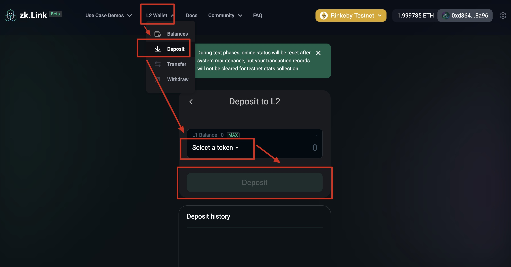
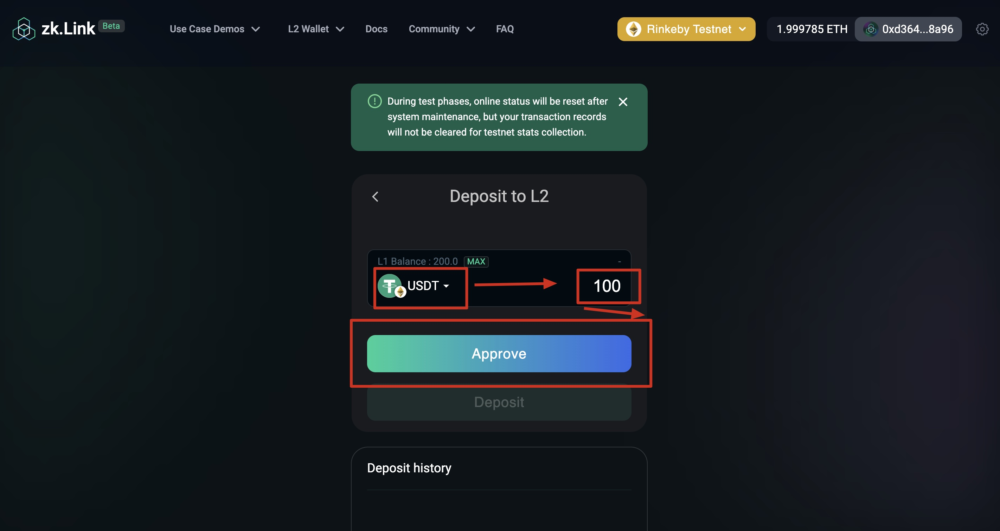
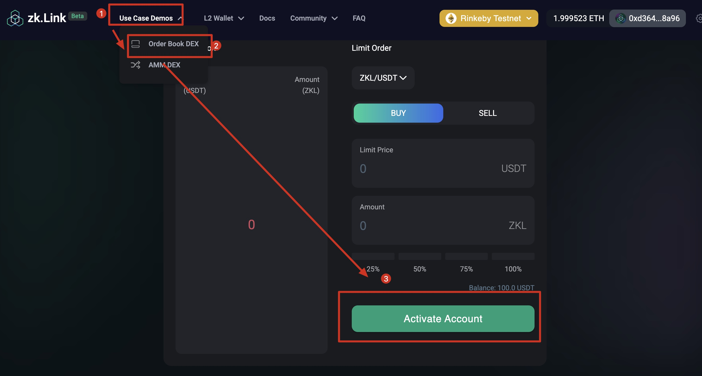
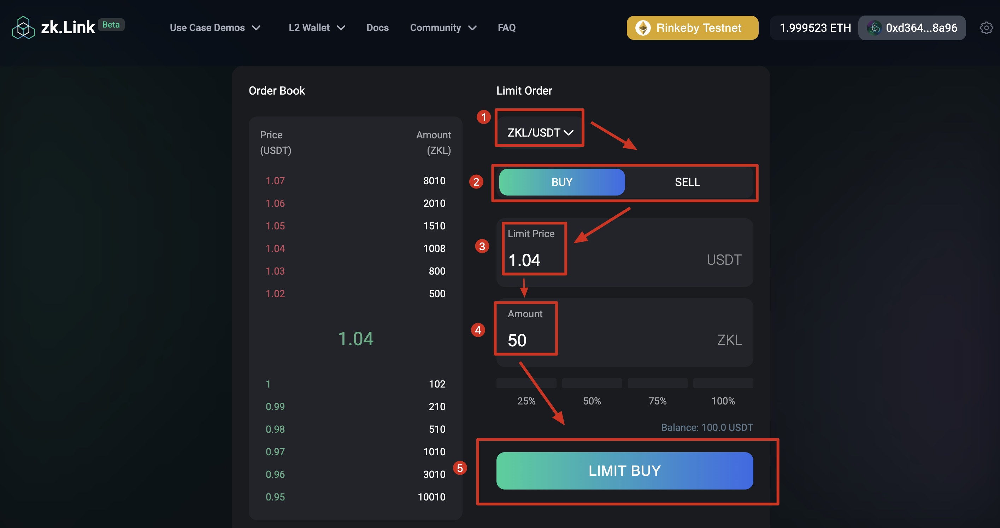

# How to use zkLink's Order Book DEX Demo

---
## Step 1. Deposit to zkLink L2 Wallet
> If you already had enough balance on Rinkeby on zkLink L2 wallet, skip to [create a limit order](/docs/UserGuide/orderbook#step-2-create-a-limit-order).

  a. Navigate to "Top Bar - L2 Wallet - Deposit".

  b. Select a token and enter the amount that you wish to deposit. Then click "Approve".

  c. Click "Approve" and sign in your wallet.

  d. Click "Deposit" and sign again to finalize the deposit.

  e. You can view your deposit history at the bottom of the page.

  
  

## Step 2. Create a limit order

### 1. Activate your limit order account

  a. Navigate to "Top bar - Use Case Demos - Order Book DEX".

  b. Switch network to Rinkeby and connect your Metamask wallet.

  c. Click "Activate Account"

  

### 2. Make an order

  a. Select a token pair.

  b. Choose between "buy" or "sale" order.

  c. Set your limit price and amount.

  d. Click "Limit Buy" and sign in your wallet.

  e. Wait for your order to be filled. You can view your active orders at the bottom of the page.

  
