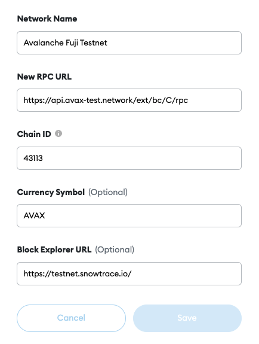

# Preparatory Work

---
>If you are testing zkLink's Order Book Demo, you only need to switch Metamask network to Rinkeby (set by default), claim **[ETH on Rinkeby](/docs/UserGuide/preparatory-work#--claim-eth-test-tokens-on-rinkeby-testnet)** as test gas fees, and claim "**[USDT, USDC, ZKL](/docs/UserGuide/preparatory-work#step-2-claim-and-add-test-tokens)**" as test tokens.
 
If you are testing zkLink's AMM DEX Demo, please go through the following guide to set up at lease two networks, claim gas fees on each network, and claim at least one test token on each network.
 

## Step 1. Set up your wallet & claim gas fees

### 1. Configure Metamask for testnets
Please configure your Metamask for our four testnets: Rinkeby, Goerli, AVAX Testnet, and Polygon Testnet.

  **a. Set up Metamask on your browser. Click "expand view" to open the web version.**

  **b. Click network settings and choose "Custom RPC".**

  **c. Manually add AVAX and Polygon Testnet as shown below:**

  - AVAX Testnet
    - networkName: Avalanche Fuji Testnet
    - RPC Url: https://api.avax-test.network/ext/bc/C/rpc
    - chainId: 43113
    - symbol: AVAX
    - explorerUrl: https://testnet.snowtrace.io/

  - Polygon Testnet
    - networkName: Mumbai Testnet
    - RPC Url: https://rpc-mumbai.maticvigil.com
    - chainId: 80001
    - symbol: Matic
    - explorerUrl: https://explorer-mumbai.maticvigil.com

  - Rinkeby & Goerli Testnet
    - Goerli Testnet and Rinkeby Testnet (Ethereum Testnets) are set to default in the your networks.

### 2. Claim gas fee

**Claim test gas fees for the four testnets: Rinkeby, Goerli, AVAX Testnet, and Polygon Testnet.**

<!------>

#### - Claim ETH test tokens on Rinkeby testnet
Please make sure that you have sufficient gas fee (ETH) for Rinkeby Testnet.

  - a. Switch network on Metamask to Rinkeby, and open the website: https://faucet.rinkeby.io/

  - b. Redirect to Twitter.

  - c. Change the 0x... address to the public key of your wallet and tweet it.

  - d. Find the tweet, click "Copy link to Tweet".

  - e. Go back to Rinkeby. Paste the link and claim ETH test token.

#### - Claim ETH test tokens on Goerli testnet
##### Method 1
  a. Switch network on Metamask to Goerli and open the website: https://faucet.goerli.mudit.blog/

  b. Redirect to Twitter. Follow the guide as of Rinkeby testnet in twitter.

  e. Go back to Goerli. Paste the link and claim an ETH test token.

##### Method 2

  a. Switch network to Goerli on Metamask, and open the website: https://goerli-faucet.slock.it/

  b. Wait about 1 minute and then check the ETH balance in your wallet.

#### - Claim MATIC test tokens on Polygon testnet
  a. Switch network on Metamask to Polygon testnet, and open the website: https://faucet.matic.network/

  b. Copy and paste your wallet address, click 'Submit', and then click 'Confirm'.

  c. Wait about 1 minute and then check the MATIC balance in your wallet.

#### - Claim AVAX test tokens on AVAX testnet

  a. Switch the network to AVAX Testnet on Metamask and open the website: https://faucet.avax-test.network/

  b. Copy and paste your wallet address (C-chain), and click "request".

  c. Wait about 1 minute and then check the AVAX balance in your wallet.

## Step 2. Claim and add test tokens

### 1. Claim test tokens
<!---  --->

  a. Make sure that you have claimed testnet gas fees.

  b. Go to [zkLink Faucet](https://zk.link/app/faucet) or navigate to "Top bar - Community - Faucet".

  c. Switch your network to the one that you wish to claim test tokens on.

  d. Select a token and click "Get".

  e. Sign in your wallet.

  

**Currently we support the following kinds of test tokens:**
  - Rinkeby: USDT, USDC, ZKL
  - Goerli: USDT, BUSD, ZKL
  - Polygon Testnet: USDT, ZKL
  - AVAX Testnet: USDT, USDC, ZKL

### 2. Add test tokens to MetaMask
<!---  --->

  a. Make sure that you are on the right Metamask network.

  b. Copy the token address above the "Get" button.

  c. Go to your Metamask - Assets - Import tokens.

  d. Paste the token address that you just copied, and click "Add Custom Token".

  e. You can see test tokens added to your wallet.

  
