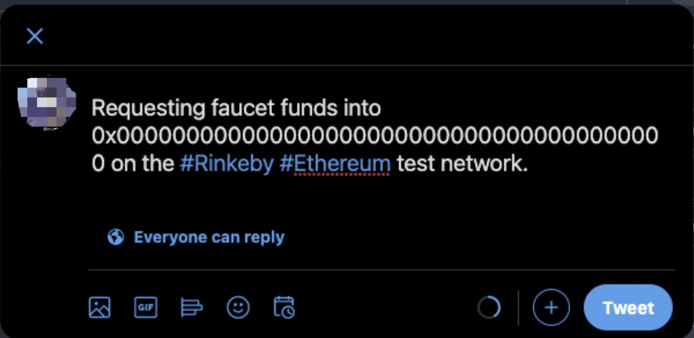
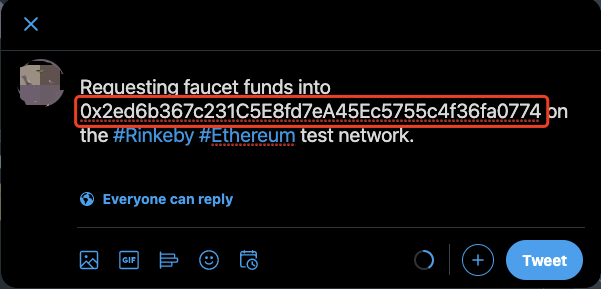
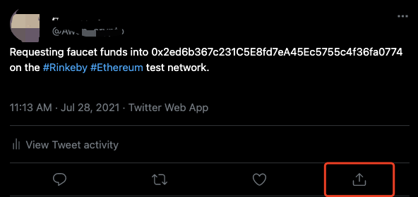
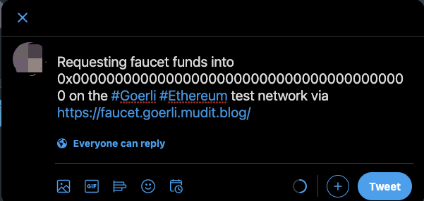
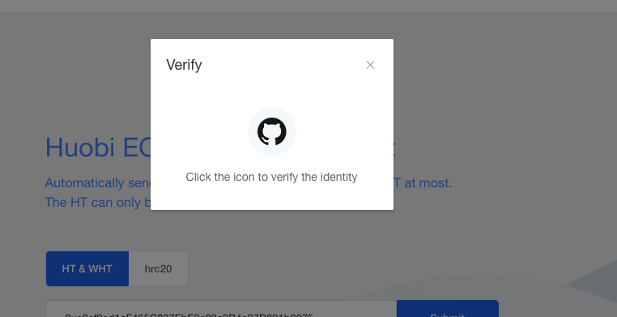
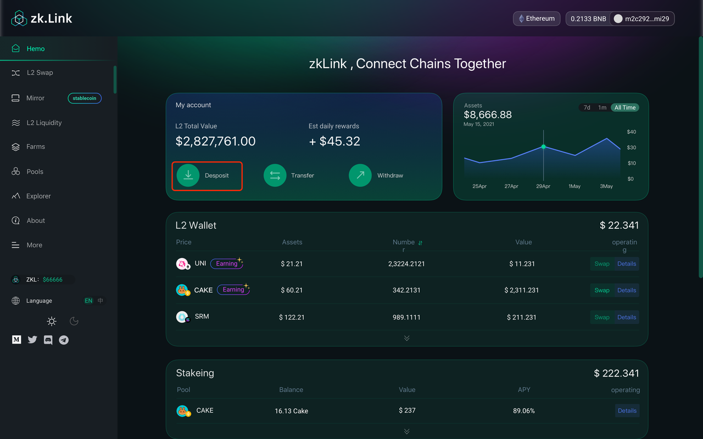
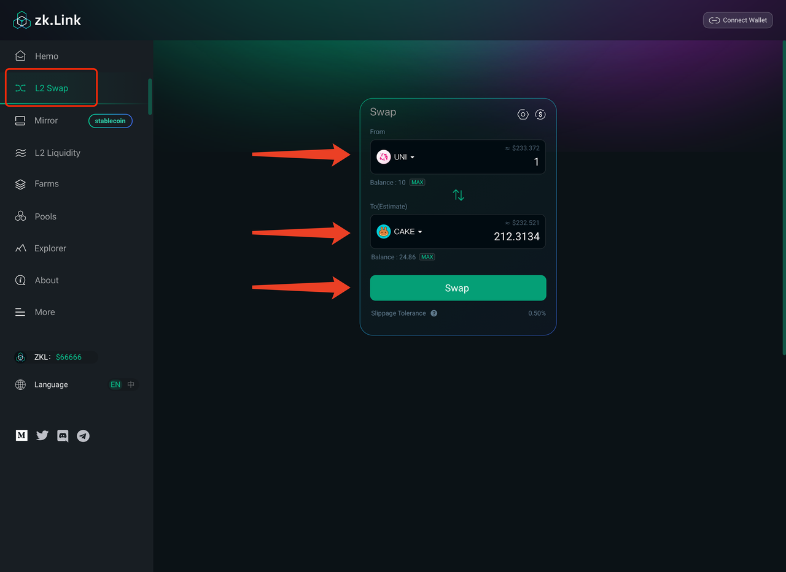
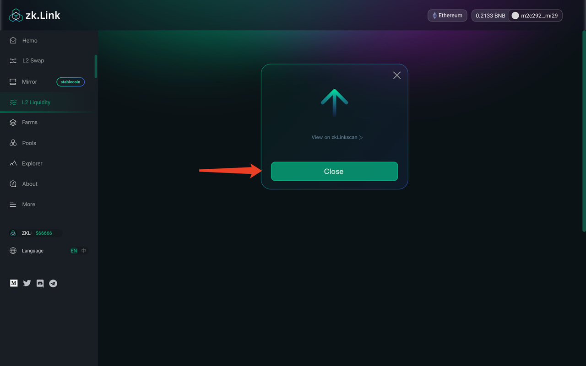
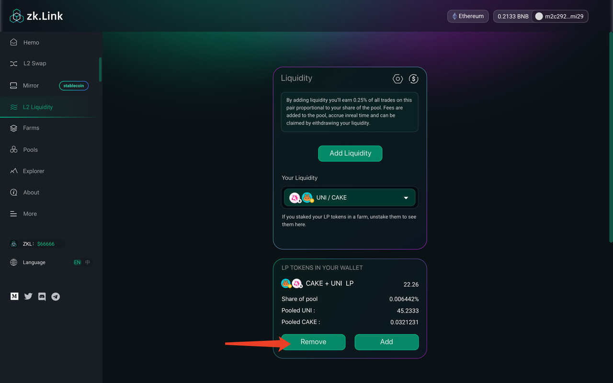

# Como participar do testnet de zkLink? (português)

---
## Passo 1 : Configure sua carteira & prepare-se

### 1. Configure Metamask for testnets

#### - Heco Testnet

a. Configure o Metamask no seu navegador, clique em "expand view" para abrir a versão web.

b. Clique em configurações de rede e escolha "Custom RPC".

c. Adicione manualmente HECO Testnet conforme abaixo.

  - HECO Testnet
    - networkName: Test heco
    - RPC Url: https://http-testnet.huobichain.com
    - chainId: 256
    - symbol: HT
    - explorerUrl: https://testnet.hecoinfo.com

  - Polygon Testnet
    - networkName: Mumbai Testnet
    - RPC Url: https://rpc-mumbai.maticvigil.com
    - chainId: 80001
    - symbol: Matic
    - explorerUrl: https://explorer-mumbai.maticvigil.com

  - Rinkeby & Goerli Testnet
    e Rinkeby & Goerli são definidos por padrão em suas redes, não há necessidade de adicionar.

### 2. Você deve reivindicar alguma taxa de Gas

#### - Rinkeby
  a. Mude a rede do Metamask para Rinkeby e abra o site: https://faucet.rinkeby.io/

  b. Redirecione para o Twitter.

  c. Mude o endereço 0x ... para o seu endereço Ethereum e poste no Twitter.

  d. Encontre o Twitter e copie o link para Twitter.

  e. Volte para Rinkeby. Copie o link do Twitter e solicite o token de teste do ETH.

#### - Goerli

##### Método de coleta 1
  a. Mude a rede do Metamask para Goerli e abra o site: https://faucet.goerli.mudit.blog/

  b. Redirecione para o Twitter.

  c. Mude o endereço 0x ... para o seu endereço Ethereum e poste no Twitter.

  d. Encontre o Twitter e copie o link para Twitter.

  e. Volte para Goerli. Copie o link do Twitter e solicite o token de teste do ETH.

##### Método de coleta 2

  a. Mude a rede para Goerli na Metamask e abra o site: https://goerli-faucet.slock.it/

  b. Copie o endereço, execute a verificação homem-máquina e clique "REQUEST 0.05 GOETH".

  c. Espere cerca de 1 minuto e você poderá verificar a conta de ETH na sua carteira.

#### - Polygon
  a. Mude a rede para Mumbai testnet na Metamask e abra o site: https://faucet.matic.network/

  b. Copie o endereço, clique "Submit" e depois clique "Confirm".

  c. Espere cerca de 1 minuto e você poderá verificar a conta da ETH na sua carteira.

#### - HECO

  a. Mude a rede para test Heco na Metamask e abra o site: https://scan-testnet.hecochain.com/faucet

  b. Você será redirecionado ao GitHub para verificar a identidade. É necessária uma conta github para reivindicar tokens de teste HT.

  c. Espere cerca de 1 minuto e você poderá verificar a conta de HT na sua carteira.

## Passo 2 : Reivindique e adicione tokens de teste

### 1. Reivindique tokens de teste

  a. Certifique-se de ter reivindicado as taxas de Gas da testnet.

  b. Mude sua rede para o testnet correspondente.

  c. Escolha " Faucet " na barra lateral, selecione “UNI” e clique em "Get".

  d. Cadastre-se em sua carteira.

**Fornecemos 10 tokens de teste conforme a seguir**
  - Rinkeby （XVS, AUTO, UNI, SUSHI）
  - Goerli （SRM, RAY）
  - Polygon Test （QUICK, KRILL）
  - Heco Test（COW, MDX）

### 2. Adicione 10 tokens de teste ao Metamask

#### - Rinkeby testnet (XVS, AUTO, UNI, SUSHI)

  - XVS  ：0xAAC36C620E2f52AeC3EeEd2b89A2eA19BAbB132A
  - AUTO ：0x5122fa43c7D6dA72Ecf423F4955A0cC38753dab2
  - UNI  ：0x8Dc5CA19e64ade17aEEB4F8c52BF8ff220eD17dE
  - SUSHI ：0xFced6f29c8BE8C1A679fBc7Ebb0AC1D3298e775e

#### - Goerli testnet (SRM, RAY)

  - SRM ：0x80101F4da93A2912DC41b8eDBB30b98d428b8C43
  - RAY：0xd42b3eebb2e86ef83f78eFB7d5432912D5F9259c

#### - HECO testnet (COW, MDX)
  - COW ：0x1A508809A119Eee6F4b7ADeef3f2a9b4479608Ac
  - MDX ：0xe583769738b6dd4E7CAF8451050d1948BE717679

#### - Polygon testnet (QUICK, KRILL）
  - QUICK ：0xAAC36C620E2f52AeC3EeEd2b89A2eA19BAbB132A
  - KRILL ：0x5122fa43c7D6dA72Ecf423F4955A0cC38753dab2

#### Pegue o XVS como exemplo e você pode adicionar outro token da mesma maneira.

  a. Mude a rede Metamask para Rinkeby.

  b. Na guia "Assets", clique em "Add token".

  c. Copie e cole o endereço do contrato de token acima e clique em "Next".

## Passo 3 : Depósito, retirada e transferência

### 1. Depósito

  - Passo 1. Clique em " Deposit " na página inicial.
  - Passo 2. Na página seguinte, selecione um token de destino e insira a quantidade de token que deseja depositar. Em seguida, clique em " Deposit ".
  - Passo 3. Confirme a transação na sua carteira.
  - Passo 4. Assim que a transação na Camada 1 (o " mainchain ") for confirmada, o depósito será adicionado à conta de sua carteira L2.
  - Passo 5. Você pode verificar o status do seu depósito no zkLinkscan.

### 2. Transferir

  - Passo 1. Clique em " Transfer " na página inicial.
  - Passo 2. Insira o endereço (outro endereço de carteira zkLinkSwap Layer2), selecione um token designado, insira o valor e clique em " Transfer ".
  - Passo 3. Cadastre-se na sua carteira.
  - Passo 4. Transação enviada.
  - Passo 5. Verifique o status no histórico de transações.

### 3. Retirar

  - Passo 1. Clique em " Withdraw " na página inicial.
  - Passo 2. Insira o endereço de destino --- selecione um token --- insira o valor --- selecione uma rede e clique em " Withdraw ".
  - Passo 3. Confirme e faça login na sua carteira.
  - Passo 4. Após o envio do saque, você pode verificar o status da transação no histórico de saques.

## Passo 4：Troque e forneça liquidez

### 1. Trocar

  - Passo 1. Clique em " L2 Swap " na página inicial.
  - Passo 2. Escolha o token em “From” e “To” e insira o valor que deseja trocar.
  - Passo 3. Defina um deslizamento e clique em " Swap ".
  - Passo 4. Confirme e faça login na sua carteira.
  - Passo 5. A solicitação de troca é enviada. Leva de 5 segundos a 2 minutos para que a troca seja confirmada.

### 2. Adicione liquidez

  - Passo 1. Clique em " L2 Liquidity " na barra lateral.
  - Passo 2. Selecione dois tokens que deseja adicionar liquidez. Insira o valor de um token e o valor do outro token necessário será preenchido automaticamente. Em seguida, clique em " Supply ".
  - Passo 3. Confirme e faça login na sua carteira.
  - Passo 4. Leva de 5 segundos a 2 minutos para que a troca seja confirmada. Você pode visualizar seu histórico de fornecimento de liquidez na página " L2 Liquidity ".

### 3. Remova a liquidez

  - Passo 1. Clique na carteira de liquidez que deseja remover e clique em " remove ".
  - Passo 2. Deslize e escolha a porcentagem que deseja remover e clique em " approve ".
  - Passo 3. Confirme e faça login em sua carteira.
  - Passo 4. Quanto mais retiradas forem feitas ao mesmo tempo, mais rápido será a confirmação da sua retirada.

