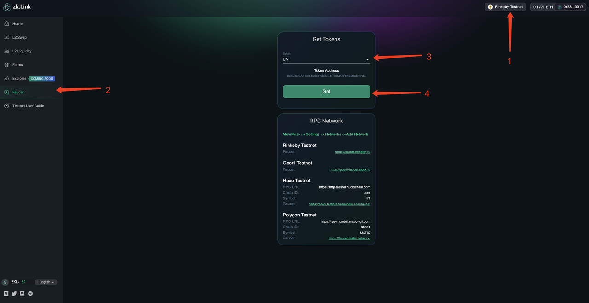

# 如何參與zkLink測試？ （繁體中文）

---
## 一、準備工作

### 1. Metamask錢包添加測試網RPC

a. 瀏覽器安裝metamask插件錢包，點擊三個點，選擇expand view打開網頁版

b. 點擊網絡設置，選擇自定義RPC

c. 按照順序輸入對應的數值，即可添加完成測試網

  - heco測試網
    - networkName: Test heco
    - RPC Url: https://http-testnet.huobichain.com
    - chainId: 256
    - symbol: HT
    - explorerUrl: https://testnet.hecoinfo.com

  - Polygon測試網
    - networkName: Mumbai Testnet
    - RPC Url: https://rpc-mumbai.maticvigil.com
    - chainId: 80001
    - symbol: Matic
    - explorerUrl: https://explorer-mumbai.maticvigil.com

  - Rinkeby & Goerli 測試網
    Rinkeby & Goerli 測試網默認存在無需添加

### 2. 領取測試網絡的Gas費

#### - Rinkeby
  a. Metamask網絡切換到Rinkeby，打開水龍頭領取測試幣網址： https://faucet.rinkeby.io/

  b. 點擊URL打開鏈接並跳轉至推特

  c. 將模版中0x....地址改為自己的錢包公鑰地址，並發布推特

  d. 找到轉發的推特，點擊【分享】按鈕，點擊【Copy link to Tweet】

  e. 回到Rinkeby水龍頭網站，複製推特地址領取ETH測試幣

#### - Goerli

##### 領取方式一

  a. Metamask網絡切換到Goerli，打開水龍頭領取測試幣網址: https://faucet.goerli.mudit.blog/

  b. 點擊下圖【tweet】打開鏈接並跳轉至推特

  c. 將模版中0x....地址改為自己的錢包公鑰地址，並發布推特

  d. 找到轉發的推特，點擊【分享】按鈕，點擊【Copy link to Tweet】

  e. 回到Goerli水龍頭網站，複製推特地址領取ETH測試幣

##### 領取方式二

  a. Metamask網絡切換到Goerli，打開Goerli水龍頭: https://goerli-faucet.slock.it/

  b. 複製地址，進行人機驗證，然後點擊【REQUEST 0.05 GOETH】

  c. 領取完成等1分鐘左右可以在錢包查看ETH測試幣是否到賬

#### - Polygon
  a. Metamask網絡切換Mumbai Testnet，打開matic水龍頭: https://faucet.matic.network/

  b. 複製地址，點擊【Submit】，然後點擊【Confirm】

  c. 領取完成等1分鐘左右可以在錢包查看Matic測試幣是否到賬

#### - Heco

  a. Metamask網絡切換到test Heco，打開heco水龍頭: https://scan-testnet.hecochain.com/faucet

  b. 鏈接github賬號，沒有的用戶需要提前註冊github賬戶

  c. 領取完成等1分鐘左右可以在錢包查看HT測試幣是否到賬

## 二、如何領取zkLink測試網代幣

### 1. 領取測試幣

  a. 保證自己測試網有一定量的Gas費  

  b. 切換到對應的測試網，設置Metamask和zkLink的網絡一致。以Rinkeby測試網領取UNI為例：

  c. 導航欄選擇【Faucet】，選擇UNI，點擊Get

  d. 在Metamask錢包簽名，在錢包查看測試幣到賬

#### 目前支持領取的測試幣：

  - Rinkeby （XVS、AUTO、UNI、SUSHI、USDT、USDC）
  - Goerli （SRM、RAY、USDT、BUSD）
  - Polygon Test （QUICK、KRILL、USDT）
  - Heco Test（COW、MDX、USDT、HUSD）

### 2. 在Metamask添加測試幣地址

#### 測試代幣合約地址：

#### - Rinkeby testnet（XVS, AUTO, UNI, SUSHI, USDT, USDC）

  - XVS  ：0xAAC36C620E2f52AeC3EeEd2b89A2eA19BAbB132A
  - AUTO ：0x5122fa43c7D6dA72Ecf423F4955A0cC38753dab2
  - UNI  ：0x8Dc5CA19e64ade17aEEB4F8c52BF8ff220eD17dE
  - SUSHI ：0xFced6f29c8BE8C1A679fBc7Ebb0AC1D3298e775e
  - USDT：0xa689352b7c1CaD82864bEb1D90679356d3962f4d
  - USDC：0xe583769738b6dd4E7CAF8451050d1948BE717679

#### - Goerli testnet（SRM, RAY, USDT, BUSD)

  - SRM ：0x80101F4da93A2912DC41b8eDBB30b98d428b8C43
  - RAY：0xd42b3eebb2e86ef83f78eFB7d5432912D5F9259c
  - USDT：0xe583769738b6dd4E7CAF8451050d1948BE717679
  - BUSD：0xb809b9B2dc5e93CB863176Ea2D565425B03c0540

#### - HECO testnet（COW, MDX, USDT, HUSD）
  - COW ：0x1A508809A119Eee6F4b7ADeef3f2a9b4479608Ac
  - MDX ：0xe583769738b6dd4E7CAF8451050d1948BE717679
  - USDT：0x100fFDF20A0a105C83174F28b74dBA13625b54Dd
  - HUSD：0x934988A757a543C2ECCf39F6eFf398C62A0D9Fd6

#### - Polygon testnet（QUICK, KRILL, USDT）
  - QUICK ：0xAAC36C620E2f52AeC3EeEd2b89A2eA19BAbB132A
  - KRILL ：0x5122fa43c7D6dA72Ecf423F4955A0cC38753dab2
  - USDT：0xe583769738b6dd4E7CAF8451050d1948BE717679

#### 如何添加

這里以Rinkeby添加XVS為例。添加代幣需先切換到對應網絡，其他同理：

a. 選擇Rinkeby測試網

b. 點擊【Add token】

c. 複製代幣合約地址（XVS  ：0xAAC36C620E2f52AeC3EeEd2b89A2eA19BAbB132A）到 Token Contract Address，點擊【Next】即可添加完成

## 三、如何進行充提和轉賬

### 1. 充值

  - a. 點擊首頁【充值】,進入充值頁面
  - b. 在充值頁面，選擇想要充值代幣並輸入充值金額，點擊【充值】
  - c. MetaMask會將顯示一個彈出窗口以確認交易。您可以在此處調整 GAS 費用（GAS費視當時L1主網平均手續費而定），點擊確認
  - d. 充值提交完成：需要等待L1主鏈區塊確認後，充值進zkLink的代幣才會到賬，具體時間基於L1主鍊網絡情況而定。到賬後將會在L2錢包資產明細中顯示
  - e. 可在充值記錄查看充值明細，點擊可以跳轉至zkLink瀏覽器充值查看詳情

### 2. 轉賬

  - a. 點擊首頁【轉賬】,進入轉賬頁面
  - b. 輸入轉賬地址（其他 zkLinkSwap layer2 錢包地址），選擇代幣並輸入轉賬金額，點擊【轉賬】
  - c. MetaMask會自動彈窗，點擊簽名完成轉賬
  - d. 可在轉賬記錄查看轉賬明細，點擊可以跳轉至zkLink瀏覽器查看詳情

### 3. 提現

  - a. 點擊首頁【提現】,進入提現頁面
  - b. 輸入提現地址 - 選擇要提現的幣種 - 輸入提現金額 - 選擇提現網絡 - 點擊【提現】
  - c. MetaMask會自動彈窗，點擊簽名完成提現
  - d. 提現提交完成（預計1-3分鐘提現交易會發送至L1網絡，具體到賬時間取決於L1網絡狀況，可以跳轉至瀏覽器查看進度）
  - e. 可在提現記錄查看提現明細，點擊可以跳轉至zkLink瀏覽器查看詳情

## 四、如何交換和提供流動性

### 1. 交換代幣

  - a. 點擊L2交換
  - b. 選擇輸入的代幣種類和數量-選擇輸出的代幣種類
  - c. 在上角設置滑點-點擊兌換
  - d. MetaMask 彈窗顯示即將執行的對話交易 - 點擊簽名
  - e. 兌換完成提交：（目前約等待5秒至2分鐘完成兌換確認，取決於L2交易狀況，交易越多則確認越快）

### 2. 如何添加流動性

  - a. 左邊導航欄選擇L2流動性，點擊【添加流動性】
  - b. 選擇添加流動性的兩種代幣，輸入其中一種代幣數量，系統會自動生成需要添加的另一種的代幣數量 - 點擊【供應】
  - c. MetaMask 彈窗顯示即將執行的交易 - 點擊簽名
  - d. 添加流動性完成；（目前約等待5秒至2分鐘完成添加確認，取決於L2交易狀態，交易越多則確認越快）
  - e. 在流動性頁面可以看到已添加過流動性的資金池顯示 ，下拉展開已添加流動性列表，點擊【增加】可以添加流動性的份額

### 3. 如何移除流動性

  - a. 左邊導航欄選擇L2流動性，點擊已添加過流動性資金池，點擊【移除】按鈕
  - b. 拉動按鈕確認移除金額的百分比 - 點擊【移除】；（目前約等待5秒至2分鐘完成移除確認，取決於L2交易狀況，交易越多則確認越快）
  - c. MetaMask 自動彈窗顯示即將執行的交易 - 點擊“簽名”
  - d. 移除流動性完成；（目前約等待5秒至2分鐘完成流動性移除的確認（取決於L2交易狀況，交易越多則確認越快）
  - e. 在流動性頁面可以看到已添加過流動性的資金池顯示 ，下拉展開已添加流動性列表，點擊【增加】可以添加流動性的份額

