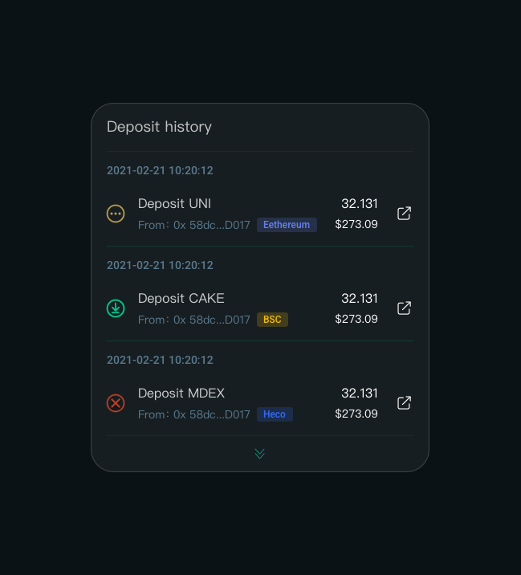
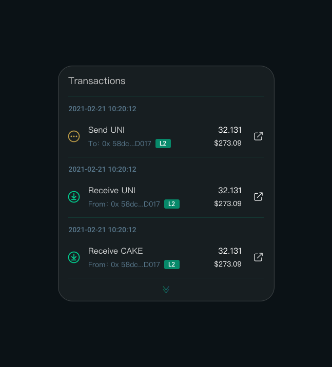
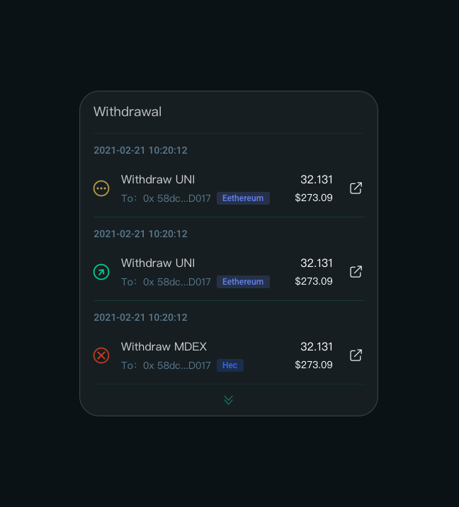
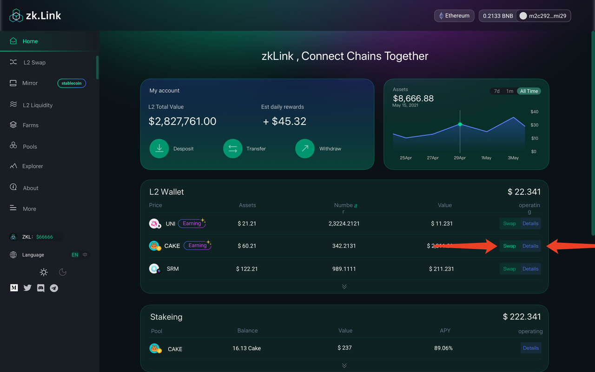
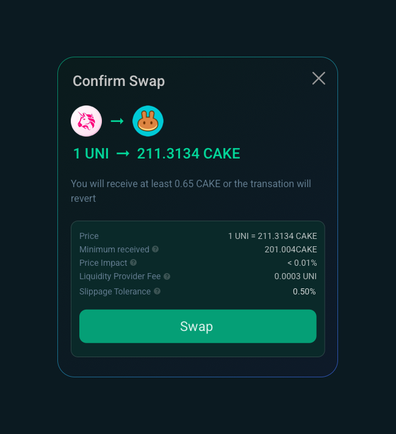
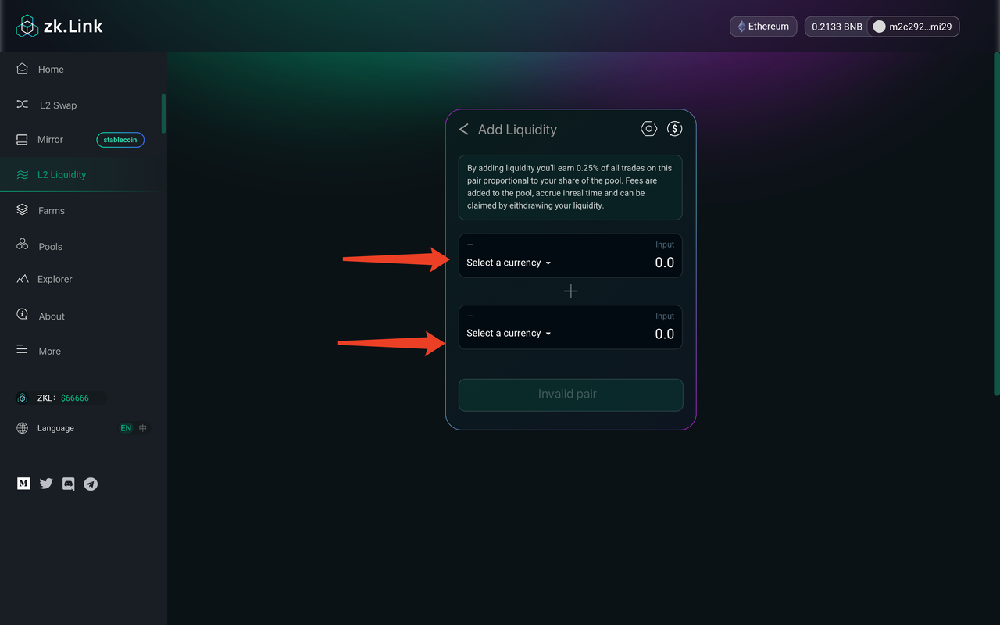
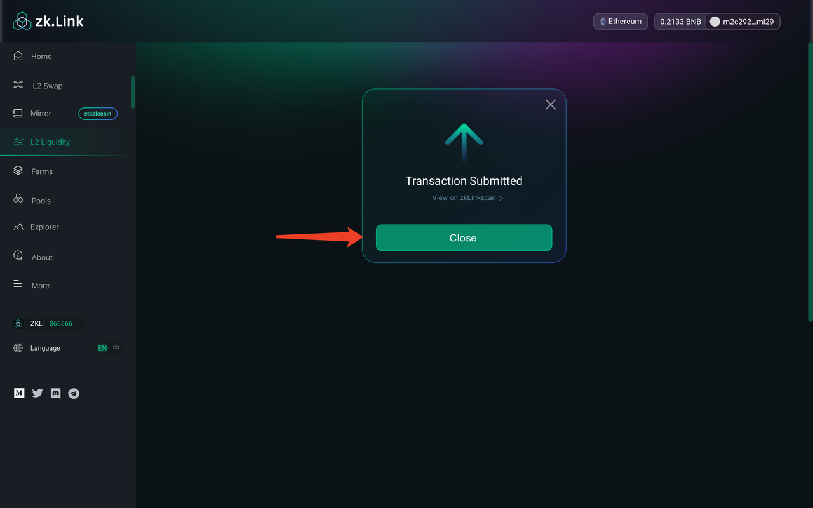
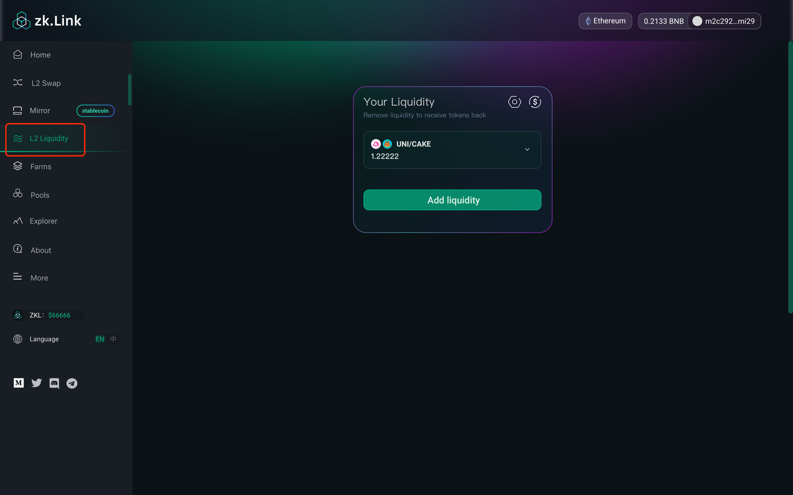
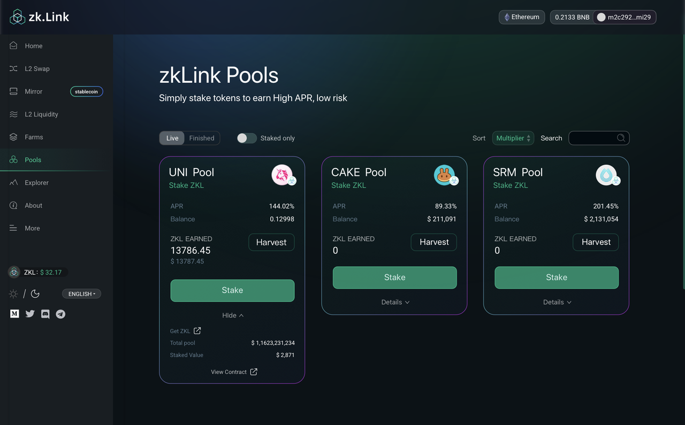

# User Guide

---

## How to connect your wallet to zkLink

Step 1. Go to https://zk.link/ and click "Enter App"

Step 2. Connect your wallet

Connect the wallet in the top-right corner (zkLink v1 supports MetaMask).

Select a network: the default setting is Ethereum network, and you can switch to BSC or Heco by clicking Ethereum. MetaMask will pop up and you can authorize to switch a network. 

## Deposit, withdrawal and transactions

### Deposit to Layer2

Step 1. Click "Deposit" from the home page

Step 2. In the following page, select a target token and enter the amount of token that you wish to deposit. Then click "Deposit"

Step 3. A MetaMask pop-up window will appear. You can adjust your gas fee and click "confirm"

Step 4. Once the block on Layer1 (the "mainchain") is confirmed, the deposit is credited as is shown in the L2 wallet

Step 5. You can check the status in the deposit history

### Transactions

Step 1. Click "Transfer" from the home page

Step 2. Enter the address (a zkLinkSwap Layer2 wallet address), then select a designated token and enter the amount. Then click "Transfer"

Step 3. Confirm and sign in the MetaMask pop-up window

Step 4. Transaction submitted. It takes 5 seconds to 2 minutes to confirm the transaction depending on Layer2 traffic. The more transactions on Layer2 are happening, the fast your transaction is confirmed

Step 5. You can check the status in the transaction history

### Withdrawal to Layer1

Step 1. Click "Withdraw" from the home page

Step 2. Enter the target address --- select a token --- enter the amount --- select a network, and click "Withdraw"

Step 3. Confirm and sign in the MetaMask pop-up window

Step 4. Withdrawal submitted. It takes 1~3 minutes for the request to be sent to the target Layer1 network, and the confirmation time depends on Layer1 network traffic

Step 5. You can check the status in the withdrawal history

### My Layer2 wallet

In this section, you can view your tokens on Layer2. Click "Detais" to view the balance and history. By clicking "Swap" you can be directed to swap page.

## Swap and provide liquidity

### Swap

Step 1. Click "L2 Swap" from home page

Step 2. Choose the token in “From” and “To” and enter the amount you want to swap.

Step 3. Set a slippage and click "Swap"

Step 4. Confirm and sign in the MetaMask pop-up window

Step 5. Swap request is submitted. It takes 5 seconds to 2 minutes for the swap to be confirmed, depending on Layer2 traffic. The more transactions on Layer2 are happening, the fast your swap is confirmed

### Mirror (Stablecoins swap)

> zkLink supports **one-click swapping** with stablecoins on different chains or of different kinds.

Step 1. Click "Mirror" from the side bar in home page 

Step 2. Select a stablecoin you wish to swap from. zkLink supports the swap between USD, BTC and ETH

Step 3. Select initiative and objective public chains. Current zkLink supports Ethereum, BSC, and Heco

Step 4. Choose the token in “From” and “To” and enter the amount you want to trade.

Step 5. Step 3. Set a slippage and click "Swap"

Step 6. Confirm and sign in the MetaMask pop-up window

Step 7. Swap request is submitted. It takes 5 seconds to 2 minutes for the swap to be confirmed, depending on Layer2 traffic. The more transactions on Layer2 are happening, the fast your swap is confirmed

### Add liquidity

Step 1. Click "L2 Liquidity" from the side bar in home page 

Step 2. Select a liquidity pair that you wish to add liquidity to. Enter the amount of a token, and the amount of the other token required will be calculated by the system. Click "Supply"

Step 3. Confirm and sign in the MetaMask pop-up window

Step 4. It takes 5 seconds to 2 minutes for the swap to be confirmed, depending on Layer2 traffic. The more transactions on Layer2 are happening, the fast your swap is confirmed

Step 5. You can view your liquidity providing history from "L2 liquidity" page

### Remove liquidity

Step 1. Click the liquidity pool that you want to remove, and click "remove"

Step 2. Slide and choose a percentage that you want to remove, and click "approve"

Step 3. Confirm and sign in the MetaMask pop-up window

Step 4. It takes 5 seconds to 2 minutes for the request to be confirmed, depending on Layer2 traffic. The more transactions on Layer2 are happening, the fast your swap is confirmed

## Farming

### Start farming

Step 1. Click "farm" from the side bar in home page, and choose a liquidity pool that you prefer. For example, UNI-CAKE, to earn ZKL

Step 2. Click "Deposit" (make sure that you have the according tokens in your Layer2 wallet)

Step 3. The liquidity pools and their respective API are shown in the "Farms" page. 

Step 4. By adding liquidity, users can acquire LP Token. Users who hold LP Tokens on zkLinkswap can participate in farming automatically, and the earnings will be credited to their Layer2 account daily

### Stop farming

Step 1. Click "withdraw" in the "Farms" page to stop farming

## Staking

Step 1. Click "Pool" from the side bar in home page, select a pool where you wish to stake tokens and earn. For example, earn ZKL by stake UNI

Step 2. Make sure that you have the according tokens in your Layer2 wallet. Staking is an automatic process, and the rewards will be credited to your Layer2 account daily

