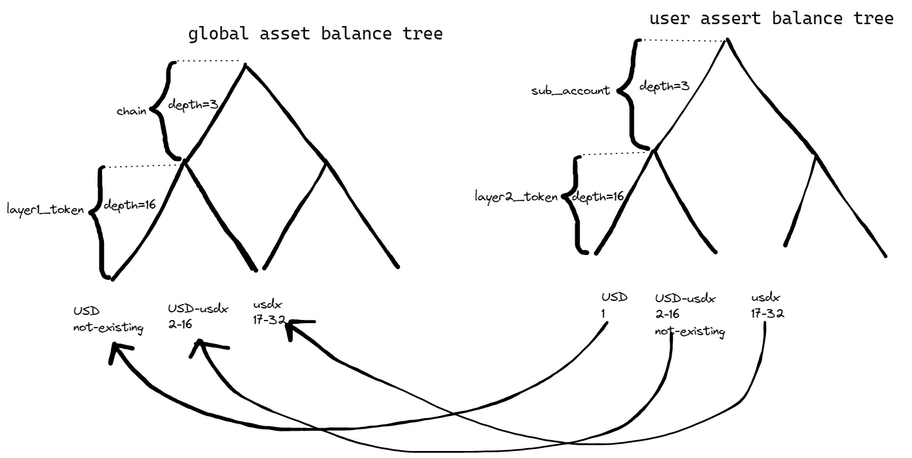

# Terminology

---

## L1
Blockchains such as Ethereum, Binance Smart Chain, Solana, etc. zkLink smart contracts are deployed on L1s that users interact with. L2 downloads events from L1 that include change-in-states, and Validator submits Block and Proof to smart contracts to sync L2 states with L1.


### Event
A `NewPriorityRequest` is created on L1s that needs to be processed on L2s, including the following information:

| Name              | Description                |
|-----------------|-------------------|
| nextPriorityRequestId          | The Id of Operation   |
| opType          | The type of Operation   |
| pubData         | The content of Operation      |
| expirationBlock | The expiration Block of Operation |

A PriorityRequest is the request that should be prioritized by L2. Requests sent via L2 interfaces by users are not PriorityRequest. When L2 captures a PriorityRequest from L1, L2 will first execute the PriorityRequest in the queue. If the PriorityRequest is still not processed when L1 block number exceeds `expirationBlock`, the L1 contract will be into `Exodus` mode when

### PendingBalance
During block processing when the contract executes token exit requests such as FullExit, Withdraw, ForcedExit, if the transaction fails, pending balance information will be generated. For example, when the contract is requested to transit 100 USDT to Alice, if the transaction fails, `pendingBalance[Alice][USDT] += 100`. Failure causes might be:

 * the gas of the transaction exceeds 100,000. There is a gas limit for every transaction which is supposed to be more than enough for normal eth transactions and ERC20 token transactions.
 * transaction fails. For example, the contract address refuses eth transactions.

In these cases, Users may invoke `withdrawPendingBalance` and withdraw tokens.

### Exodus Mode

When users' L1 transactions（PriorityRequest) are not executed in time, `activeExodus` can be called to activate `Exodus` mode, when all L1 transactions, block executions from the Validator, and acceptance executions from the Accepter will be rejected.

In `Exodus` mode, users can cancel their un-processed `Deposit` by calling `cancelOutstandingDepositsForExodusMode`, and acquire L2 balance information by calling `performExodus` and providing `exitProof` to the contract.

Since cross-chain block verification is needed in block execution, when a chain is in `Exodus` mode, the rest chains will enter `Exodus` mode in sequence because they are not able to execute blocks anymore. The algorithm for the available token amount via `performExodus` on a specific chain is:

```
// allAmount is the total amount of token on all chains
const allAmount = chainAmount[0] + chainAmount[1] + ... + chainAmount[n];
// userPercent is the percentage of the user's token amount
const userPercent = userAmount / allAmount;
// userExodus[i] is number of tokens that the users is able to withdraw on chain_i
const userExodus[i] = userPercent * chainAmount[i];
```
For example, Alice holds 100 USDT on L2, and there are 4 chains connected to L2 whose sum of USDT is 1000 (among which there are 500 on Ethereum). Thus Alice owns 10% of the total USDT. When Alice calls `performExodus` on Ethereum she will get 50 USDT, and will have to call `performExodus` on the other three chains to withdraw the rest 50 USDT.

The algorithm for the merged token USD is slightly different: assuming USD includes USDC, BUSD, HUSD, and there are 100 USDT, 50 BUSD, and 50 HUSD. When Alice holds 20 USD, first the contract calculates the exit-able USD "package" proportionately for Alice, which is 10 USDC, 5 BUSD, and 5 HUSD; then calculates the amount of token on each chain that can be withdrawn following the above algorithm.

### Cross-Chain Block Verification
Before a block can be executed, proof must be finished, and syncHash must be verified as consistent as it on other chains. Only when the syncHash on all chains are all consistent can a block being executed. L1 contracts on different chains pass syncHash to each other via bridges such as LayerZero, Mutlichain.

zkLink is responsible for cross-chain bridges management, and can ban those who cannot pass information in time or those with malicious behavior. This will make sure that cross-chain syncHash verification can be finished on time and avoid `Exodus` mode due to the contract fails to execute blocks.

zkLink defines each chain with a `CHAIN_ID`. For example in zkLink testnet:

| Network        | CHAIN_ID |
| ----------- | -------- |
| POLYGONTEST | 1        |
| AVAXTEST    | 2        |
| RINKEBY     | 3        |
| GOERLI      | 4        |

The result of every syncHash cross-chain verification is stored in the L1 contract, which is calculated by all the other `CHAIN_ID` moving 1 to the left (1 << CHAIN_ID - 1). For example, for the syncHash of a block, AVAXTEST and GOERLI pass the information via bridges that the syncHash is correct, the result of cross-chain verification on POLYGONTEST is:

```
1 << 0 | 1 << 1 | 1 << 3 = 11
```

When all chains have confirmed that the syncHash is correct, the result of the cross-chain verification should be:

```
1 << 0 | 1 << 1 | 1 << 2 | 1 << 3 = 15
```

Only when the result of the cross-chain verification on POLYGONTEST equals 15 will POLYGONTEST executes the block.


## L2
L2 (Layer2) in zkLink refers to ZK-Rollup service that includes a state machine. L1 events and L2 transactions will trigger the change in state on L2. L2 transactions refer to those from L2 APIs including Transfer, Withdraw, OrderMatching, etc. L2 state changes are regularly pushed to L1, and the rollup operator generates a zero knowledge proof that includes transactions and state changes during a certain period of time, then the validator uploads the proof to L1.

## Account

An account is a component of L2 state, that includes:


| Name          | Description                                                   |
|-------------|------------------------------------------------------|
| address     | the ETH address of this account                                      |
| pubKeyHash  | the pubKeyHash set by ChangePubKey, not the pubKeyHash of the address |
| nonce       | similar to the nonce of ETH address on L1 chains                               |
| balanceTree | there are 8 balanceSubtree in a balanceTree that correspond to 8 sub accounts    |
| orderTree   | the height of an orderTree is 4, referring to 16 order nonce|


Two ways to create a new account:
  * Deposit from L1 and designate the target address
  * Initiate a transfer on L2 and designate the target address

If the target address does not linked to any account, a new account will be created. The pubKeyHash must be set be before making any operation to the account, which is executed via ChangePubKey. If the address is an EOA address with a private key, the pubKeyHash will be the pubKey Hash of the L2 private key; if the address is a contract address generated by create2 with no private key, the pubKeyHash will be one of the salt input parameters during creating create2.

L2 private key is derived from the private key of EOA address:

```
EOA account private key (L1) -> sign the EIP-712 -> signature as the seed to create L1 private key -> L2 private key -> L2pubKey -> pubKeyHash
```
A user can control the account with the private key of EOA account. The L2 private key can be created again if lost, and change the pubKeyHash that controls the account via ChangePubKey. If the EOA account private key is lost, the user can still control the account with L2 private key.


For a contract address, there are two scenarios:
* If the address is created via create2 and complies with EIP-1271, assets on it can still be transferred or withdrawn by providing correct signature.
* For other contract addresses without a private key, there is no way to transfer assets but users can still withdraw tokens to L1 by ForcedExit.


The nonce of an account is to avoid double processing. Every L2 transaction is linked with a nonce that is consistent with the nonce of the according account. When the L2 transaction is finalized the account nonce will be added by 1.

There are 8 sub-accounts under each account that record token balance. For example, Alice holds 100 USDT in sub_account_0 and 200 ZKL in sub_account_1. The purpose of sub-accounts is to reduce the risk of concurrent operations. Without sub-accounts, Alice can transit her USDT to another account AFTER placing a ZKEX order selling USDT for BTC, which will fail when ZKEX tries to uploads this OrderMatching to L2 because there is no sufficient USDT in her account.

zkLink will tag a sub-account with a certain application, such as sub_account_1 for ZKEX. Users still hold full control of their sub-accounts with signature required for any sub-account operation. However, zkLink may restrict the operator of sub accounts, for example, sub_account_1 transactions can only be submitted by ZKEX in the following process:

```
Alice signs the sub_account_1 transaction -> ZKEX receives the transaction request with signature -> ZKEX sends the transaction to zkLink -> update the sub_account_0 of Alice
```

Sub_account_0 is not tagged to any specific application, which anyone can send transactions to.

```
Alice signs a sub_account_0 transaction -> the signed transaction is sent to zkLink -> sub_account_0 of Alice is updated
```

It is worth noticing that the sub-account mechanism can only solve L2 concurrent operations, and users can still withdraw tokens from their sub-accounts from L2 via FullExit from L1. zkLink will notify the application operators of sub-accounts (except for sub_account_0) before FullExit request is processed.

### Special Account

#### Validator Account
For now, the validator account id is 0 in zkLink protocol and circuit.

validator account is zklink collect-fee(network fee) account，fee will be added to the validator account during the execution of each op.

#### Global Assets Account
For now, the global assets account id is 1 in zkLink protocol and circuit.

The global assets account is mainly used to keep L1 tokens on each chain, with chain_id equals the sub_account_id of this account. Transaction such as deposit, withdraw, forcedExit, fullExit will change this account status.

chain_id equals the sub_account_id of the account, and in this account, the tokenId from 2-16 represents stablecoins deposited from L1 as USD such as USD-USDT, USD-USDC, etc; thus USD with tokenId=1 in this account and with tokenId from 2-16 in special accounts is illegal.


The default address of this account is 0xffff.... , thus there is no private key to this account and changepubkey can not be processed. No one can control this account.




## Token

There are two concept in the definition of Token: Fungible Token(ERC20) and Non-Fungible Token(NFT). Currently zkLink only supports Fungible Token. Each kind of Token is encoded with a unique Token ID on L2. There are other attributes of tokens on L1 contracts:


| Name           | Description          |
| -------------- | ----------------------- |
| tokenId        | L2 tokenId             |
| paused         | true encoded as 'not deposit-able'     |
| tokenAddress   | token contract address               |
| decimals       | decimals of L1 token         |
| standard       | whether it is standard erc20 token |
| mappingTokenId | L2 mapping tokenId       |

> 0xEeeeeEeeeEeEeeEeEeEeeEEEeeeeEeeeeeeeEEeE is encoded as gas fees.

zkLink allows Governor to forbid token deposit, but token withdrawal can be processed at any time.  

zkLink supports nonstandard ERC20 token, which refers to those that transaction fees might be charged to transfer-out or  transfer-in. For example, when Alice transfers 100 tokens to Bob, for nonstandard ERC20 tokens, 101 tokens might deducted from Alice's account (1% transaction fees included). In all cases the increase of L2 balance is subject to L1 contract: for example, Alice deposits 100 nonstandard ERC20 token but zkLink contract receives only 95, Alice's L2 account balance will be added by 95.

The same kind of token on different chains is encoded with the same tokenId on L2, such as USDT on Ethereum and USDT on BSC, despite their different chains and contract address, they share the same L2 tokenId.

### Token Decimals

The decimal of each token on L2 is 18, but not all on L1; for example, the decimal of USDC on Ethereum is 6. In Deposit, token amount is improved by decimals. For example, A user deposit 5 USDC from Ethereum, the `amount` processed by zkLink contract is `5 * 10 ^ 6`, the amount in Deposit pubdata generated by zkLink contract is improved by decimals as `5 *  10 ^ 18`.

On the contrary, in withdraw processes (Withdraw, FullExit, and ForcedExit）the decimal of `amount` in pubdata is resumed. For example, in a withdraw process of 5 USDC from L2 to Ethereum, the `amount` in pubdata is `5 * 10 ^ 18`, and the `amount` input of USDC transfer API is `5 * 10 ^ 6`.


### Token Mapping
Some stablecoins back by fiats such as USDC and BUSD are equivalent to USD. To aggregate the liquidity of these stablecoins, zkLink creates a virtual USD token. Users can choose to receive the same amount of USD on L2 while depositing USDC or BUSD, and can withdraw the same amount of USDC or BUSD while withdrawing USD.

| TokenId  | Description                       |
| -------- | -------------------------- |
| 0        | illegal                     |
| 1        | USD                        |
| 2-16     | stablecoins tokenId that are merged as USD |
| 17-31    | stablecoins tokenId            |
| 32-65535 | other tokens                  |

## Transaction

Users update account states by transactions, such as pubKeyHash. Transactions are classified into two categories:
* L1 transaction, by calling L1 contract to generate an event;
* L2 transaction, by calling L2 API to send a transaction.

### L1 Transaction

A `NewPriorityRequest` event is generated with a L1 transaction, when L2 receives the request it will update the account state. There are two kinds of L1 transactions:
* Deposit
* FullExit

zkLink will prioritize all L1 transactions, and guarantees that zkLink will rollup all transactions and upload them to L1 even if the transaction does not change account status. Otherwise when a L1 transaction times out the contract will be in Exodus mode.

`totalOpenPriorityRequests` records the number of pending L1 transactions. On some public chains with high TPS and low gasPrice, a huge amount of invalid L1 transactions can be initiated that brings great pressure to L2 service since generating a Proof requires a certain computational cost. To avoid such DDOS attack, the amount of transactions is restricted on L1 that varies on different chains with the default value being 4096.

#### Deposit

A deposit transaction includes depositETH and depositERC20 that deposits tokens from L1 to L2. The number of tokens added to L2 balance is subject to the number increased on L1 contract. Deposits of the same kind of token on different chains (such as USDT on Ethereum and USDT on BSC) will be accumulated.

For example, Alice deposits 100 USDT from Ethereum, and 100 USDT from BSC, her L2 account will own 200 USDT.


#### FullExit

When users do not trust the service operator on zkLink, they can initiate FullExit and withdraw L2 tokens to L1. A user may initiate FullExit to other accounts but nothing will happen.

Note: when the number of a token on a L2 account exceeds the its balance on a certain chain, for example, Alice owns 200 USDT on L2 but there are only 100 USDT on zkLink contract on Ethereum. In this rare case FullExit will still succeed, but Alice can only withdraw 100 USDT to Ethereum, and has to initiate FullExit from other chains to withdraw the rest 100 USDT.

### L2 Transaction
L2 transactions include:
* ChangePubKey
* Transfer
* Withdraw
* ForcedExit
* OrderMatching

#### ChangePubKey
The pubKeyHash must be set before doing any operation with L2 account. To increase security level, ChangePubKey should also be verified on L1 in the following ways:
* ECDSA for EOA addresses. Users signs the new pubKeyHash with the private key of EOA address and the contract will verify whether the signature address is consistent with the account address.
* Create2 for ChangePubKey transaction initiated from L2. The account address must be created by create2 and the parameter 'salt' must include the pubKeyHash. This method can only be applied to accounts with no operation processed. i.e., nonce = 0.
* OnChain with two steps:
  * Step 1, call `setAuthPubkeyHash` on L1 contract to set up a new pubKeyHash;
  * Step 2, initiate a ChangePubKey transaction on L2 and choose the transaction type to OnChain. This method does not require any signature.

For an EOA address, the cost for ECDSA is the lowest; for an contract address that is created by zkLink create2, Create2 is the most cost-friendly way; For the rest addresses only OnChain is feasible.  


#### Transfer
In an EOA address, tokens can be transferred from one sub-account to a sub-account of another account.

```
from(accountId, subAccountId) => to(address, subAccountId)
```
If the to_address does not exist, a new account will be creased. Different sub0accounts can transfer to each other with the only limit that the sub-accounts under one account involved in a transaction can not be the same.

#### Withdraw

For an EOA address, L2 tokens in a sub-account can be withdrawn to L1 with a specified address and amount. zkLink will check if the amount of token exceeds the sum of L1 tokens. If true, the transaction will be denied.

There are two forms of withdraw transactions:
* withdraw
* fast withdraw

The process of a withdraw transaction is:  

```
Alice initiates a withdraw -> zkLink rollups multiple transactions -> Commits block -> Prove block -> Exec block -> Alice receives tokens
```

The process of a fast withdraw transaction is:  

```
Alice initiates a withdraw -> zkLink rollups multiple transactions -> Commits block -> Prove block -> Exec block -> the broker receives the token -> the broker transfers to Alice from L1 -> Alice receives tokens
```

Since the broker can transfer to Alice immediately once the broker receives Alice's L2 request, the transaction speed of a fast_withdraw is much faster than a withdraw transaction. There will be acceptance fee for the broker. For example, Alice initiates a fast_withdraw request with 10,000 USDT and sets the acceptance fee to be 2%, Alice will receive 9,980 USDT and pay the rest 20 USDT to the broker.

The broker is required to transfer to the user's L1 account immediately once the request is received and transfers 9,980 USDT to Alice. When Alice's Withdraw transaction is finalized on L2, the broker will receive 10,000 USDT in the pending balance. If no broker is available for Alice's fast_withdraw request, this fast_withdraw request will be executed as a withdraw transaction.

#### ForcedExit

If an account address is a contract address and can not set up a pubKeyHash, token withdrawal from this address to L1 can only be executed via a ForcedExit transaction. Any account can initiate this transaction whose transaction fee will be paid by the initiator. Similar to FullExit, the available token amount is restricted by the L1 balance of this token on each chain.

#### OrderMatching

OrderMatching is used for atomic exchange between two different accounts that includes the following information:


| Name                  | Description                                   |
| --------------------- | -------------------------------------- |
| submitterAccountId    | Id of the account that submits the transaction                         |
| submitterSubAccountId | Id of the sub-account that submits the transaction                       |
| taker                 | the information of the taker order                               |
| maker                 | the information of the maker order                               |
| expectBaseAmount      | the maximum value of the base token that the submitter expects to make |
| expectQuoteAmount     | the maximum value of the quote token that the submitter expects to make |


The submitter collects the order making information, matches taker and maker orders, and submits OrderMatching transactions. Any account can be a submitter. The submitter will be charged with L2 transaction fees.

##### Order
Maker and taker orders include the same information:

| Name         | Description                    |
| ------------ | ----------------------- |
| accountId    | the account id                  |
| subAccountId | the sub-account id                |
| slotId       | the slot of the order                |
| nonce        | the nonce of the order               |
| baseTokenId  | the token id of the base token            |
| quoteTokenId | the token id of the quote token            |
| amount       | the amount of the base token        |
| price        | the base token price         |
| isSell       | whether it is a buy order or a sell order          |
| feeRatio1    | the transaction fee ratio of taker |
| feeRatio2    | the transaction fee ratio of maker |


OrderMatching can realize order book transactions that supports multiple order making, cancellation, and partial fulfillment. If the nonce used during order making is the user's account nonce, only one order can be made and the user can only make the next order after the last one is fully fulfilled. To support multiple order making, zkLink introduces order nonce.

There are 16 order slots in each sub-account, with each slot linked with a nonce, for example:

| Slot0 | Slot1 | Slot2 | Slot3 | Slot4 | Slot5 | Slot6 | Slot7 | ... | Slot15 |
|-------|-------|-------|-------|-------|-------|-------|-------|:----|:-------|
| 0     | 2     | 4     | 0     | 7     | 9     | 23    | 1     |     | 122    |

A user can choose any vacant slot to make an order. A vacant slot refers to the slot that is not taken by any order. For example, if slot5 is vacant, the nonce of the order can be set as 5 (similar to account nonce). 16 slots means that a user can make up to 16 orders, which meets most users' needs.

To support partial fulfillment, each slot will record the current amount of the rest orders. For example, in slot5 the total amount of the current order is 1,000 USDT and 800 of them have been fulfilled. When other OrderMatching transactions match this oder, at most 200 USDT can be fulfilled.

Apart from nonce and the rest amount, the slot also records the sig hash to the order for the purpose of cross check.

The subAccountId of taker, maker, and submitter must be consistent (to guarantee that they are from the same application). zkLink does not support cross-sub-account ordermatching. The baseTokenId and quoteTokenId of maker and taker must be consistent as well, isSell must be opposite (buy and sell).

The decimal of price in an order is 18, e.g., if the price of `BTC/USD` is 20000, and the price in an order would be `20000 * 10 ^18`. The quote in zkLink is mainly in units of `USD`,`BTC`; and the maximum value of price(uint120 type) is 1329227995784915872, which is enough to satisfy the actual quote requirements.

##### expectBaseAmount and expectQuoteAmount
zkLink allows submitter to set up token amount (baseToken and quoteToken) that is expected to be traded, but these two number cannot exceed the maximum token amount that can actually be traded by the order. I.e., in ZKEX `BTC/USD` orderbook, this may be the case:

```
 sell (price, amount)
 10000, 4
 8000, 2

 buy (price, amount)
 7000, 3
 ```
When Alice wishes to buy 3 BTC with the price 10,000, ZKEX will send two `OrderMatching` to zkLink:

```
 maker(price, amount)   <-> taker(price, amount)
 8000, 2 <-> 10000, 3 // OrderMaching A
 10000, 4 <-> 10000, 3 // OrderMaching B
 ```

If zkLink noticed the insufficient BTC balance of maker when processing `OrderMaching A`, `A` will fail; then zkLink will process `OrderMaching B`, if the balance of maker and taker is correct, `B` will succeed. This result may not what ZKEX wishes: to process orders more efficiently, a DEX usually keeps its own data copy and the transaction data will firstly be updated in this data copy before acquiring the final execution result from zkLink. It bothers the DEX if an order is successfully matched but the amount does not match.

With `expectBaseAmount` and `expectQuoteAmount`, ZKEX can send transactions to zkLink as:
```
 maker(price, amount, expected_amount)   <-> taker(price, amount, expected_amount)
 8000, 2, 2 <-> 10000, 3, 2 // OrderMaching A
 10000, 4, 1 <-> 10000, 3, 1 // OrderMaching B
 ```
 In this case, even `B` succeeds, the amount of BTC traded will be 1 as the same of DEX local data copy.


#### Transaction Fees
A fee for L2 transactions needs to be paid. Any token except for tokenId 0 and 2-16 can be accepted as transaction fees. The fees are for:
* computational cost for zero knowledge proofs, determined by the computation of a certain type of transaction and also the price of the fee_token.
* the gas fee for uploading the proof to L1s, determined by the amount of gas, gas_price, token_price of a certain chain, and the price of fee_token.

Algorithm:

```js
 fee = zkp_fee + total_gas_fee
 zkp_fee = zkp_cost_chunk_usd(usd cost of executing a zk proof) * op_chunks(op chunks number) / token_usd(token price in USD)
 total_gas_fee = sum(onchain_gas_fee_of_each_chain) // the accumulated gas value of this transaction on each chain.
 onchain_gas_fee_of_each_chain = tx_gas_amount * average_gas_price（average gas price in recent days） * wei_price_usd_for_chain (gas token price in USD)
 ```

tx_gas_amount is the total amount of gas consumed during pushing a trancation on-chain (commit + verify): tx gas of uncompressed block on a chain with uncompressed blocks; tx gas of compressed block on a chain with comressed blocks;  0 if the transaction is not uploaded to L1.


The accounts charged with transaction fees are different for different transaction types:
* transaction fees of OrderMatching are paid by submitters;
* transaction fees of ForcedExit are paid by initiators;
* transaction fees of the other transactions are paid by transaction initiators.


## Block(on-chain)

A block contains all L1 and L2 transactions. The same block data is submitted to all chains connected, and the contract on each chain only needs to process transactions related only its chain. To reduce the cost for the Validator to submit blocks, zkLink will publish Rollup pubdata to the chain with minimum cost.

The height of block must be continuous monotonic increasing. For example, if the height of the current block is 10, then the next can only be 11 instead of 12 or any bigger number. zkLink supports multiple chains, and block height of the first connected chains is 0. The height of a newly-connected chain starts from the current zkLink block height.

Theoretically, anyone may commit a block, but to avoid status conflict, block commitment is limited to Validators. There are two models of block commitment: compressed block commitment and uncompressed block commitment. Compressed block commitment can reduce the block size and gas cost for computation to a great extent.


## Role
### User

A user refers to a zkLink user who can `Deposit`, `FullExit`, `withdrawPendingBalance`, and `setAuthPubkeyHash` on L1 when the user can not `ChangePubKey` on L2.

When a user finds the L1 transaction is not executed in time, the user can also execute `activateExodusMode` to activate `Exodus` mode to process `performExodus` and `cancelOutstandingDepositsForExodusMode` for refund.

A user can initiate L2 transactions via L2 APIs.

### Accepter

An accepter can accept users' fast_withdraw transactions who has access to zkLink fast_withdraw requests and transfers to users via `accept` API in L1 contracts. The fast_withdraw transaction must be finalized before the withdrawal request is executed on L1.


### Validator

A validator can call some of L1 APIs such as `commitBlocks`, `proveBlocks`, `revertBlocks`, `executeBlocks` to manage blocks.

### Governor

The right of a governor includes:
* register and manage token information by calling interfaces such as `addToken`,`addTokens`,`setTokenPaused`;
* add and manage validator list by calling `setValidator`;
* change governors by calling `changeGovernor`;
* add and manage bridges by `addBridge` and `updateBridge`.

### Bridger

Cross-chain bridges are responsible passing information among chains and syncing blocks.

### Service Operator

The service operator is the operator of zkLink L2 service that:
* captures L1 events
* executes L2 transactions
* runs the state machine
* batches blocks
* generates witness(ProveData)
* submits proofs and all transactions to L1


### Prover
The prover generates zero knowledge proofs.
