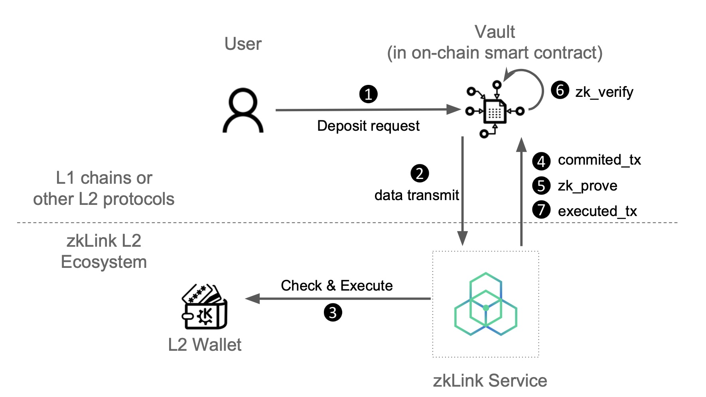

# Deposit

---
DApp developers using zkLink service are able to define their own business logic. 

To use these applications, a user must deposit to zkLink's rollup contract beforehand.



---
## Step 1: Deposit Request
1. User A initiates a deposit request to the on-chain zkLink smart contract.
2. Layer1 Watcher on zkLink protocol monitors L1 smart contract logs and synchronizes the parameters of each request.
3. zkLink service updates the user account upon receiving the request and checking it.
4. Users can immediately use their deposit in the zkLink ecosystem without waiting for the verification process.


Once the user signs the deposit transaction, a deposit function is called with the following parameters:

```python
deposit: {
    from_chain_id: ChainId;
		from: Address;
		token: TokenId;
		amount: BigUint;
		to: Address;
		serial_id: u64;
		eth_hash: H256;
  }
```

| Name | Description |
| --- | --- |
| deposit.from_chain_id | The chain ID of sender |
| deposit.from | Address of the transaction initiator's L1 account |
| deposit.token | Type of deposited token |
| deposit.amount | Amount of tokens deposited. |
| deposit.to | Address of zkLink L2 account that the deposit funds is transferred to. |
| deposit.serial_id | serial id for unique tx_hash |
| deposit.eth_hash | serial id for unique tx_hash |

> 💡 Users can use their deposit on zkLink ecosystem immediately once the transaction is committed the zkLink. There is no need to wait until the verification process is finished.


---
## Step 2: Emit event log (params)

After 10 blocks’ confirmation, the zkLink L2 service receives the deposit request with all the parameters.

---
## Step 3: Check and execute

zkLink service verifies the deposit request, If it passes, the user's zkLink L2 account state is updated.

---
## Step 4: Commit
The deposit transaction is included in a batch and committed to L1.

---
## Step 5: Prove
The deposit transaction is included in a batch and committed to L1.

---
## Step 6: Verification
zkLink L1 smart contract verifies the proof using zero-knowledge and emits log( `final_root`).

---
## Step 7: Send Executed Transaction to L1
Remove the corresponding amount from the pending balance.

The deposit transaction is settled with finality.

