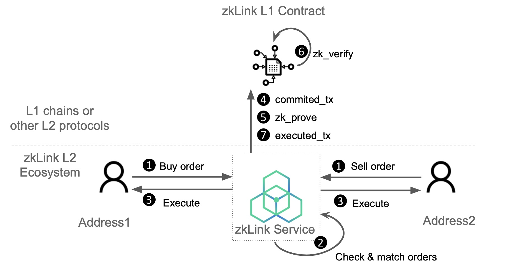

# Limit Order

---
Buy/sell a certain amount of tokens at a certain price.


---
## Step 1: Initiate limit order request

Users send limit order requests and sign them. An order includes the following parameters:

```python
order: {
		account_id: AccountId;
    slot_id: SlotId;
    nonce: Nonce;
    base_token_id: TokenId;
    quote_token_id: TokenId;
    amount: BigUint;
    price: BigUint;
    is_sell: u8;
    time_range: TimeRange;
  }
```

---
## Step 2: Check and match orders

> 💡 zkLink supports partial fulfillment


The zkLink service matches the limit orders and checks to ensure:

- valid signature
- the price is as good as what the users signed on
- both users have enough balance in their L2 wallet
- both requests have not expired
- both requests have never been executed before
- both requests have not been fulfilled and the traded amount is less then the left part of the order

The struct of the order matching function is :

```python
OrderMatching {
    account_id: AccountID;
    account: Address;
    taker: Order;
    maker: Order;
    nonce: Nonce;
    fee: BigUint;
    fee_token: TokenId;
}
```

| Name | Description |
| --- | --- |
| OrderMatching.account_id | zkLink network account ID of the transaction initiator |
| OrderMatching.account | Address of L2 account of the transaction initiator |
| OrderMatching.taker | All content of Taker orders (see above) |
| OrderMatching.maker | all content of Maker orders (see above) |
| OrderMatching.nonce | Current account nonce (layer2) |
| OrderMatching.fee | Fee for the transaction |
| OrderMatching.fee_token | The token in which fee will be paid |

---
## Step 3: Execute

Once checked, the buy and sell orders matched will be executed and deposited to the user’s L2 wallets.

---
## Step 4&5: Commit and prove

The buy and sell orders are included in a batch and committed to L1.

The zkLink L2 service generates a validity proof and uploads it separately to L1 for verification.

---
## Step 6: Verification

zkLink L1 smart contract verifies the `r_proof` using zero knowledge, and emits log( `final_root`).

---
## Step 7: Send executed_tx to L1

The buy and sell orders are settled with finality.
