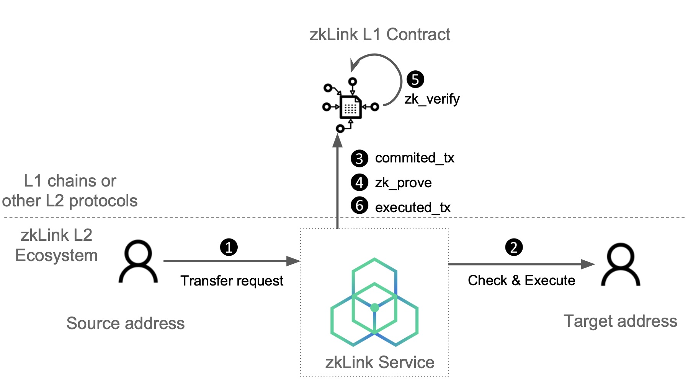

# L2 Transfer

---
Transfer token between any two zkLink L2 addresses.



---
## Step 1: Transfer Request

The user initiates a transfer request from their zkLink L2 wallet, and signs it, calling a transfer function with the following parameters:

```python
transfer: {
		account_id: AccountId;
		from: Address;
		to: Address;
		token: TokenId;
		amount: BigUint;
		fee: BigUint;
		nonce: Nonce;
		ts: TimeStamp;
  }
```

| Name | Description |
| --- | --- |
| transfer.account_id | zkLink network account ID of the transaction initiator |
| transfer.from | Address of L2 account to transfer funds from |
| transfer.to | Address of L2 account to transfer funds to |
| transfer.token | Type of token for transfer. Also represents the token in which fee will be paid |
| transfer.amount | Amount of funds to transfer. |
| transfer.fee | Fee for this transaction. |
| transfer.nonce | Current account nonce |
| transfer.ts | The time stamp for this transaction |

---
## Step 2: Check and execute

The zkLink service verifies the the withdrawal request to ensure:

- valid signature
- the initiator has enough balance
- the request has not expired
- the request has never been executed before

Once it passes, the zkLink service will execute the transaction request and send the token from the source address to the target address.

---
## Step 3&4: Commit and prove

The transfer is included in a batch and committed to L1.

The zkLink L2 service generates a validity proof and uploads it separately to L1 for verification.

---
## Step 5: Verification

The zkLink L1 smart contract verifies the `r_proof` using zero knowledge, and emits log( `final_root`).

---
## Step 6: Send executed_tx to L1

The transfer is settled with finality.
