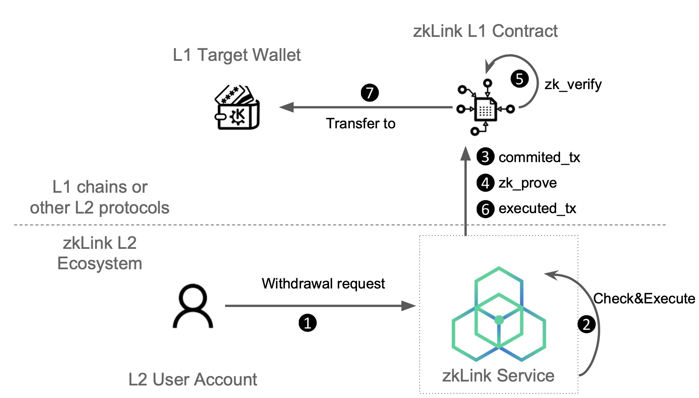

# Withdraw

---
zkLink supports dApp users to withdraw funds to any blockchains connected, regardless of the origin of the token, under the condition the token exists on the destination chain.

> 💡 E.g., a user deposit a certain number of USDC from Ethereum to zkLink, and they can withdraw USDC to Starknet, without navigating outside zkLink to find a third-party token bridge.



---
## Step 1: Withdrawal Request

The user initiates a withdrawal request from their zkLink L2 wallet and signs it, calling a withdraw function with the required parameters.

```python
withdraw: {
	  chain_id: ChainId;
		account_id: AccountId;
		from: Address;
		to: Address;
		token: TokenId;
		amount: BigUint;
		fee: BigUint;
		nonce: Nonce;
  }
```

| Name | Description |
| --- | --- |
| withdraw.chain_id | The chain ID of the target chain |
| withdraw.account_id | zkLink network account ID of the transaction initiator |
| withdraw.from | Address of L2 account to withdraw funds from |
| withdraw.to | Address of L1 account to withdraw funds |
| withdraw.token | Type of token for withdrawal. Also represents the token in which fee will be paid |
| withdraw.amount | Amount of funds to withdraw. |
| withdraw.fee | Fee for this transaction. |
| withdraw.nonce | Current account nonce |

---
## Step 2: Check and Execute
The zkLink service verifies the withdrawal request

Once it passes, the zkLink service executes the transaction request and sends the token from the source address to the target address.

---
## Step 3: Commit 
The withdrawal transaction is included in a batch and committed to L1.

---
## Step 4: Prove
zkLink L2 service generates a validity proof and separately uploads it to L1 for verification.

---
## Step 5: Verification
zkLink L1 smart contract verifies the proof using zero knowledge and emits log( `final_root`). 

---
## Step 6: Send Executed Transaction to L1
Transfer Token to L1 Address.

The appropriate amount of tokens is transferred from the zkLink L1 contract to the target L1 address.

The withdrawal transaction from L2 to L1 is finalized.
