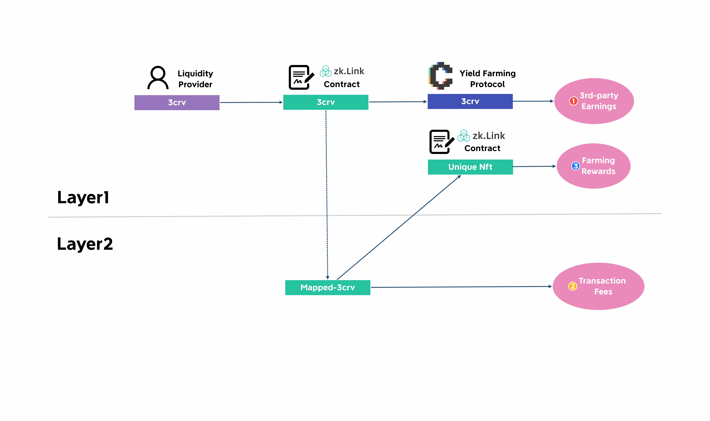

# L2 Liquidity

---

AMM-based, Layer2 liquidity pools composed of LP tokens from two separate chains, providing support for L2 Swap and L2 Mirror (Stable Swap). LP providers would receive high rewards by easy steps without firstly depositing to L2, fulling utilizing the LP tokens they’ve earned from other DEXs - reaping twice with single staking.

> **🥇** Features
- No need to manually deposit to Layer2 in advance.
- Easy earning with no extra effort by staking LP tokens ALREADY EARNED from other AMM protocols.

## Reaping twice with one stake

For some commonly used pairs, zkLink has created a "never-been-easier" process for players to provide liquidity on zkLink from Layer1 while earning double rewards.

Take 3CRV(Ethereum)-3EPS(Solana) as an example - when a user adds 3CRV liquidity from its Ethereum Layer1 wallet, instead of locking up on zkLink's Layer1 smart contract, zkLink stakes it to one of the yield farming protocols such as Convex, helping the liquidity provider to secure the first half of earnings. In the mean time, zkLink mints the same amount of mapped-3CRV on our Layer2 network, adds liquidity to the correct pool, generating the second half for the LP. When the LP chooses to remove liquidity or to harvest earnings, the two parts of earnings will be collected together and received at once.

Whenever liquidity is deposited into a pool, an unique NFT (ERC-721) which can be regarded as liquidity tokens on other Dexs is minted and sent to the provider's Layer1 address. This NFT represents the LP's contribution (or "share") to the given liquidity pool, and can be further staked to zkLink Layer1 contract in order to receive farming rewards.

