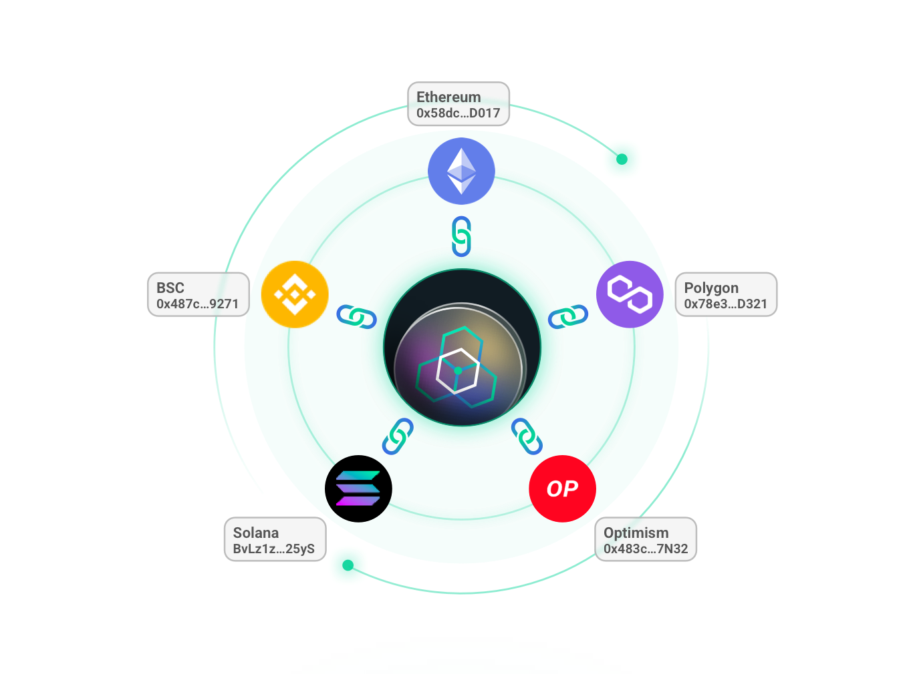

# L2 Liquidity

---

AMM-based, Layer2 liquidity pools composed of LP tokens from two separate chains, providing support for L2 Swap and L2 Mirror (Stable Swap). LP providers would receive high rewards by easy steps without firstly depositing to L2, fulling utilizing the LP tokens they’ve earned from other DEXs - reaping twice with single staking.

> **🥇** Features
- No need to manually deposit to Layer2 in advance.
- Easy earning with no extra effort by staking LP tokens ALREADY EARNED from other AMM protocols.

