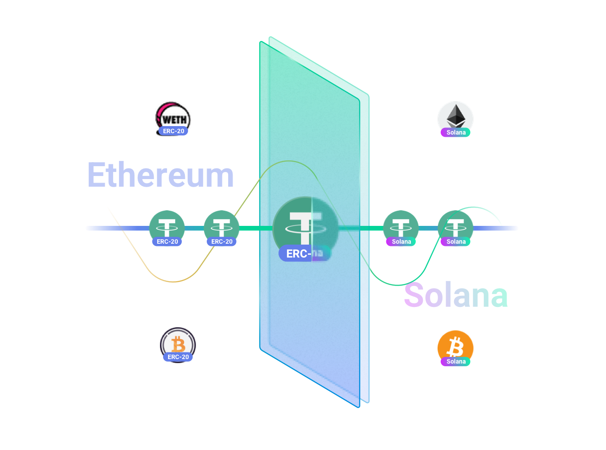
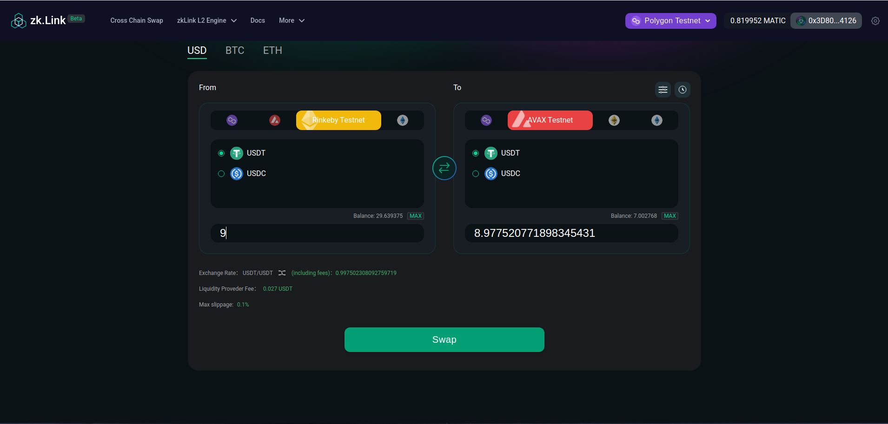

# L2 Mirror (Stable Swap)

---

zkLink supports **one-click swapping** with stablecoins on different chains or of different kinds.

For example, on zkLink's Layer2 network, users can not only transfer their USDT on Ethereum (ERC-20) to BSC (BEP-20), but also swap their USDT on Ethereum to USDC on BSC.

> **🥇** Features
- A stablecoin-specialized AMM curve, referring to Curve.fi.
- Lower slippage, extremely friendly for large transactions.

<!-- mirror img -->

