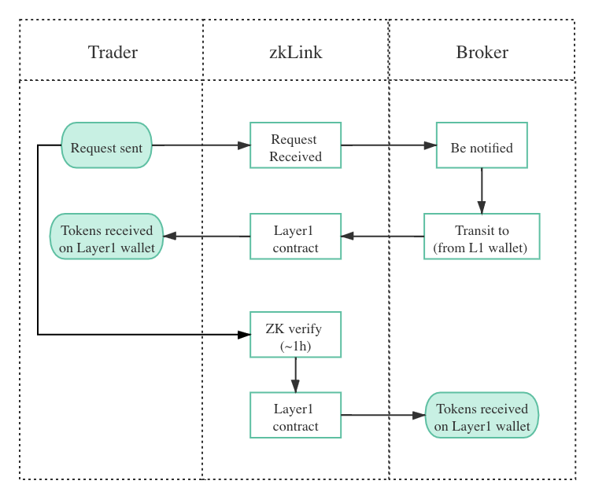

# Fast Withdraw

---
Token withdrawal from Layer2 back to Layer1 wallet can take as long as hours or even days, spoiling user experience considerably - an inevitable drawback of almost all Layer2 protocols. zkLink, however, aiming to provide the state-of-the-art user experience, innovatively propose the "broker mechanism", tactfully transferring the long waiting time from trader to a "broker", at the expense of only a small amount of extra fee: an idea of "**buy time with money**".

There are two scenarios of Fast Withdraw:
1. Traders initiate a ***Fast Withdraw*** request from Layer2, as a substitute for general ***Withdraw*** process.
2. Traders initiate a ***Fast Cross Chain Swap*** on the Layer1 network of the source chain. ***Fast Withdraw*** is functioning as a sub-process of it on zkLink Layer2 network.

> **🥇** Features
- Fast & Secure. Target token will be received in trader's Layer1 wallet in only one block's interval. (～15s on Ethereum, ～0.4s on Solana, and ~3s on Binance Smart Chain)

## How it works

As soon as [zkLink's Layer2 engine](/docs/Technology/Overview#zklink-technological-process) receives a Fast Withdraw request, it will notify the optimal broker, who will then initiate a transaction from its Layer1 wallet on the target chain to the one of the trader's, via zkLink smart contract deployed on Layer1 for the purpose of data storage. This process takes only one block interval of the target chain.

When the ZK proof of this Layer2 transaction is verified, i.e., the final roots of both chains are consistent (normally it takes from 30 minutes to 1 hour), zkLink Layer1 contract will transit the right amount of tokens to the broker's Layer1 wallet.

That is how the account balances of the trader, zkLink, and the broker achieve equilibrium, and end users can enjoy chain-to-chain transactions without having to wait for ZK verification process,
